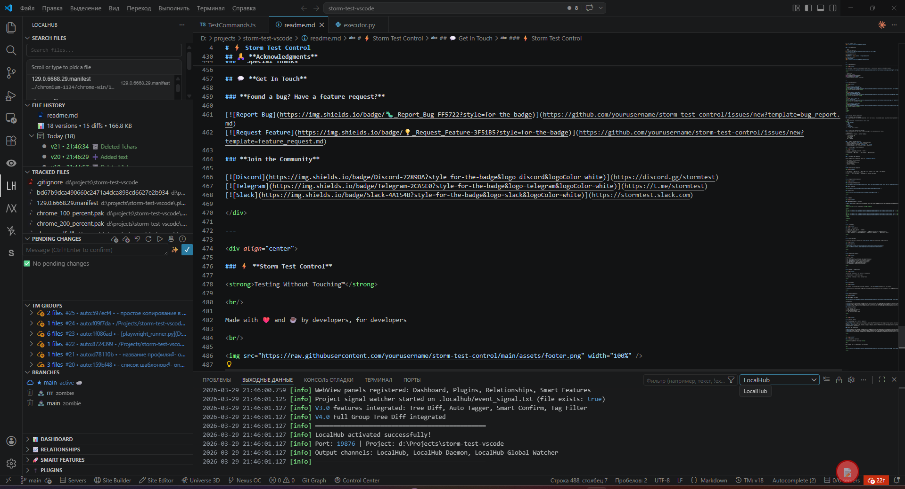
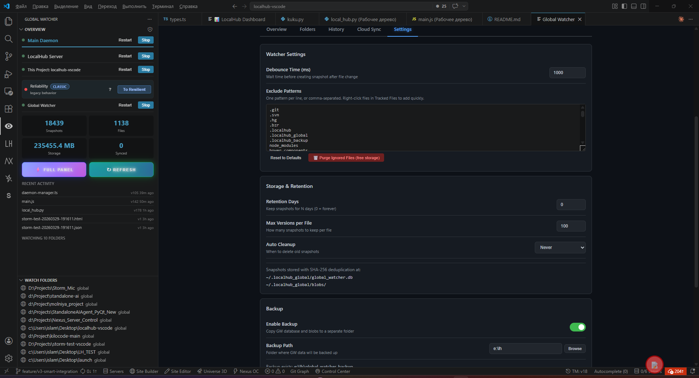

# LocalHub тАФ Time Machine for Code

**Automatic local file versioning. No Git commands, no commits тАФ everything in the background.**

LocalHub is a complete "Time Machine" for your code. Every significant action automatically creates a file snapshot. Branches, groups, diff navigator, AI analytics, plugins, cloud sync, global file monitoring тАФ all out of the box.


---

## Screenshots

<p align="center">
  
  <br/><em>LocalHub Sidebar: File History, TM Groups, Branches — all inside VS Code</em>
</p>

<p align="center">
  
  <br/><em>Global Watcher: 18,439 snapshots across 10 monitored folders, 235MB stored</em>
</p>


---

## Table of Contents

- [Features](#features)
- [Shadow Sandboxes](./docs/SHADOW_SANDBOXES.md)
- [Universal MCP](./docs/UNIVERSAL_MCP.md)
- [Installation](#installation)
- [Quick Start](#quick-start)
- [LocalHub тАФ Functionality](#localhub--functionality)
  - [Automatic Snapshots](#automatic-snapshots)
  - [File History](#file-history)
  - [Recovery](#recovery)
  - [Change Groups (TM Groups)](#change-groups-tm-groups)
  - [LHL Mode тАФ Auto-grouping](#lhl-mode--auto-grouping)
  - [Branches](#branches)
  - [Zombie Branches and Zombie Commits](#zombie-branches-and-zombie-commits)
  - [Tree Diff тАФ Change Visualization](#tree-diff--change-visualization)
  - [Diff Navigator тАФ Interactive Review](#diff-navigator--interactive-review)
  - [Rejected Blocks Trash](#rejected-blocks-trash)
  - [Blame and Bisect](#blame-and-bisect)
  - [Surgical File Management](#surgical-file-management)
  - [Deleted Files (Trash)](#deleted-files-trash)
  - [Backup](#backup)
  - [GitHub Synchronization](#github-synchronization)
  - [Git Integration](#git-integration)
  - [Storm Code Integration](#storm-code-integration)
  - [Built-in LH Console](#built-in-lh-console)
  - [Plugins](#plugins)
  - [Agent Diary тАФ AI Log](#agent-diary--ai-log)
  - [AI Deletion Protection](#ai-deletion-protection)
- [Smart Features тАФ AI Analytics](#smart-features--ai-analytics)
- [Visualizations](#visualizations)
- [Global Watcher тАФ Global Monitoring](#global-watcher--global-monitoring)
- [Panels and Interface](#panels-and-interface)
- [Settings](#settings)
- [Hotkeys](#hotkeys)
- [CLI](#cli)
- [Technologies](#technologies)
- [Author](#author)

---

## Features

### Core
- **Automatic Snapshots** тАФ 7 smart triggers (save, tab switch, editing, focus loss, idle, external changes, deletion)
- **Deduplication** тАФ identical content stored once (SHA-256 hashing)
- **Branches** тАФ parallel versioning lines with merge, cherry-pick, export/import
- **Zombie Branches** тАФ full control over deleted branches and commits with recovery capability
- **Change Groups** тАФ commit analogue with auto-tagging and AI description generation
- **Group Tag Search** тАФ manual assignment of custom text tags with quick search
- **Diff Navigator** тАФ interactive change review with Accept/Reject for each block
- **Rejected Blocks Trash** тАФ saving all rejected code pieces for later recovery
- **Blame** тАФ who and when changed each line (like `git blame`)
- **Bisect** тАФ binary search for bug version (like `git bisect`)
- **Surgical Management** тАФ remove any file from branch or commit via UI

### Monitoring
- **Global Watcher** тАФ background OS-level file monitoring, works even without IDE
- **Seamless Symbiosis** тАФ automatic data transfer between global watcher and local hub
- **Cloud Synchronization** тАФ Google Drive, OneDrive, Dropbox, Yandex Disk or custom API
- **Backup** тАФ centralized backup with rotation

### AI and Analytics
- **8 Smart Analyzers** тАФ predictions, heatmap, refactoring, change velocity, dependencies, clusters, analytics
- **Agent Diary** тАФ automatic logging of AI agent actions
- **Storm Code Integration** тАФ automatic commits based on AI agent responses
- **Trash Protection** тАФ AI cannot delete files from trash

### Visualizations
- **3D Grid** тАФ three-dimensional project visualization
- **Time Machine** тАФ time travel through project states
- **Code Replay** тАФ coding session playback as video
- **Branch Tree** тАФ visual branch tree
- **Group Change Trees** тАФ change visualization for entire file groups (accordion and classic modes)
- **Dependency Graph** тАФ interactive file relationship graph (Nexus Vision)
- **Symbol Timeline** тАФ function and class timeline

### Extensibility
- **Plugin System** тАФ install, enable/disable, configure, marketplace
- **CLI** тАФ command line for terminal work
- **Built-in LH Console** тАФ full terminal inside the program
- **150+ API Endpoints** тАФ full programmatic access to all functionality
- **Shadow Sandboxes** тАФ isolated working copies for AI and human review: create/status/diff/checkout/return/merge/destroy
- **Universal MCP** тАФ standard project-level `.vscode/mcp.json` bootstrap for MCP clients

---

## Installation

### Requirements
- **VS Code** 1.85+ or any VS Code-based IDE
- **Python** 3.9+ with pip

### From VSIX
```bash
# Download .vsix file
code --install-extension localhub-3.0.1.vsix --force

### From Source (Development)
```bash
git clone <repo>
cd localhub-vscode
npm install
npm run compile
# F5 to run in debug mode

Python dependencies are installed automatically on first run.

---

## Quick Start

1. Open project in VS Code
2. LocalHub automatically starts daemon server
3. Start working тАФ snapshots are created automatically
4. **LocalHub** sidebar shows history, files, groups, branches
5. `Ctrl+Alt+S` тАФ manual snapshot
6. `Ctrl+Alt+H` тАФ show all features
7. `Ctrl+Alt+L` тАФ open built-in LH console

---

## LocalHub тАФ Functionality

### Automatic Snapshots

7 smart triggers automatically create file snapshots:

| Trigger | Description |
|---------|-------------|
| **File Save** | Ctrl+S or autosave тЖТ snapshot `auto:save` |
| **Tab Switch** | Snapshot of old file (`tab_switch`) and new (`tab_focus`) |
| **File Open** | Explorer click тЖТ `explorer_click` |
| **Text Editing** | After 2 sec pause тЖТ detailed reason: `added:"code"`, `deleted:15chars`, `replaced:"text"` |
| **Focus Loss** | IDE minimize тЖТ snapshot of open file |
| **Idle** | Configurable idle interval (default 5 min) |
| **External Changes** | AI agents, terminal, other editors тЖТ `external:change` |

Each snapshot records detailed reason тАФ shows not just "file changed", but what exactly happened.

### File History

- Complete history of all versions in sidebar
- History search with filters (file, date, reason, branch)
- **Starred Files** тАФ version fixation with star for complete deletion protection
- **Context Jump** тАФ jump from starred version directly to corresponding TM group
- Stars show TM group binding тАФ can see entire project state at that moment
- Version description editing
- Delete unnecessary versions

### Recovery

- **Full Recovery** тАФ rollback file to any version in one click
- **Partial Recovery** тАФ select specific blocks for recovery
- **Diff** тАФ compare any version with current file
- Safety snapshot automatically created before recovery

### Change Groups (TM Groups)

Groups are commit analogues. Set of related changes confirmed together.

- **Group Confirmation** тАФ collect accumulated changes into group
- **Smart Confirm** тАФ smart confirmation with automatic analysis
- **AI Description Generation** тАФ automatic summary creation via AI
- **Auto-tagging** тАФ 15+ tag types: `new-function`, `bugfix`, `refactor`, `api-change`, `ui-change`, `ai-generated` etc.
- **Manual Tags** тАФ assign custom text tags for each group
- **Tag Search** тАФ quick search by automatic and manual tags
- **Tag Filtering** тАФ find groups by change type
- **Re-tagging** тАФ recalculate tags for all groups

### LHL Mode тАФ Auto-grouping

Automatic group creation without manual confirmation:

- **By Timeout** тАФ group created after N minutes of inactivity (default 10 min)
- **By Count** тАФ group created after N saves (default 10)
- **Name Template** тАФ `{count}`, `{time}`, `{date}`, `{files}` for name generation

### Branches

Parallel versioning lines, like in Git:

- **Branch Creation** тАФ fork from current state
- **Switching** тАФ instant switch between branches
- **Merge** тАФ branch merging with conflict detection
- **Selective Merge** тАФ choose which files to merge
- **Smart Merge** тАФ smart merge with preview
- **Cherry-Pick** тАФ select individual changes from another branch
- **Export/Import** тАФ export branch to ZIP and import back
- **Stash** тАФ postpone current changes and return later

### Zombie Branches and Zombie Commits

Full control over deleted data:

- **Zombie Branches** тАФ deleted branches don't disappear, but become "zombies"
- **Branch Recovery** тАФ restore any deleted branch in one click
- **Zombie Commits** тАФ deleted commit groups saved in special trash
- **Group Recovery** тАФ restore entire commit group with all files
- **Commit Deletion** тАФ ability to delete commits with content preservation or complete destruction
- **Deletion History** тАФ complete log of all deletions with rollback capability

### Tree Diff тАФ Change Visualization

Advanced diff visualization with semantic analysis:

- **Version Chain** тАФ v1 тЖТ v2 тЖТ v3 тЖТ ... тЖТ vN in one view
- **Group Change Trees** тАФ unique change visualization for entire file group
- **Accordion Mode** тАФ compact view with click expansion
- **Classic View** тАФ traditional change tree with beautiful design
- **Semantic Analysis** тАФ shows "function `getUser()` added", not just "lines 15-20"
- **Language Support** тАФ Python, JavaScript, TypeScript, Go, Rust, Java, C#, PHP, Ruby
- **10 Icon Themes** тАФ Vivid, Minimal, Neon, Pastel, Earth, Aurora, Sunset, Ocean, Candy, Matrix
- **Configurable Context** тАФ number of lines around changes (0-20)
- **Modes** тАФ Collapsed, Step-by-step Chain, Summary

### Diff Navigator тАФ Interactive Review

Navigator for step-by-step change review (like code review in Git):

- **Navigation** тАФ тЧА Previous / тЦ╢ Next block
- **Accept/Reject** тАФ accept or reject each change block
- **Apply Decisions** тАФ surgical application of selected blocks only
- **Rejected Trash** тАФ all rejected blocks saved for later recovery
- Hotkeys in editor panel

### Rejected Blocks Trash

Unique system for saving rejected code:

- **Auto-save** тАФ all rejected blocks automatically go to trash
- **Categorization** тАФ blocks grouped by files and review sessions
- **Recovery** тАФ any rejected block can be restored
- **Search** тАФ quick search by rejected block content
- **Rejection History** тАФ full log with date, time and context
- **Retention Period** тАФ configurable period (default 30 days)

### Blame and Bisect

Git-like analysis tools:

- **Blame** тАФ for each file line: which version appeared, when, why
- **Bisect** тАФ binary search for bug version:
  1. Specify "version X is good, version Y is bad"
  2. System shows middle version
  3. You check тАФ repeat until finding exact version

### Surgical File Management

Direct file management via visual interface:

- **Remove from Branch** тАФ kick any file from branch via context menu
- **Remove from Commit** тАФ remove file from already created commit
- **Instant Exclusion Transfer** тАФ send file to `.localhubignore` directly from UI
- **Stop Tracking** тАФ file stops being tracked, but history preserved
- **Mass Operations** тАФ select multiple files for group actions
- **Visual Mode** тАФ all operations available via drag & drop

### Deleted Files (Trash)

- All deleted files saved to trash
- View deleted file history
- Restore one file or all at once
- Configurable retention period (default 30 days)
- Trash cleanup

### Backup

- **Centralized Backup** тАФ copy snapshots to separate folder (external drive, NAS, cloud)
- **Rotation** тАФ automatic deletion of backups older than N days
- **Restore from Backup** тАФ complete project restoration

### GitHub Synchronization

- Upload project to GitHub via Personal Access Token
- Clone from GitHub
- Auto-sync on group confirmation
- SSH Push for advanced users
- Sync branch configuration

### Git Integration

- **Auto Git Commit** тАФ automatic `git commit` on TM Group confirmation
- **Auto Push** тАФ automatic `git push` after commit
- **Configurable Prefix** for commit messages

### Storm Code Integration

Automatic commits based on AI agent work:

- **Response Tracking** тАФ system monitors agent responses in Storm Code
- **Trigger Words** тАФ "Done", "Completed", "Finished", "Ready"
- **Auto-commit** тАФ automatically creates commit when trigger detected
- **AI Description** тАФ agent response used as official commit description
- **Task Linking** тАФ commit automatically linked to task in Storm Code
- **Agent History** тАФ all agent commits available in separate panel

### Built-in LH Console

Full terminal inside the program:

- **Quick Access** тАФ `Ctrl+Alt+L` to open console
- **All LH Commands** тАФ available without `lh` prefix
- **Auto-completion** тАФ intelligent hints for commands and files
- **Command History** тАФ navigation with up/down arrows
- **Color Highlighting** тАФ syntax highlighting for output
- **UI Integration** тАФ command results displayed in panels
- **Macros** тАФ create custom command aliases

### Plugins

Extensible plugin system:

- Install plugins from folder or marketplace
- Enable/disable without deletion
- Configure each plugin via UI
- Update checking
- Plugins react to events (file save, group confirmation, etc.)

### Agent Diary тАФ AI Log

Automatic logging of AI agent actions:

- Record all saves, commits, branch operations
- Terminal command logging
- Diary files in `.localhub/agent/` тАФ readable Markdown
- Next AI agent can use diary as "memory"
- Configurable log rotation

### AI Deletion Protection

- AI agents **cannot** clear trash, delete files from trash or erase history
- Only user via UI can perform destructive operations
- Log of all deletion attempts

---

## Smart Features тАФ AI Analytics

8 smart analyzers based on change history:

| Analyzer | Description |
|----------|-------------|
| **Predictive Suggestions** | Predict files you'll likely change |
| **Timeline View** | Visual project change timeline |
| **Activity Heatmap** | Heatmap тАФ which files change most often |
| **Refactoring Hints** | Refactoring recommendations based on change patterns |
| **Change Velocity** | Change speed over time тАФ when project develops faster |
| **Dependency Overlay** | Dependency analysis тАФ static imports vs. co-changes |
| **Smart Clusters** | Automatic detection of logical file groups |
| **Analytics Dashboard** | Overall project health statistics |

---

## Visualizations

| Visualization | Description |
|--------------|-------------|
| **3D Grid** | Three-dimensional project structure visualization |
| **Time Machine** | Time travel тАФ view project state at any moment |
| **Code Replay** | Coding session playback as accelerated video |
| **Branch Tree** | Visual branch tree with hierarchy and history |
| **Dependency Graph** | Interactive file relationship graph (co-changes) |
| **Nexus Vision** | Advanced graph with clusters, filters and animation |
| **Symbol Timeline** | Function and class timeline |
| **Group Trees** | Change visualization for entire file group |

---

## Global Watcher тАФ Global Monitoring

Global Watcher тАФ separate system for OS-level file monitoring. Works independently of VS Code тАФ files tracked while daemon runs.

### Features

- **Monitor Any Folders** тАФ not just open project, but any computer folders
- **IDE Independence** тАФ works while daemon process runs
- **Global and Local Folders** тАФ global visible from any project, local only from current
- **150+ Default Exclusions** тАФ node_modules, .git, __pycache__, etc.
- **Support .localhubignore** тАФ own file ignore system in each folder
- **Seamless Symbiosis** тАФ automatic transfer of current picture to local hub when editor opens

### History and Recovery

- Complete version history for each tracked file
- View, diff, restore any version
- Track deleted files
- Configurable storage (days, max versions)

### Cloud Synchronization

- **Folder Mode** тАФ sync via Google Drive, OneDrive, Dropbox, Yandex Disk (auto-detect)
- **API Mode** тАФ sync via HTTP API
- **Instant or Periodic** synchronization
- Status and progress in panel

### Project Export

- Export folder to ZIP with latest file versions
- Optional тАФ with complete history (all versions)

### Management

Three daemon process management levels:

| Level | Description | Buttons |
|-------|-------------|---------|
| **Main Daemon** | Entire Python process | Start, Stop, Restart |
| **LocalHub Daemon** | Project server | Start, Stop, Restart |
| **Global Watcher** | Monitoring module | Start, Stop, Restart |

### Settings Panel

5 tabs in full panel:

1. **Overview** тАФ statistics, daemon status
2. **Folders** тАФ manage watched folders (global + local)
3. **History** тАФ files, versions, recovery, deleted files
4. **Cloud Sync** тАФ cloud synchronization (service setup, sync now)
5. **Settings** тАФ debounce, exclusions, rotation, backup

---

## Panels and Interface

### LocalHub Sidebar (11 sections)

| Panel | Description |
|-------|-------------|
| **File History** | All versions of selected file with star marks |
| **Tracked Files** | All files with history in project |
| **Pending Changes** | Ungrouped changes |
| **TM Groups** | Confirmed groups with tags and search |
| **Branches** | Versioning branches |
| **Zombie Branches** | Deleted branches trash |
| **Zombie Commits** | Deleted commits trash |
| **Rejected Blocks** | Rejected code blocks trash |
| **Deleted Files** | Trash тАФ deleted files |
| **Dashboard** | Project statistics and metrics |
| **Relationships** | File relationship graph |
| **Smart Features** | AI analyzers |

### Global Watcher Sidebar

| Panel | Description |
|-------|-------------|
| **Overview** | Status, statistics, daemon management |
| **Watch Folders** | List of monitored folders |

### Built-in Console

| Element | Description |
|---------|-------------|
| **Command Line** | Input field with auto-completion |
| **Output** | Colored result output |
| **History** | Executed command history |
| **Macros** | List of saved macros |

### Settings Panel (11 tabs)

| Tab | Content |
|-----|---------|
| **General** | Main settings, LHL mode, ignore, daemon management |
| **Global Watcher** | Enable GW, folders, storage parameters, symbiosis |
| **Backup** | Centralized backup, trash |
| **Git Sync** | Automatic git commit/push |
| **GitHub** | Token, repo, auto-sync |
| **Storm Code** | AI agent integration, trigger words |
| **Console** | Built-in console settings, macros |
| **Advanced** | Python path, port, marketplace, Agent Diary |
| **Tree Diff** | Icon theme, semantic analysis, context, modes |
| **Plugins** | Plugin management |
| **About** | About, statistics |

---

## Settings

### General

| Setting | Default | Description |
|---------|---------|-------------|
| `localhub.enabled` | `true` | Enable LocalHub |
| `localhub.autoSave` | `true` | Automatic snapshots |
| `localhub.debounceMs` | `2000` | Delay before snapshot (ms) |
| `localhub.maxVersionsPerFile` | `100` | Max versions per file |
| `localhub.idleCheckpointMinutes` | `5` | Idle snapshot (0 = off) |

### LHL Mode

| Setting | Default | Description |
|---------|---------|-------------|
| `localhub.lhlMode` | `false` | Auto-grouping |
| `localhub.lhl.timeoutMinutes` | `10` | Inactivity timeout |
| `localhub.lhl.threshold` | `10` | Count threshold |
| `localhub.lhl.namePattern` | тАФ | Group name template |

### Global Watcher

| Setting | Default | Description |
|---------|---------|-------------|
| `localhub.enableGlobalWatcher` | `true` | Enable global monitoring |
| `localhub.globalWatchPaths` | `[]` | Global folders |
| `localhub.localWatchPaths` | `[]` | Local folders |
| `localhub.excludePatterns` | 150+ items | Exclusion patterns |
| `localhub.seamlessSync` | `true` | Seamless symbiosis with local hub |

### Backup and Trash

| Setting | Default | Description |
|---------|---------|-------------|
| `localhub.backup.enabled` | `true` | Central backup |
| `localhub.backup.centralPath` | тАФ | Backup folder |
| `localhub.backup.retentionDays` | `30` | Backup rotation (0 = forever) |
| `localhub.trash.retentionDays` | `30` | Deleted files retention |
| `localhub.zombies.retentionDays` | `90` | Zombie branches and commits retention |
| `localhub.rejected.retentionDays` | `30` | Rejected blocks retention |

### Storm Code Integration

| Setting | Default | Description |
|---------|---------|-------------|
| `localhub.stormCode.enabled` | `false` | Enable integration |
| `localhub.stormCode.triggers` | `["Done", "Completed", "Ready"]` | Trigger words |
| `localhub.stormCode.autoCommit` | `true` | Automatic commits |
| `localhub.stormCode.useAgentResponse` | `true` | Use response as description |

### Built-in Console

| Setting | Default | Description |
|---------|---------|-------------|
| `localhub.console.enabled` | `true` | Enable console |
| `localhub.console.historySize` | `1000` | Command history size |
| `localhub.console.autoComplete` | `true` | Auto-completion |
| `localhub.console.colorOutput` | `true` | Colored output |

### GitHub

| Setting | Default | Description |
|---------|---------|-------------|
| `localhub.github.enabled` | `false` | Enable GitHub sync |
| `localhub.github.token` | тАФ | Personal Access Token |
| `localhub.github.owner` | тАФ | Username |
| `localhub.github.repo` | тАФ | Repository |
| `localhub.github.branch` | `main` | Branch |
| `localhub.github.syncOnConfirm` | `false` | Auto-sync on confirmation |

### Git

| Setting | Default | Description |
|---------|---------|-------------|
| `localhub.git.syncOnConfirm` | `false` | Auto git commit |
| `localhub.git.autoPush` | `false` | Auto git push |
| `localhub.git.commitPrefix` | тАФ | Commit prefix |

### Tree Diff

| Setting | Default | Description |
|---------|---------|-------------|
| `localhub.treeDiff.semanticAnalysis` | `true` | Semantic code analysis |
| `localhub.treeDiff.contextLines` | `3` | Context lines (0-20) |
| `localhub.treeDiff.reviewMode` | `true` | Accept/Reject buttons |
| `localhub.treeDiff.groupMode` | `accordion` | Group mode (accordion/classic) |
| `localhub.icons.theme` | `vivid` | Icon theme (10 options) |

### Advanced

| Setting | Default | Description |
|---------|---------|-------------|
| `localhub.pythonPath` | `python` | Python path |
| `localhub.serverPort` | `19876` | Server port |
| `localhub.agentDiary.enabled` | `true` | AI agent diary |
| `localhub.marketplaceUrl` | тАФ | Plugin marketplace URL |
| `localhub.customTags` | `[]` | List of custom tags |

---

## Hotkeys

| Combination | Action |
|------------|--------|
| `Ctrl+Alt+H` | Show all features |
| `Ctrl+Alt+S` | Create snapshot |
| `Ctrl+Alt+B` | Create branch |
| `Ctrl+Alt+T` | Show trash |
| `Ctrl+Alt+Shift+T` | Show branch trash |
| `Ctrl+Alt+Shift+G` | Show TM group trash |
| `Ctrl+Alt+Shift+R` | Show rejected blocks trash |
| `Ctrl+Alt+R` | Show backups |
| `Ctrl+Alt+Shift+R` | Restore from backup |
| `Ctrl+Alt+L` | Open built-in console |
| `Ctrl+Alt+X` | Surgical file removal |
| `Ctrl+Alt+I` | Add file to exclusions |

---

## CLI

Command line for terminal work (installed in `~/bin/lh.py`):

```bash
lh status          # Project status
lh log [file]      # Project/file history
lh diff <file>     # Diff with last version
lh restore <file>  # Restore file
lh branch          # Branch list
lh branch trash    # Deleted branch trash
lh group           # TM group list
lh group trash     # Deleted TM group trash
lh rejected        # Rejected blocks trash
lh surgery <file>  # Surgical file removal
lh ignore <file>   # Add file to exclusions
lh tag <group>     # Add tag to group
lh search <tag>    # Search by tags
lh push            # Push to GitHub

### Built-in Console

All commands also available in built-in console without `lh` prefix:

```bash
status             # Project status
log [file]         # History
diff <file>        # Compare
restore <file>     # Recovery
# ... and all other commands

---

## Technologies

| Component | Technology |
|-----------|------------|
| IDE Extension | TypeScript, VS Code Extension API |
| Server | Python, FastAPI, Uvicorn |
| Database | SQLite |
| File Storage | Content-addressable storage (SHA-256) |
| File Monitoring | watchdog (Python) + VS Code FileSystemWatcher |
| Graph Visualization | Cytoscape.js |
| 3D Visualization | Three.js |
| Built-in Console | xterm.js + node-pty |
| IDE Support | VS Code and any VS Code-based IDE |

---

## Author

**Islam Dev**

> "Every change is a save point. Never lose your code."
# LocalHub тАФ Time Machine for Code

**╨Р╨▓╤В╨╛╨╝╨░╤В╨╕╤З╨╡╤Б╨║╨╛╨╡ ╨╗╨╛╨║╨░╨╗╤М╨╜╨╛╨╡ ╨▓╨╡╤А╤Б╨╕╨╛╨╜╨╕╤А╨╛╨▓╨░╨╜╨╕╨╡ ╤Д╨░╨╣╨╗╨╛╨▓. ╨С╨╡╨╖ Git ╨║╨╛╨╝╨░╨╜╨┤, ╨▒╨╡╨╖ ╨║╨╛╨╝╨╝╨╕╤В╨╛╨▓ тАФ ╨▓╤Б╤С ╨▓ ╤Д╨╛╨╜╨╡.**

LocalHub тАФ ╤Н╤В╨╛ ╨┐╨╛╨╗╨╜╨╛╤Ж╨╡╨╜╨╜╨░╤П "╨Ь╨░╤И╨╕╨╜╨░ ╨Т╤А╨╡╨╝╨╡╨╜╨╕" ╨┤╨╗╤П ╨▓╨░╤И╨╡╨│╨╛ ╨║╨╛╨┤╨░. ╨Ъ╨░╨╢╨┤╨╛╨╡ ╨╖╨╜╨░╤З╨╕╨╝╨╛╨╡ ╨┤╨╡╨╣╤Б╤В╨▓╨╕╨╡ ╨░╨▓╤В╨╛╨╝╨░╤В╨╕╤З╨╡╤Б╨║╨╕ ╤Б╨╛╨╖╨┤╨░╤С╤В ╤Б╨╜╨╕╨╝╨╛╨║ ╤Д╨░╨╣╨╗╨░. ╨Т╨╡╤В╨║╨╕, ╨│╤А╤Г╨┐╨┐╤Л, diff-╨╜╨░╨▓╨╕╨│╨░╤В╨╛╤А, AI-╨░╨╜╨░╨╗╨╕╤В╨╕╨║╨░, ╨┐╨╗╨░╨│╨╕╨╜╤Л, ╨╛╨▒╨╗╨░╤З╨╜╤Л╨╣ ╤Б╨╕╨╜╨║, ╨│╨╗╨╛╨▒╨░╨╗╤М╨╜╤Л╨╣ ╨╝╨╛╨╜╨╕╤В╨╛╤А╨╕╨╜╨│ ╤Д╨░╨╣╨╗╨╛╨▓ тАФ ╨▓╤Б╤С ╨╕╨╖ ╨║╨╛╤А╨╛╨▒╨║╨╕.


---

## ╨Ю╨│╨╗╨░╨▓╨╗╨╡╨╜╨╕╨╡

- [╨Т╨╛╨╖╨╝╨╛╨╢╨╜╨╛╤Б╤В╨╕](#╨▓╨╛╨╖╨╝╨╛╨╢╨╜╨╛╤Б╤В╨╕)
- [Shadow Sandboxes](./docs/SHADOW_SANDBOXES.md)
- [Universal MCP](./docs/UNIVERSAL_MCP.md)
- [╨г╤Б╤В╨░╨╜╨╛╨▓╨║╨░](#╤Г╤Б╤В╨░╨╜╨╛╨▓╨║╨░)
- [╨С╤Л╤Б╤В╤А╤Л╨╣ ╤Б╤В╨░╤А╤В](#╨▒╤Л╤Б╤В╤А╤Л╨╣-╤Б╤В╨░╤А╤В)
- [LocalHub тАФ ╨д╤Г╨╜╨║╤Ж╨╕╨╛╨╜╨░╨╗](#localhub--╤Д╤Г╨╜╨║╤Ж╨╕╨╛╨╜╨░╨╗)
  - [╨Р╨▓╤В╨╛╨╝╨░╤В╨╕╤З╨╡╤Б╨║╨╕╨╡ ╤Б╨╜╨╕╨╝╨║╨╕](#╨░╨▓╤В╨╛╨╝╨░╤В╨╕╤З╨╡╤Б╨║╨╕╨╡-╤Б╨╜╨╕╨╝╨║╨╕)
  - [╨Ш╤Б╤В╨╛╤А╨╕╤П ╤Д╨░╨╣╨╗╨╛╨▓](#╨╕╤Б╤В╨╛╤А╨╕╤П-╤Д╨░╨╣╨╗╨╛╨▓)
  - [╨Т╨╛╤Б╤Б╤В╨░╨╜╨╛╨▓╨╗╨╡╨╜╨╕╨╡](#╨▓╨╛╤Б╤Б╤В╨░╨╜╨╛╨▓╨╗╨╡╨╜╨╕╨╡)
  - [╨У╤А╤Г╨┐╨┐╤Л ╨╕╨╖╨╝╨╡╨╜╨╡╨╜╨╕╨╣ (TM Groups)](#╨│╤А╤Г╨┐╨┐╤Л-╨╕╨╖╨╝╨╡╨╜╨╡╨╜╨╕╨╣-tm-groups)
  - [LHL Mode тАФ ╨Р╨▓╤В╨╛╨│╤А╤Г╨┐╨┐╨╕╤А╨╛╨▓╨║╨░](#lhl-mode--╨░╨▓╤В╨╛╨│╤А╤Г╨┐╨┐╨╕╤А╨╛╨▓╨║╨░)
  - [╨Т╨╡╤В╨║╨╕](#╨▓╨╡╤В╨║╨╕)
  - [╨Ч╨╛╨╝╨▒╨╕-╨▓╨╡╤В╨║╨╕ ╨╕ ╨Ч╨╛╨╝╨▒╨╕-╨║╨╛╨╝╨╝╨╕╤В╤Л](#╨╖╨╛╨╝╨▒╨╕-╨▓╨╡╤В╨║╨╕-╨╕-╨╖╨╛╨╝╨▒╨╕-╨║╨╛╨╝╨╝╨╕╤В╤Л)
  - [Tree Diff тАФ ╨Т╨╕╨╖╤Г╨░╨╗╨╕╨╖╨░╤Ж╨╕╤П ╨╕╨╖╨╝╨╡╨╜╨╡╨╜╨╕╨╣](#tree-diff--╨▓╨╕╨╖╤Г╨░╨╗╨╕╨╖╨░╤Ж╨╕╤П-╨╕╨╖╨╝╨╡╨╜╨╡╨╜╨╕╨╣)
  - [Diff Navigator тАФ ╨Ш╨╜╤В╨╡╤А╨░╨║╤В╨╕╨▓╨╜╤Л╨╣ ╨╛╨▒╨╖╨╛╤А](#diff-navigator--╨╕╨╜╤В╨╡╤А╨░╨║╤В╨╕╨▓╨╜╤Л╨╣-╨╛╨▒╨╖╨╛╤А)
  - [╨Ъ╨╛╤А╨╖╨╕╨╜╨░ ╨╛╤В╨║╨╗╨╛╨╜╨╡╨╜╨╜╤Л╤Е ╨▒╨╗╨╛╨║╨╛╨▓](#╨║╨╛╤А╨╖╨╕╨╜╨░-╨╛╤В╨║╨╗╨╛╨╜╨╡╨╜╨╜╤Л╤Е-╨▒╨╗╨╛╨║╨╛╨▓)
  - [Blame ╨╕ Bisect](#blame-╨╕-bisect)
  - [╨е╨╕╤А╤Г╤А╨│╨╕╤З╨╡╤Б╨║╨╛╨╡ ╤Г╨┐╤А╨░╨▓╨╗╨╡╨╜╨╕╨╡ ╤Д╨░╨╣╨╗╨░╨╝╨╕](#╤Е╨╕╤А╤Г╤А╨│╨╕╤З╨╡╤Б╨║╨╛╨╡-╤Г╨┐╤А╨░╨▓╨╗╨╡╨╜╨╕╨╡-╤Д╨░╨╣╨╗╨░╨╝╨╕)
  - [╨г╨┤╨░╨╗╤С╨╜╨╜╤Л╨╡ ╤Д╨░╨╣╨╗╤Л (╨Ъ╨╛╤А╨╖╨╕╨╜╨░)](#╤Г╨┤╨░╨╗╤С╨╜╨╜╤Л╨╡-╤Д╨░╨╣╨╗╤Л-╨║╨╛╤А╨╖╨╕╨╜╨░)
  - [╨а╨╡╨╖╨╡╤А╨▓╨╜╨╛╨╡ ╨║╨╛╨┐╨╕╤А╨╛╨▓╨░╨╜╨╕╨╡](#╤А╨╡╨╖╨╡╤А╨▓╨╜╨╛╨╡-╨║╨╛╨┐╨╕╤А╨╛╨▓╨░╨╜╨╕╨╡)
  - [GitHub ╤Б╨╕╨╜╤Е╤А╨╛╨╜╨╕╨╖╨░╤Ж╨╕╤П](#github-╤Б╨╕╨╜╤Е╤А╨╛╨╜╨╕╨╖╨░╤Ж╨╕╤П)
  - [Git ╨╕╨╜╤В╨╡╨│╤А╨░╤Ж╨╕╤П](#git-╨╕╨╜╤В╨╡╨│╤А╨░╤Ж╨╕╤П)
  - [Storm Code ╨╕╨╜╤В╨╡╨│╤А╨░╤Ж╨╕╤П](#storm-code-╨╕╨╜╤В╨╡╨│╤А╨░╤Ж╨╕╤П)
  - [╨Т╤Б╤В╤А╨╛╨╡╨╜╨╜╨░╤П ╨║╨╛╨╜╤Б╨╛╨╗╤М LH](#╨▓╤Б╤В╤А╨╛╨╡╨╜╨╜╨░╤П-╨║╨╛╨╜╤Б╨╛╨╗╤М-lh)
  - [╨Я╨╗╨░╨│╨╕╨╜╤Л](#╨┐╨╗╨░╨│╨╕╨╜╤Л)
  - [Agent Diary тАФ ╨Ф╨╜╨╡╨▓╨╜╨╕╨║ AI](#agent-diary--╨┤╨╜╨╡╨▓╨╜╨╕╨║-ai)
  - [╨Ч╨░╤Й╨╕╤В╨░ ╨╛╤В AI ╤Г╨┤╨░╨╗╨╡╨╜╨╕╤П](#╨╖╨░╤Й╨╕╤В╨░-╨╛╤В-ai-╤Г╨┤╨░╨╗╨╡╨╜╨╕╤П)
- [Smart Features тАФ AI-╨░╨╜╨░╨╗╨╕╤В╨╕╨║╨░](#smart-features--ai-╨░╨╜╨░╨╗╨╕╤В╨╕╨║╨░)
- [╨Т╨╕╨╖╤Г╨░╨╗╨╕╨╖╨░╤Ж╨╕╨╕](#╨▓╨╕╨╖╤Г╨░╨╗╨╕╨╖╨░╤Ж╨╕╨╕)
- [Global Watcher тАФ ╨У╨╗╨╛╨▒╨░╨╗╤М╨╜╤Л╨╣ ╨╝╨╛╨╜╨╕╤В╨╛╤А╨╕╨╜╨│](#global-watcher--╨│╨╗╨╛╨▒╨░╨╗╤М╨╜╤Л╨╣-╨╝╨╛╨╜╨╕╤В╨╛╤А╨╕╨╜╨│)
- [╨Я╨░╨╜╨╡╨╗╨╕ ╨╕ ╨╕╨╜╤В╨╡╤А╤Д╨╡╨╣╤Б](#╨┐╨░╨╜╨╡╨╗╨╕-╨╕-╨╕╨╜╤В╨╡╤А╤Д╨╡╨╣╤Б)
- [╨Э╨░╤Б╤В╤А╨╛╨╣╨║╨╕](#╨╜╨░╤Б╤В╤А╨╛╨╣╨║╨╕)
- [╨У╨╛╤А╤П╤З╨╕╨╡ ╨║╨╗╨░╨▓╨╕╤И╨╕](#╨│╨╛╤А╤П╤З╨╕╨╡-╨║╨╗╨░╨▓╨╕╤И╨╕)
- [CLI](#cli)
- [╨в╨╡╤Е╨╜╨╛╨╗╨╛╨│╨╕╨╕](#╤В╨╡╤Е╨╜╨╛╨╗╨╛╨│╨╕╨╕)
- [╨Р╨▓╤В╨╛╤А](#╨░╨▓╤В╨╛╤А)

---

## ╨Т╨╛╨╖╨╝╨╛╨╢╨╜╨╛╤Б╤В╨╕

### ╨п╨┤╤А╨╛
- **╨Р╨▓╤В╨╛╨╝╨░╤В╨╕╤З╨╡╤Б╨║╨╕╨╡ ╤Б╨╜╨╕╨╝╨║╨╕** тАФ 7 ╤Г╨╝╨╜╤Л╤Е ╤В╤А╨╕╨│╨│╨╡╤А╨╛╨▓ (╤Б╨╛╤Е╤А╨░╨╜╨╡╨╜╨╕╨╡, ╨┐╨╡╤А╨╡╨║╨╗╤О╤З╨╡╨╜╨╕╨╡ ╤В╨░╨▒╨╛╨▓, ╤А╨╡╨┤╨░╨║╤В╨╕╤А╨╛╨▓╨░╨╜╨╕╨╡, ╨┐╨╛╤В╨╡╤А╤П ╤Д╨╛╨║╤Г╤Б╨░, idle, ╨▓╨╜╨╡╤И╨╜╨╕╨╡ ╨╕╨╖╨╝╨╡╨╜╨╡╨╜╨╕╤П, ╤Г╨┤╨░╨╗╨╡╨╜╨╕╨╡)
- **╨Ф╨╡╨┤╤Г╨┐╨╗╨╕╨║╨░╤Ж╨╕╤П** тАФ ╨╛╨┤╨╕╨╜╨░╨║╨╛╨▓╤Л╨╣ ╨║╨╛╨╜╤В╨╡╨╜╤В ╤Е╤А╨░╨╜╨╕╤В╤Б╤П ╨╛╨┤╨╕╨╜ ╤А╨░╨╖ (SHA-256 ╤Е╤Н╤И╨╕╤А╨╛╨▓╨░╨╜╨╕╨╡)
- **╨Т╨╡╤В╨║╨╕** тАФ ╨┐╨░╤А╨░╨╗╨╗╨╡╨╗╤М╨╜╤Л╨╡ ╨╗╨╕╨╜╨╕╨╕ ╨▓╨╡╤А╤Б╨╕╨╛╨╜╨╕╤А╨╛╨▓╨░╨╜╨╕╤П ╤Б merge, cherry-pick, export/import
- **╨Ч╨╛╨╝╨▒╨╕-╨▓╨╡╤В╨║╨╕** тАФ ╨┐╨╛╨╗╨╜╤Л╨╣ ╨║╨╛╨╜╤В╤А╨╛╨╗╤М ╨╜╨░╨┤ ╤Г╨┤╨░╨╗╤С╨╜╨╜╤Л╨╝╨╕ ╨▓╨╡╤В╨║╨░╨╝╨╕ ╨╕ ╨║╨╛╨╝╨╝╨╕╤В╨░╨╝╨╕ ╤Б ╨▓╨╛╨╖╨╝╨╛╨╢╨╜╨╛╤Б╤В╤М╤О ╨▓╨╛╤Б╤Б╤В╨░╨╜╨╛╨▓╨╗╨╡╨╜╨╕╤П
- **╨У╤А╤Г╨┐╨┐╤Л ╨╕╨╖╨╝╨╡╨╜╨╡╨╜╨╕╨╣** тАФ ╨░╨╜╨░╨╗╨╛╨│ ╨║╨╛╨╝╨╝╨╕╤В╨╛╨▓ ╤Б ╨░╨▓╤В╨╛╤В╨╡╨│╨╕╤А╨╛╨▓╨░╨╜╨╕╨╡╨╝ ╨╕ AI-╨│╨╡╨╜╨╡╤А╨░╤Ж╨╕╨╡╨╣ ╨╛╨┐╨╕╤Б╨░╨╜╨╕╨╣
- **╨Я╨╛╨╕╤Б╨║ ╨┐╨╛ ╤В╨╡╨│╨░╨╝ ╨│╤А╤Г╨┐╨┐** тАФ ╤А╤Г╤З╨╜╨╛╨╡ ╨┐╤А╨╕╤Б╨▓╨╛╨╡╨╜╨╕╨╡ ╤Б╨╛╨▒╤Б╤В╨▓╨╡╨╜╨╜╤Л╤Е ╤В╨╡╨║╤Б╤В╨╛╨▓╤Л╤Е ╤В╨╡╨│╨╛╨▓ ╤Б ╨▒╤Л╤Б╤В╤А╤Л╨╝ ╨┐╨╛╨╕╤Б╨║╨╛╨╝
- **Diff-╨╜╨░╨▓╨╕╨│╨░╤В╨╛╤А** тАФ ╨╕╨╜╤В╨╡╤А╨░╨║╤В╨╕╨▓╨╜╤Л╨╣ ╨╛╨▒╨╖╨╛╤А ╨╕╨╖╨╝╨╡╨╜╨╡╨╜╨╕╨╣ ╤Б Accept/Reject ╨╜╨░ ╨║╨░╨╢╨┤╤Л╨╣ ╨▒╨╗╨╛╨║
- **╨Ъ╨╛╤А╨╖╨╕╨╜╨░ ╨╛╤В╨║╨╗╨╛╨╜╨╡╨╜╨╜╤Л╤Е ╨▒╨╗╨╛╨║╨╛╨▓** тАФ ╤Б╨╛╤Е╤А╨░╨╜╨╡╨╜╨╕╨╡ ╨▓╤Б╨╡╤Е rejected ╨║╤Г╤Б╨║╨╛╨▓ ╨║╨╛╨┤╨░ ╨┤╨╗╤П ╨┐╨╛╤Б╨╗╨╡╨┤╤Г╤О╤Й╨╡╨│╨╛ ╨▓╨╛╤Б╤Б╤В╨░╨╜╨╛╨▓╨╗╨╡╨╜╨╕╤П
- **Blame** тАФ ╨║╤В╨╛ ╨╕ ╨║╨╛╨│╨┤╨░ ╨╕╨╖╨╝╨╡╨╜╨╕╨╗ ╨║╨░╨╢╨┤╤Г╤О ╤Б╤В╤А╨╛╨║╤Г (╨║╨░╨║ `git blame`)
- **Bisect** тАФ ╨▒╨╕╨╜╨░╤А╨╜╤Л╨╣ ╨┐╨╛╨╕╤Б╨║ ╨▓╨╡╤А╤Б╨╕╨╕ ╤Б ╨▒╨░╨│╨╛╨╝ (╨║╨░╨║ `git bisect`)
- **╨е╨╕╤А╤Г╤А╨│╨╕╤З╨╡╤Б╨║╨╛╨╡ ╤Г╨┐╤А╨░╨▓╨╗╨╡╨╜╨╕╨╡** тАФ ╤Г╨┤╨░╨╗╨╡╨╜╨╕╨╡ ╨╗╤О╨▒╨╛╨│╨╛ ╤Д╨░╨╣╨╗╨░ ╨╕╨╖ ╨▓╨╡╤В╨║╨╕ ╨╕╨╗╨╕ ╨║╨╛╨╝╨╝╨╕╤В╨░ ╤З╨╡╤А╨╡╨╖ UI

### ╨Ь╨╛╨╜╨╕╤В╨╛╤А╨╕╨╜╨│
- **Global Watcher** тАФ ╤Д╨╛╨╜╨╛╨▓╤Л╨╣ ╨╝╨╛╨╜╨╕╤В╨╛╤А╨╕╨╜╨│ ╤Д╨░╨╣╨╗╨╛╨▓ ╨╜╨░ ╤Г╤А╨╛╨▓╨╜╨╡ ╨Ю╨б, ╤А╨░╨▒╨╛╤В╨░╨╡╤В ╨┤╨░╨╢╨╡ ╨▒╨╡╨╖ IDE
- **╨С╨╡╤Б╤И╨╛╨▓╨╜╤Л╨╣ ╤Б╨╕╨╝╨▒╨╕╨╛╨╖** тАФ ╨░╨▓╤В╨╛╨╝╨░╤В╨╕╤З╨╡╤Б╨║╨░╤П ╨┐╨╡╤А╨╡╨┤╨░╤З╨░ ╨┤╨░╨╜╨╜╤Л╤Е ╨╝╨╡╨╢╨┤╤Г ╨│╨╗╨╛╨▒╨░╨╗╤М╨╜╤Л╨╝ ╨╜╨░╨▒╨╗╤О╨┤╨░╤В╨╡╨╗╨╡╨╝ ╨╕ ╨╗╨╛╨║╨░╨╗╤М╨╜╤Л╨╝ ╤Е╨░╨▒╨╛╨╝
- **╨Ю╨▒╨╗╨░╤З╨╜╨░╤П ╤Б╨╕╨╜╤Е╤А╨╛╨╜╨╕╨╖╨░╤Ж╨╕╤П** тАФ Google Drive, OneDrive, Dropbox, Yandex Disk ╨╕╨╗╨╕ ╤Б╨▓╨╛╨╣ API
- **╨а╨╡╨╖╨╡╤А╨▓╨╜╨╛╨╡ ╨║╨╛╨┐╨╕╤А╨╛╨▓╨░╨╜╨╕╨╡** тАФ ╤Ж╨╡╨╜╤В╤А╨░╨╗╨╕╨╖╨╛╨▓╨░╨╜╨╜╤Л╨╣ ╨▒╤Н╨║╨░╨┐ ╤Б ╤А╨╛╤В╨░╤Ж╨╕╨╡╨╣

### AI ╨╕ ╨░╨╜╨░╨╗╨╕╤В╨╕╨║╨░
- **8 ╤Г╨╝╨╜╤Л╤Е ╨░╨╜╨░╨╗╨╕╨╖╨░╤В╨╛╤А╨╛╨▓** тАФ ╨┐╤А╨╡╨┤╤Б╨║╨░╨╖╨░╨╜╨╕╤П, ╤В╨╡╨┐╨╗╨╛╨▓╨░╤П ╨║╨░╤А╤В╨░, ╤А╨╡╤Д╨░╨║╤В╨╛╤А╨╕╨╜╨│, ╤Б╨║╨╛╤А╨╛╤Б╤В╤М ╨╕╨╖╨╝╨╡╨╜╨╡╨╜╨╕╨╣, ╨╖╨░╨▓╨╕╤Б╨╕╨╝╨╛╤Б╤В╨╕, ╨║╨╗╨░╤Б╤В╨╡╤А╤Л, ╨░╨╜╨░╨╗╨╕╤В╨╕╨║╨░
- **Agent Diary** тАФ ╨░╨▓╤В╨╛╨╗╨╛╨│╨╕╤А╨╛╨▓╨░╨╜╨╕╨╡ ╨┤╨╡╨╣╤Б╤В╨▓╨╕╨╣ AI ╨░╨│╨╡╨╜╤В╨╛╨▓
- **Storm Code ╨╕╨╜╤В╨╡╨│╤А╨░╤Ж╨╕╤П** тАФ ╨░╨▓╤В╨╛╨╝╨░╤В╨╕╤З╨╡╤Б╨║╨╕╨╡ ╨║╨╛╨╝╨╝╨╕╤В╤Л ╨╜╨░ ╨╛╤Б╨╜╨╛╨▓╨╡ ╨╛╤В╨▓╨╡╤В╨╛╨▓ AI ╨░╨│╨╡╨╜╤В╨╛╨▓
- **╨Ч╨░╤Й╨╕╤В╨░ ╨║╨╛╤А╨╖╨╕╨╜╤Л** тАФ AI ╨╜╨╡ ╨╝╨╛╨╢╨╡╤В ╤Г╨┤╨░╨╗╨╕╤В╤М ╤Д╨░╨╣╨╗╤Л ╨╕╨╖ ╨║╨╛╤А╨╖╨╕╨╜╤Л

### ╨Т╨╕╨╖╤Г╨░╨╗╨╕╨╖╨░╤Ж╨╕╨╕
- **3D Grid** тАФ ╤В╤А╤С╤Е╨╝╨╡╤А╨╜╨░╤П ╨▓╨╕╨╖╤Г╨░╨╗╨╕╨╖╨░╤Ж╨╕╤П ╨┐╤А╨╛╨╡╨║╤В╨░
- **Time Machine** тАФ ╨┐╤Г╤В╨╡╤И╨╡╤Б╤В╨▓╨╕╨╡ ╨▓╨╛ ╨▓╤А╨╡╨╝╨╡╨╜╨╕ ╨┐╨╛ ╤Б╨╛╤Б╤В╨╛╤П╨╜╨╕╤П╨╝ ╨┐╤А╨╛╨╡╨║╤В╨░
- **Code Replay** тАФ ╨▓╨╛╤Б╨┐╤А╨╛╨╕╨╖╨▓╨╡╨┤╨╡╨╜╨╕╨╡ ╤Б╨╡╤Б╤Б╨╕╨╕ ╨║╨╛╨┤╨╕╤А╨╛╨▓╨░╨╜╨╕╤П ╨║╨░╨║ ╨▓╨╕╨┤╨╡╨╛
- **Branch Tree** тАФ ╨▓╨╕╨╖╤Г╨░╨╗╤М╨╜╨╛╨╡ ╨┤╨╡╤А╨╡╨▓╨╛ ╨▓╨╡╤В╨╛╨║
- **╨У╤А╤Г╨┐╨┐╨╛╨▓╤Л╨╡ ╨┤╨╡╤А╨╡╨▓╤М╤П ╨╕╨╖╨╝╨╡╨╜╨╡╨╜╨╕╨╣** тАФ ╨▓╨╕╨╖╤Г╨░╨╗╨╕╨╖╨░╤Ж╨╕╤П ╨┐╤А╨░╨▓╨╛╨║ ╨┤╨╗╤П ╨▓╤Б╨╡╨╣ ╨│╤А╤Г╨┐╨┐╤Л ╤Д╨░╨╣╨╗╨╛╨▓ (╤А╨╡╨╢╨╕╨╝╤Л "╨│╨░╤А╨╝╨╛╤И╨║╨░" ╨╕ ╨║╨╗╨░╤Б╤Б╨╕╤З╨╡╤Б╨║╨╕╨╣)
- **╨У╤А╨░╤Д ╨╖╨░╨▓╨╕╤Б╨╕╨╝╨╛╤Б╤В╨╡╨╣** тАФ ╨╕╨╜╤В╨╡╤А╨░╨║╤В╨╕╨▓╨╜╤Л╨╣ ╨│╤А╨░╤Д ╤Б╨▓╤П╨╖╨╡╨╣ ╤Д╨░╨╣╨╗╨╛╨▓ (Nexus Vision)
- **Symbol Timeline** тАФ ╨▓╤А╨╡╨╝╨╡╨╜╨╜╨░╤П ╨╗╨╕╨╜╨╕╤П ╤Д╤Г╨╜╨║╤Ж╨╕╨╣ ╨╕ ╨║╨╗╨░╤Б╤Б╨╛╨▓

### ╨а╨░╤Б╤И╨╕╤А╤П╨╡╨╝╨╛╤Б╤В╤М
- **╨б╨╕╤Б╤В╨╡╨╝╨░ ╨┐╨╗╨░╨│╨╕╨╜╨╛╨▓** тАФ ╤Г╤Б╤В╨░╨╜╨╛╨▓╨║╨░, ╨▓╨║╨╗╤О╤З╨╡╨╜╨╕╨╡/╨╛╤В╨║╨╗╤О╤З╨╡╨╜╨╕╨╡, ╨║╨╛╨╜╤Д╨╕╨│╤Г╤А╨░╤Ж╨╕╤П, ╨╝╨░╤А╨║╨╡╤В╨┐╨╗╨╡╨╣╤Б
- **CLI** тАФ ╨║╨╛╨╝╨░╨╜╨┤╨╜╨░╤П ╤Б╤В╤А╨╛╨║╨░ ╨┤╨╗╤П ╤А╨░╨▒╨╛╤В╤Л ╨╕╨╖ ╤В╨╡╤А╨╝╨╕╨╜╨░╨╗╨░
- **╨Т╤Б╤В╤А╨╛╨╡╨╜╨╜╨░╤П ╨║╨╛╨╜╤Б╨╛╨╗╤М LH** тАФ ╨┐╨╛╨╗╨╜╨╛╤Ж╨╡╨╜╨╜╤Л╨╣ ╤В╨╡╤А╨╝╨╕╨╜╨░╨╗ ╨▓╨╜╤Г╤В╤А╨╕ ╨┐╤А╨╛╨│╤А╨░╨╝╨╝╤Л
- **150+ API ╤Н╨╜╨┤╨┐╨╛╨╕╨╜╤В╨╛╨▓** тАФ ╨┐╨╛╨╗╨╜╤Л╨╣ ╨┐╤А╨╛╨│╤А╨░╨╝╨╝╨╜╤Л╨╣ ╨┤╨╛╤Б╤В╤Г╨┐ ╨║╨╛ ╨▓╤Б╨╡╨╝╤Г ╤Д╤Г╨╜╨║╤Ж╨╕╨╛╨╜╨░╨╗╤Г
- **Shadow Sandboxes** тАФ ╨╕╨╖╨╛╨╗╨╕╤А╨╛╨▓╨░╨╜╨╜╤Л╨╡ ╤А╨░╨▒╨╛╤З╨╕╨╡ ╨║╨╛╨┐╨╕╨╕ ╨┤╨╗╤П AI ╨╕ human review: create/status/diff/checkout/return/merge/destroy
- **Universal MCP** тАФ ╤Б╤В╨░╨╜╨┤╨░╤А╤В╨╜╤Л╨╣ project-level `.vscode/mcp.json` bootstrap ╨┤╨╗╤П MCP-╨║╨╗╨╕╨╡╨╜╤В╨╛╨▓

---

## ╨г╤Б╤В╨░╨╜╨╛╨▓╨║╨░

### ╨в╤А╨╡╨▒╨╛╨▓╨░╨╜╨╕╤П
- **VS Code** 1.85+ ╨╕╨╗╨╕ ╨╗╤О╨▒╨░╤П IDE ╨╜╨░ ╨▒╨░╨╖╨╡ VS Code
- **Python** 3.9+ ╤Б pip

### ╨Ш╨╖ VSIX
```bash
# ╨б╨║╨░╤З╨░╤В╤М .vsix ╤Д╨░╨╣╨╗
code --install-extension localhub-3.0.1.vsix --force

### ╨Ш╨╖ ╨╕╤Б╤Е╨╛╨┤╨╜╨╕╨║╨╛╨▓ (╤А╨░╨╖╤А╨░╨▒╨╛╤В╨║╨░)
```bash
git clone <repo>
cd localhub-vscode
npm install
npm run compile
# F5 ╨┤╨╗╤П ╨╖╨░╨┐╤Г╤Б╨║╨░ ╨▓ debug ╤А╨╡╨╢╨╕╨╝╨╡

Python ╨╖╨░╨▓╨╕╤Б╨╕╨╝╨╛╤Б╤В╨╕ ╤Г╤Б╤В╨░╨╜╨░╨▓╨╗╨╕╨▓╨░╤О╤В╤Б╤П ╨░╨▓╤В╨╛╨╝╨░╤В╨╕╤З╨╡╤Б╨║╨╕ ╨┐╤А╨╕ ╨┐╨╡╤А╨▓╨╛╨╝ ╨╖╨░╨┐╤Г╤Б╨║╨╡.

---

## ╨С╤Л╤Б╤В╤А╤Л╨╣ ╤Б╤В╨░╤А╤В

1. ╨Ю╤В╨║╤А╨╛╨╣╤В╨╡ ╨┐╤А╨╛╨╡╨║╤В ╨▓ VS Code
2. LocalHub ╨░╨▓╤В╨╛╨╝╨░╤В╨╕╤З╨╡╤Б╨║╨╕ ╨╖╨░╨┐╤Г╤Б╤В╨╕╤В daemon-╤Б╨╡╤А╨▓╨╡╤А
3. ╨Э╨░╤З╨╜╨╕╤В╨╡ ╤А╨░╨▒╨╛╤В╨░╤В╤М тАФ ╤Б╨╜╨╕╨╝╨║╨╕ ╤Б╨╛╨╖╨┤╨░╤О╤В╤Б╤П ╨░╨▓╤В╨╛╨╝╨░╤В╨╕╤З╨╡╤Б╨║╨╕
4. ╨С╨╛╨║╨╛╨▓╨░╤П ╨┐╨░╨╜╨╡╨╗╤М **LocalHub** ╨┐╨╛╨║╨░╨╖╤Л╨▓╨░╨╡╤В ╨╕╤Б╤В╨╛╤А╨╕╤О, ╤Д╨░╨╣╨╗╤Л, ╨│╤А╤Г╨┐╨┐╤Л, ╨▓╨╡╤В╨║╨╕
5. `Ctrl+Alt+S` тАФ ╤А╤Г╤З╨╜╨╛╨╣ ╤Б╨╜╨╕╨╝╨╛╨║
6. `Ctrl+Alt+H` тАФ ╨┐╨╛╨║╨░╨╖╨░╤В╤М ╨▓╤Б╨╡ ╨▓╨╛╨╖╨╝╨╛╨╢╨╜╨╛╤Б╤В╨╕
7. `Ctrl+Alt+L` тАФ ╨╛╤В╨║╤А╤Л╤В╤М ╨▓╤Б╤В╤А╨╛╨╡╨╜╨╜╤Г╤О ╨║╨╛╨╜╤Б╨╛╨╗╤М LH

---

## LocalHub тАФ ╨д╤Г╨╜╨║╤Ж╨╕╨╛╨╜╨░╨╗

### ╨Р╨▓╤В╨╛╨╝╨░╤В╨╕╤З╨╡╤Б╨║╨╕╨╡ ╤Б╨╜╨╕╨╝╨║╨╕

7 ╤Г╨╝╨╜╤Л╤Е ╤В╤А╨╕╨│╨│╨╡╤А╨╛╨▓ ╨░╨▓╤В╨╛╨╝╨░╤В╨╕╤З╨╡╤Б╨║╨╕ ╤Б╨╛╨╖╨┤╨░╤О╤В ╤Б╨╜╨╕╨╝╨║╨╕ ╤Д╨░╨╣╨╗╨╛╨▓:

| ╨в╤А╨╕╨│╨│╨╡╤А | ╨Ю╨┐╨╕╤Б╨░╨╜╨╕╨╡ |
|---------|----------|
| **╨б╨╛╤Е╤А╨░╨╜╨╡╨╜╨╕╨╡ ╤Д╨░╨╣╨╗╨░** | Ctrl+S ╨╕╨╗╨╕ ╨░╨▓╤В╨╛╤Б╨╛╤Е╤А╨░╨╜╨╡╨╜╨╕╨╡ тЖТ ╤Б╨╜╨╕╨╝╨╛╨║ `auto:save` |
| **╨Я╨╡╤А╨╡╨║╨╗╤О╤З╨╡╨╜╨╕╨╡ ╤В╨░╨▒╨╛╨▓** | ╨б╨╜╨╕╨╝╨╛╨║ ╤Б╤В╨░╤А╨╛╨│╨╛ ╤Д╨░╨╣╨╗╨░ (`tab_switch`) ╨╕ ╨╜╨╛╨▓╨╛╨│╨╛ (`tab_focus`) |
| **╨Ю╤В╨║╤А╤Л╤В╨╕╨╡ ╤Д╨░╨╣╨╗╨░** | ╨Ъ╨╗╨╕╨║ ╨▓ ╨┐╤А╨╛╨▓╨╛╨┤╨╜╨╕╨║╨╡ тЖТ `explorer_click` |
| **╨а╨╡╨┤╨░╨║╤В╨╕╤А╨╛╨▓╨░╨╜╨╕╨╡ ╤В╨╡╨║╤Б╤В╨░** | ╨з╨╡╤А╨╡╨╖ 2 ╤Б╨╡╨║ ╨┐╨╛╤Б╨╗╨╡ ╨┐╨░╤Г╨╖╤Л тЖТ ╨┤╨╡╤В╨░╨╗╤М╨╜╨░╤П ╨┐╤А╨╕╤З╨╕╨╜╨░: `added:"╨║╨╛╨┤"`, `deleted:15chars`, `replaced:"╤В╨╡╨║╤Б╤В"` |
| **╨Я╨╛╤В╨╡╤А╤П ╤Д╨╛╨║╤Г╤Б╨░** | ╨б╨▓╨╛╤А╨░╤З╨╕╨▓╨░╨╜╨╕╨╡ IDE тЖТ ╤Б╨╜╨╕╨╝╨╛╨║ ╨╛╤В╨║╤А╤Л╤В╨╛╨│╨╛ ╤Д╨░╨╣╨╗╨░ |
| **Idle** | ╨Э╨░╤Б╤В╤А╨░╨╕╨▓╨░╨╡╨╝╤Л╨╣ ╨╕╨╜╤В╨╡╤А╨▓╨░╨╗ ╨▒╨╡╨╖╨┤╨╡╨╣╤Б╤В╨▓╨╕╤П (╨┐╨╛ ╤Г╨╝╨╛╨╗╤З╨░╨╜╨╕╤О 5 ╨╝╨╕╨╜) |
| **╨Т╨╜╨╡╤И╨╜╨╕╨╡ ╨╕╨╖╨╝╨╡╨╜╨╡╨╜╨╕╤П** | AI ╨░╨│╨╡╨╜╤В╤Л, ╤В╨╡╤А╨╝╨╕╨╜╨░╨╗, ╨┤╤А╤Г╨│╨╕╨╡ ╤А╨╡╨┤╨░╨║╤В╨╛╤А╤Л тЖТ `external:change` |

╨Ъ╨░╨╢╨┤╤Л╨╣ ╤Б╨╜╨╕╨╝╨╛╨║ ╨╖╨░╨┐╨╕╤Б╤Л╨▓╨░╨╡╤В ╨┤╨╡╤В╨░╨╗╤М╨╜╤Г╤О ╨┐╤А╨╕╤З╨╕╨╜╤Г тАФ ╨▓╨╕╨┤╨╜╨╛ ╨╜╨╡ ╨┐╤А╨╛╤Б╤В╨╛ "╤Д╨░╨╣╨╗ ╨╕╨╖╨╝╨╡╨╜╨╕╨╗╤Б╤П", ╨░ ╤З╤В╨╛ ╨╕╨╝╨╡╨╜╨╜╨╛ ╨┐╤А╨╛╨╕╨╖╨╛╤И╨╗╨╛.

### ╨Ш╤Б╤В╨╛╤А╨╕╤П ╤Д╨░╨╣╨╗╨╛╨▓

- ╨Я╨╛╨╗╨╜╨░╤П ╨╕╤Б╤В╨╛╤А╨╕╤П ╨▓╤Б╨╡╤Е ╨▓╨╡╤А╤Б╨╕╨╣ ╨▓ ╨▒╨╛╨║╨╛╨▓╨╛╨╣ ╨┐╨░╨╜╨╡╨╗╨╕
- ╨Я╨╛╨╕╤Б╨║ ╨┐╨╛ ╨╕╤Б╤В╨╛╤А╨╕╨╕ ╤Б ╤Д╨╕╨╗╤М╤В╤А╨░╨╝╨╕ (╤Д╨░╨╣╨╗, ╨┤╨░╤В╨░, ╨┐╤А╨╕╤З╨╕╨╜╨░, ╨▓╨╡╤В╨║╨░)
- **╨Ч╨▓╤С╨╖╨┤╨╜╤Л╨╡ ╤Д╨░╨╣╨╗╤Л** тАФ ╤Д╨╕╨║╤Б╨░╤Ж╨╕╤П ╨▓╨╡╤А╤Б╨╕╨╕ ╨╖╨▓╤С╨╖╨┤╨╛╤З╨║╨╛╨╣ ╤Б ╨┐╨╛╨╗╨╜╨╛╨╣ ╨╖╨░╤Й╨╕╤В╨╛╨╣ ╨╛╤В ╤Г╨┤╨░╨╗╨╡╨╜╨╕╤П
- **╨Ъ╨╛╨╜╤В╨╡╨║╤Б╤В╨╜╤Л╨╣ ╨┐╤А╤Л╨╢╨╛╨║** тАФ ╨┐╨╡╤А╨╡╤Е╨╛╨┤ ╨╕╨╖ ╨╖╨▓╤С╨╖╨┤╨╜╨╛╨╣ ╨▓╨╡╤А╤Б╨╕╨╕ ╨╜╨░╨┐╤А╤П╨╝╤Г╤О ╨▓ ╤Б╨╛╨╛╤В╨▓╨╡╤В╤Б╤В╨▓╤Г╤О╤Й╤Г╤О TM ╨│╤А╤Г╨┐╨┐╤Г
- ╨Ч╨▓╤С╨╖╨┤╨╛╤З╨║╨╕ ╨┐╨╛╨║╨░╨╖╤Л╨▓╨░╤О╤В ╨┐╤А╨╕╨▓╤П╨╖╨║╤Г ╨║ TM ╨│╤А╤Г╨┐╨┐╨╡ тАФ ╨╝╨╛╨╢╨╜╨╛ ╤Г╨▓╨╕╨┤╨╡╤В╤М ╤Б╨╛╤Б╤В╨╛╤П╨╜╨╕╨╡ ╨▓╤Б╨╡╨│╨╛ ╨┐╤А╨╛╨╡╨║╤В╨░ ╨╜╨░ ╤В╨╛╤В ╨╝╨╛╨╝╨╡╨╜╤В
- ╨а╨╡╨┤╨░╨║╤В╨╕╤А╨╛╨▓╨░╨╜╨╕╨╡ ╨╛╨┐╨╕╤Б╨░╨╜╨╕╤П ╨▓╨╡╤А╤Б╨╕╨╕
- ╨г╨┤╨░╨╗╨╡╨╜╨╕╨╡ ╨╜╨╡╨╜╤Г╨╢╨╜╤Л╤Е ╨▓╨╡╤А╤Б╨╕╨╣

### ╨Т╨╛╤Б╤Б╤В╨░╨╜╨╛╨▓╨╗╨╡╨╜╨╕╨╡

- **╨Я╨╛╨╗╨╜╨╛╨╡ ╨▓╨╛╤Б╤Б╤В╨░╨╜╨╛╨▓╨╗╨╡╨╜╨╕╨╡** тАФ ╨╛╤В╨║╨░╤В ╤Д╨░╨╣╨╗╨░ ╨╜╨░ ╨╗╤О╨▒╤Г╤О ╨▓╨╡╤А╤Б╨╕╤О ╨▓ ╨╛╨┤╨╕╨╜ ╨║╨╗╨╕╨║
- **╨з╨░╤Б╤В╨╕╤З╨╜╨╛╨╡ ╨▓╨╛╤Б╤Б╤В╨░╨╜╨╛╨▓╨╗╨╡╨╜╨╕╨╡ (Partial Restore)** тАФ ╨▓╤Л╨▒╤А╨░╤В╤М ╨║╨╛╨╜╨║╤А╨╡╤В╨╜╤Л╨╡ ╨▒╨╗╨╛╨║╨╕ ╨┤╨╗╤П ╨▓╨╛╤Б╤Б╤В╨░╨╜╨╛╨▓╨╗╨╡╨╜╨╕╤П
- **Diff** тАФ ╤Б╤А╨░╨▓╨╜╨╡╨╜╨╕╨╡ ╨╗╤О╨▒╨╛╨╣ ╨▓╨╡╤А╤Б╨╕╨╕ ╤Б ╤В╨╡╨║╤Г╤Й╨╕╨╝ ╤Д╨░╨╣╨╗╨╛╨╝
- ╨Я╨╡╤А╨╡╨┤ ╨▓╨╛╤Б╤Б╤В╨░╨╜╨╛╨▓╨╗╨╡╨╜╨╕╨╡╨╝ ╨░╨▓╤В╨╛╨╝╨░╤В╨╕╤З╨╡╤Б╨║╨╕ ╤Б╨╛╨╖╨┤╨░╤С╤В╤Б╤П ╤Б╤В╤А╨░╤Е╨╛╨▓╨╛╤З╨╜╤Л╨╣ ╤Б╨╜╨╕╨╝╨╛╨║

### ╨У╤А╤Г╨┐╨┐╤Л ╨╕╨╖╨╝╨╡╨╜╨╡╨╜╨╕╨╣ (TM Groups)

╨У╤А╤Г╨┐╨┐╤Л тАФ ╤Н╤В╨╛ ╨░╨╜╨░╨╗╨╛╨│ ╨║╨╛╨╝╨╝╨╕╤В╨╛╨▓. ╨Э╨░╨▒╨╛╤А ╤Б╨▓╤П╨╖╨░╨╜╨╜╤Л╤Е ╨╕╨╖╨╝╨╡╨╜╨╡╨╜╨╕╨╣, ╨┐╨╛╨┤╤В╨▓╨╡╤А╨╢╨┤╤С╨╜╨╜╤Л╤Е ╨▓╨╝╨╡╤Б╤В╨╡.

- **╨Я╨╛╨┤╤В╨▓╨╡╤А╨╢╨┤╨╡╨╜╨╕╨╡ ╨│╤А╤Г╨┐╨┐╤Л** тАФ ╤Б╨╛╨▒╤А╨░╤В╤М ╨╜╨░╨║╨╛╨┐╨╗╨╡╨╜╨╜╤Л╨╡ ╨╕╨╖╨╝╨╡╨╜╨╡╨╜╨╕╤П ╨▓ ╨│╤А╤Г╨┐╨┐╤Г
- **Smart Confirm** тАФ ╤Г╨╝╨╜╨╛╨╡ ╨┐╨╛╨┤╤В╨▓╨╡╤А╨╢╨┤╨╡╨╜╨╕╨╡ ╤Б ╨░╨▓╤В╨╛╨╝╨░╤В╨╕╤З╨╡╤Б╨║╨╕╨╝ ╨░╨╜╨░╨╗╨╕╨╖╨╛╨╝
- **AI-╨│╨╡╨╜╨╡╤А╨░╤Ж╨╕╤П ╨╛╨┐╨╕╤Б╨░╨╜╨╕╤П** тАФ ╨░╨▓╤В╨╛╨╝╨░╤В╨╕╤З╨╡╤Б╨║╨╛╨╡ ╤Б╨╛╨╖╨┤╨░╨╜╨╕╨╡ summary ╤З╨╡╤А╨╡╨╖ AI
- **╨Р╨▓╤В╨╛╤В╨╡╨│╨╕╤А╨╛╨▓╨░╨╜╨╕╨╡** тАФ 15+ ╤В╨╕╨┐╨╛╨▓ ╤В╨╡╨│╨╛╨▓: `new-function`, `bugfix`, `refactor`, `api-change`, `ui-change`, `ai-generated` ╨╕ ╨┤╤А.
- **╨а╤Г╤З╨╜╤Л╨╡ ╤В╨╡╨│╨╕** тАФ ╨┐╤А╨╕╤Б╨▓╨╛╨╡╨╜╨╕╨╡ ╤Б╨╛╨▒╤Б╤В╨▓╨╡╨╜╨╜╤Л╤Е ╤В╨╡╨║╤Б╤В╨╛╨▓╤Л╤Е ╤В╨╡╨│╨╛╨▓ ╨┤╨╗╤П ╨║╨░╨╢╨┤╨╛╨╣ ╨│╤А╤Г╨┐╨┐╤Л
- **╨Я╨╛╨╕╤Б╨║ ╨┐╨╛ ╤В╨╡╨│╨░╨╝** тАФ ╨▒╤Л╤Б╤В╤А╤Л╨╣ ╨┐╨╛╨╕╤Б╨║ ╨│╤А╤Г╨┐╨┐ ╨┐╨╛ ╨░╨▓╤В╨╛╨╝╨░╤В╨╕╤З╨╡╤Б╨║╨╕╨╝ ╨╕ ╤А╤Г╤З╨╜╤Л╨╝ ╤В╨╡╨│╨░╨╝
- **╨д╨╕╨╗╤М╤В╤А╨░╤Ж╨╕╤П ╨┐╨╛ ╤В╨╡╨│╨░╨╝** тАФ ╨┐╨╛╨╕╤Б╨║ ╨│╤А╤Г╨┐╨┐ ╨┐╨╛ ╤В╨╕╨┐╤Г ╨╕╨╖╨╝╨╡╨╜╨╡╨╜╨╕╨╣
- **╨Я╨╡╤А╨╡╤В╨╡╨│╨╕╤А╨╛╨▓╨░╨╜╨╕╨╡** тАФ ╨┐╨╡╤А╨╡╤Б╤З╨╕╤В╨░╤В╤М ╤В╨╡╨│╨╕ ╨┤╨╗╤П ╨▓╤Б╨╡╤Е ╨│╤А╤Г╨┐╨┐

### LHL Mode тАФ ╨Р╨▓╤В╨╛╨│╤А╤Г╨┐╨┐╨╕╤А╨╛╨▓╨║╨░

╨Р╨▓╤В╨╛╨╝╨░╤В╨╕╤З╨╡╤Б╨║╨╛╨╡ ╤Б╨╛╨╖╨┤╨░╨╜╨╕╨╡ ╨│╤А╤Г╨┐╨┐ ╨▒╨╡╨╖ ╤А╤Г╤З╨╜╨╛╨│╨╛ ╨┐╨╛╨┤╤В╨▓╨╡╤А╨╢╨┤╨╡╨╜╨╕╤П:

- **╨Я╨╛ ╤В╨░╨╣╨╝╨░╤Г╤В╤Г** тАФ ╨│╤А╤Г╨┐╨┐╨░ ╤Б╨╛╨╖╨┤╨░╤С╤В╤Б╤П ╨┐╨╛╤Б╨╗╨╡ N ╨╝╨╕╨╜╤Г╤В ╨▒╨╡╨╖╨┤╨╡╨╣╤Б╤В╨▓╨╕╤П (╨┐╨╛ ╤Г╨╝╨╛╨╗╤З╨░╨╜╨╕╤О 10 ╨╝╨╕╨╜)
- **╨Я╨╛ ╨║╨╛╨╗╨╕╤З╨╡╤Б╤В╨▓╤Г** тАФ ╨│╤А╤Г╨┐╨┐╨░ ╤Б╨╛╨╖╨┤╨░╤С╤В╤Б╤П ╨┐╨╛╤Б╨╗╨╡ N ╤Б╨╛╤Е╤А╨░╨╜╨╡╨╜╨╕╨╣ (╨┐╨╛ ╤Г╨╝╨╛╨╗╤З╨░╨╜╨╕╤О 10)
- **╨и╨░╨▒╨╗╨╛╨╜ ╨╕╨╝╨╡╨╜╨╕** тАФ `{count}`, `{time}`, `{date}`, `{files}` ╨┤╨╗╤П ╨│╨╡╨╜╨╡╤А╨░╤Ж╨╕╨╕ ╨╕╨╝╤С╨╜

### ╨Т╨╡╤В╨║╨╕

╨Я╨░╤А╨░╨╗╨╗╨╡╨╗╤М╨╜╤Л╨╡ ╨╗╨╕╨╜╨╕╨╕ ╨▓╨╡╤А╤Б╨╕╨╛╨╜╨╕╤А╨╛╨▓╨░╨╜╨╕╤П, ╨║╨░╨║ ╨▓ Git:

- **╨б╨╛╨╖╨┤╨░╨╜╨╕╨╡ ╨▓╨╡╤В╨║╨╕** тАФ ╨╛╤В╨▓╨╡╤В╨▓╨╗╨╡╨╜╨╕╨╡ ╨╛╤В ╤В╨╡╨║╤Г╤Й╨╡╨│╨╛ ╤Б╨╛╤Б╤В╨╛╤П╨╜╨╕╤П
- **╨Я╨╡╤А╨╡╨║╨╗╤О╤З╨╡╨╜╨╕╨╡** тАФ ╨╝╨│╨╜╨╛╨▓╨╡╨╜╨╜╤Л╨╣ switch ╨╝╨╡╨╢╨┤╤Г ╨▓╨╡╤В╨║╨░╨╝╨╕
- **Merge** тАФ ╤Б╨╗╨╕╤П╨╜╨╕╨╡ ╨▓╨╡╤В╨╛╨║ ╤Б ╨╛╨▒╨╜╨░╤А╤Г╨╢╨╡╨╜╨╕╨╡╨╝ ╨║╨╛╨╜╤Д╨╗╨╕╨║╤В╨╛╨▓
- **Selective Merge** тАФ ╨▓╤Л╨▒╤А╨░╤В╤М ╨║╨░╨║╨╕╨╡ ╤Д╨░╨╣╨╗╤Л ╤Б╨╗╨╕╨▓╨░╤В╤М
- **Smart Merge** тАФ ╤Г╨╝╨╜╨╛╨╡ ╤Б╨╗╨╕╤П╨╜╨╕╨╡ ╤Б ╨┐╤А╨╡╨┤╨┐╤А╨╛╤Б╨╝╨╛╤В╤А╨╛╨╝
- **Cherry-Pick** тАФ ╨▓╤Л╨▒╤А╨░╤В╤М ╨╛╤В╨┤╨╡╨╗╤М╨╜╤Л╨╡ ╨╕╨╖╨╝╨╡╨╜╨╡╨╜╨╕╤П ╨╕╨╖ ╨┤╤А╤Г╨│╨╛╨╣ ╨▓╨╡╤В╨║╨╕
- **Export/Import** тАФ ╤Н╨║╤Б╨┐╨╛╤А╤В ╨▓╨╡╤В╨║╨╕ ╨▓ ZIP ╨╕ ╨╕╨╝╨┐╨╛╤А╤В ╨╛╨▒╤А╨░╤В╨╜╨╛
- **Stash** тАФ ╨╛╤В╨╗╨╛╨╢╨╕╤В╤М ╤В╨╡╨║╤Г╤Й╨╕╨╡ ╨╕╨╖╨╝╨╡╨╜╨╡╨╜╨╕╤П ╨╕ ╨▓╨╡╤А╨╜╤Г╤В╤М ╨┐╨╛╨╖╨╢╨╡

### ╨Ч╨╛╨╝╨▒╨╕-╨▓╨╡╤В╨║╨╕ ╨╕ ╨Ч╨╛╨╝╨▒╨╕-╨║╨╛╨╝╨╝╨╕╤В╤Л

╨Я╨╛╨╗╨╜╤Л╨╣ ╨║╨╛╨╜╤В╤А╨╛╨╗╤М ╨╜╨░╨┤ ╤Г╨┤╨░╨╗╤С╨╜╨╜╤Л╨╝╨╕ ╨┤╨░╨╜╨╜╤Л╨╝╨╕:

- **╨Ч╨╛╨╝╨▒╨╕-╨▓╨╡╤В╨║╨╕** тАФ ╤Г╨┤╨░╨╗╤С╨╜╨╜╤Л╨╡ ╨▓╨╡╤В╨║╨╕ ╨╜╨╡ ╨╕╤Б╤З╨╡╨╖╨░╤О╤В, ╨░ ╨┐╨╡╤А╨╡╤Е╨╛╨┤╤П╤В ╨▓ ╤Б╨╛╤Б╤В╨╛╤П╨╜╨╕╨╡ "╨╖╨╛╨╝╨▒╨╕"
- **╨Т╨╛╤Б╤Б╤В╨░╨╜╨╛╨▓╨╗╨╡╨╜╨╕╨╡ ╨▓╨╡╤В╨╛╨║** тАФ ╨▓╨╛╨╖╨╝╨╛╨╢╨╜╨╛╤Б╤В╤М ╨▓╨╛╤Б╤Б╤В╨░╨╜╨╛╨▓╨╕╤В╤М ╨╗╤О╨▒╤Г╤О ╤Г╨┤╨░╨╗╤С╨╜╨╜╤Г╤О ╨▓╨╡╤В╨║╤Г ╨▓ ╨╛╨┤╨╕╨╜ ╨║╨╗╨╕╨║
- **╨Ч╨╛╨╝╨▒╨╕-╨║╨╛╨╝╨╝╨╕╤В╤Л** тАФ ╤Г╨┤╨░╨╗╤С╨╜╨╜╤Л╨╡ ╨│╤А╤Г╨┐╨┐╤Л ╨║╨╛╨╝╨╝╨╕╤В╨╛╨▓ ╤Б╨╛╤Е╤А╨░╨╜╤П╤О╤В╤Б╤П ╨▓ ╤Б╨┐╨╡╤Ж╨╕╨░╨╗╤М╨╜╨╛╨╣ ╨║╨╛╤А╨╖╨╕╨╜╨╡
- **╨Т╨╛╤Б╤Б╤В╨░╨╜╨╛╨▓╨╗╨╡╨╜╨╕╨╡ ╨│╤А╤Г╨┐╨┐** тАФ ╨▓╨╛╤Б╤Б╤В╨░╨╜╨╛╨▓╨╗╨╡╨╜╨╕╨╡ ╤Ж╨╡╨╗╨╛╨╣ ╨│╤А╤Г╨┐╨┐╤Л ╨║╨╛╨╝╨╝╨╕╤В╨╛╨▓ ╤Б╨╛ ╨▓╤Б╨╡╨╝╨╕ ╤Д╨░╨╣╨╗╨░╨╝╨╕
- **╨г╨┤╨░╨╗╨╡╨╜╨╕╨╡ ╨║╨╛╨╝╨╝╨╕╤В╨╛╨▓** тАФ ╨▓╨╛╨╖╨╝╨╛╨╢╨╜╨╛╤Б╤В╤М ╤Г╨┤╨░╨╗╤П╤В╤М ╨║╨╛╨╝╨╝╨╕╤В╤Л ╤Б ╤Б╨╛╤Е╤А╨░╨╜╨╡╨╜╨╕╨╡╨╝ ╤Б╨╛╨┤╨╡╤А╨╢╨╕╨╝╨╛╨│╨╛ ╨╕╨╗╨╕ ╨┐╨╛╨╗╨╜╤Л╨╝ ╤Г╨╜╨╕╤З╤В╨╛╨╢╨╡╨╜╨╕╨╡╨╝
- **╨Ш╤Б╤В╨╛╤А╨╕╤П ╤Г╨┤╨░╨╗╨╡╨╜╨╕╨╣** тАФ ╨┐╨╛╨╗╨╜╤Л╨╣ ╨╗╨╛╨│ ╨▓╤Б╨╡╤Е ╤Г╨┤╨░╨╗╨╡╨╜╨╕╨╣ ╤Б ╨▓╨╛╨╖╨╝╨╛╨╢╨╜╨╛╤Б╤В╤М╤О ╨╛╤В╨║╨░╤В╨░

### Tree Diff тАФ ╨Т╨╕╨╖╤Г╨░╨╗╨╕╨╖╨░╤Ж╨╕╤П ╨╕╨╖╨╝╨╡╨╜╨╡╨╜╨╕╨╣

╨Я╤А╨╛╨┤╨▓╨╕╨╜╤Г╤В╨░╤П ╨▓╨╕╨╖╤Г╨░╨╗╨╕╨╖╨░╤Ж╨╕╤П diff-╨╛╨▓ ╤Б ╤Б╨╡╨╝╨░╨╜╤В╨╕╤З╨╡╤Б╨║╨╕╨╝ ╨░╨╜╨░╨╗╨╕╨╖╨╛╨╝:

- **╨ж╨╡╨┐╨╛╤З╨║╨░ ╨▓╨╡╤А╤Б╨╕╨╣** тАФ v1 тЖТ v2 тЖТ v3 тЖТ ... тЖТ vN ╨▓ ╨╛╨┤╨╜╨╛╨╝ ╨▓╨╕╨┤╨╡
- **╨У╤А╤Г╨┐╨┐╨╛╨▓╤Л╨╡ ╨┤╨╡╤А╨╡╨▓╤М╤П ╨╕╨╖╨╝╨╡╨╜╨╡╨╜╨╕╨╣** тАФ ╤Г╨╜╨╕╨║╨░╨╗╤М╨╜╨░╤П ╨▓╨╕╨╖╤Г╨░╨╗╨╕╨╖╨░╤Ж╨╕╤П ╨┐╤А╨░╨▓╨╛╨║ ╨┤╨╗╤П ╨▓╤Б╨╡╨╣ ╨│╤А╤Г╨┐╨┐╤Л ╤Д╨░╨╣╨╗╨╛╨▓
- **╨а╨╡╨╢╨╕╨╝ "╨│╨░╤А╨╝╨╛╤И╨║╨░"** тАФ ╨║╨╛╨╝╨┐╨░╨║╤В╨╜╤Л╨╣ ╨▓╨╕╨┤ ╤Б ╤А╨░╨╖╨▓╨╛╤А╨░╤З╨╕╨▓╨░╨╜╨╕╨╡╨╝ ╨┐╨╛ ╨║╨╗╨╕╨║╤Г
- **╨Ъ╨╗╨░╤Б╤Б╨╕╤З╨╡╤Б╨║╨╕╨╣ ╨▓╨╕╨┤** тАФ ╤В╤А╨░╨┤╨╕╤Ж╨╕╨╛╨╜╨╜╨╛╨╡ ╨┤╨╡╤А╨╡╨▓╨╛ ╨╕╨╖╨╝╨╡╨╜╨╡╨╜╨╕╨╣ ╤Б ╨║╤А╨░╤Б╨╕╨▓╤Л╨╝ ╨╛╤Д╨╛╤А╨╝╨╗╨╡╨╜╨╕╨╡╨╝
- **╨б╨╡╨╝╨░╨╜╤В╨╕╤З╨╡╤Б╨║╨╕╨╣ ╨░╨╜╨░╨╗╨╕╨╖** тАФ ╨┐╨╛╨║╨░╨╖╤Л╨▓╨░╨╡╤В "╨┤╨╛╨▒╨░╨▓╨╗╨╡╨╜╨░ ╤Д╤Г╨╜╨║╤Ж╨╕╤П `getUser()`", ╨░ ╨╜╨╡ ╨┐╤А╨╛╤Б╤В╨╛ "╤Б╤В╤А╨╛╨║╨╕ 15-20"
- **╨Я╨╛╨┤╨┤╨╡╤А╨╢╨║╨░ ╤П╨╖╤Л╨║╨╛╨▓** тАФ Python, JavaScript, TypeScript, Go, Rust, Java, C#, PHP, Ruby
- **10 ╤В╨╡╨╝ ╨╕╨║╨╛╨╜╨╛╨║** тАФ Vivid, Minimal, Neon, Pastel, Earth, Aurora, Sunset, Ocean, Candy, Matrix
- **╨Э╨░╤Б╤В╤А╨░╨╕╨▓╨░╨╡╨╝╤Л╨╣ ╨║╨╛╨╜╤В╨╡╨║╤Б╤В** тАФ ╨║╨╛╨╗╨╕╤З╨╡╤Б╤В╨▓╨╛ ╤Б╤В╤А╨╛╨║ ╨▓╨╛╨║╤А╤Г╨│ ╨╕╨╖╨╝╨╡╨╜╨╡╨╜╨╕╨╣ (0-20)
- **╨а╨╡╨╢╨╕╨╝╤Л** тАФ Collapsed, Step-by-step Chain, Summary

### Diff Navigator тАФ ╨Ш╨╜╤В╨╡╤А╨░╨║╤В╨╕╨▓╨╜╤Л╨╣ ╨╛╨▒╨╖╨╛╤А

╨Э╨░╨▓╨╕╨│╨░╤В╨╛╤А ╨┤╨╗╤П ╨┐╨╛╤И╨░╨│╨╛╨▓╨╛╨│╨╛ ╨╛╨▒╨╖╨╛╤А╨░ ╨╕╨╖╨╝╨╡╨╜╨╡╨╜╨╕╨╣ (╨║╨░╨║ code review ╨▓ Git):

- **╨Э╨░╨▓╨╕╨│╨░╤Ж╨╕╤П** тАФ тЧА ╨Я╤А╨╡╨┤╤Л╨┤╤Г╤Й╨╕╨╣ / тЦ╢ ╨б╨╗╨╡╨┤╤Г╤О╤Й╨╕╨╣ ╨▒╨╗╨╛╨║
- **Accept/Reject** тАФ ╨┐╤А╨╕╨╜╤П╤В╤М ╨╕╨╗╨╕ ╨╛╤В╨║╨╗╨╛╨╜╨╕╤В╤М ╨║╨░╨╢╨┤╤Л╨╣ ╨▒╨╗╨╛╨║ ╨╕╨╖╨╝╨╡╨╜╨╡╨╜╨╕╨╣
- **╨Я╤А╨╕╨╝╨╡╨╜╨╕╤В╤М ╤А╨╡╤И╨╡╨╜╨╕╤П** тАФ ╤Е╨╕╤А╤Г╤А╨│╨╕╤З╨╡╤Б╨║╨╛╨╡ ╨┐╤А╨╕╨╝╨╡╨╜╨╡╨╜╨╕╨╡ ╤В╨╛╨╗╤М╨║╨╛ ╨▓╤Л╨▒╤А╨░╨╜╨╜╤Л╤Е ╨▒╨╗╨╛╨║╨╛╨▓
- **╨Ъ╨╛╤А╨╖╨╕╨╜╨░ ╨╛╤В╨║╨╗╨╛╨╜╨╡╨╜╨╜╤Л╤Е** тАФ ╨▓╤Б╨╡ rejected ╨▒╨╗╨╛╨║╨╕ ╤Б╨╛╤Е╤А╨░╨╜╤П╤О╤В╤Б╤П ╨┤╨╗╤П ╨┐╨╛╤Б╨╗╨╡╨┤╤Г╤О╤Й╨╡╨│╨╛ ╨▓╨╛╤Б╤Б╤В╨░╨╜╨╛╨▓╨╗╨╡╨╜╨╕╤П
- ╨У╨╛╤А╤П╤З╨╕╨╡ ╨║╨╗╨░╨▓╨╕╤И╨╕ ╨▓ ╨┐╨░╨╜╨╡╨╗╨╕ ╤А╨╡╨┤╨░╨║╤В╨╛╤А╨░

### ╨Ъ╨╛╤А╨╖╨╕╨╜╨░ ╨╛╤В╨║╨╗╨╛╨╜╨╡╨╜╨╜╤Л╤Е ╨▒╨╗╨╛╨║╨╛╨▓

╨г╨╜╨╕╨║╨░╨╗╤М╨╜╨░╤П ╤Б╨╕╤Б╤В╨╡╨╝╨░ ╤Б╨╛╤Е╤А╨░╨╜╨╡╨╜╨╕╤П ╨╛╤В╨║╨╗╨╛╨╜╤С╨╜╨╜╨╛╨│╨╛ ╨║╨╛╨┤╨░:

- **╨Р╨▓╤В╨╛╤Б╨╛╤Е╤А╨░╨╜╨╡╨╜╨╕╨╡** тАФ ╨▓╤Б╨╡ rejected ╨▒╨╗╨╛╨║╨╕ ╨░╨▓╤В╨╛╨╝╨░╤В╨╕╤З╨╡╤Б╨║╨╕ ╨┐╨╛╨┐╨░╨┤╨░╤О╤В ╨▓ ╨║╨╛╤А╨╖╨╕╨╜╤Г
- **╨Ъ╨░╤В╨╡╨│╨╛╤А╨╕╨╖╨░╤Ж╨╕╤П** тАФ ╨▒╨╗╨╛╨║╨╕ ╨│╤А╤Г╨┐╨┐╨╕╤А╤Г╤О╤В╤Б╤П ╨┐╨╛ ╤Д╨░╨╣╨╗╨░╨╝ ╨╕ ╤Б╨╡╤Б╤Б╨╕╤П╨╝ review
- **╨Т╨╛╤Б╤Б╤В╨░╨╜╨╛╨▓╨╗╨╡╨╜╨╕╨╡** тАФ ╨╗╤О╨▒╨╛╨╣ ╨╛╤В╨║╨╗╨╛╨╜╤С╨╜╨╜╤Л╨╣ ╨▒╨╗╨╛╨║ ╨╝╨╛╨╢╨╜╨╛ ╨▓╨╡╤А╨╜╤Г╤В╤М ╨╛╨▒╤А╨░╤В╨╜╨╛
- **╨Я╨╛╨╕╤Б╨║** тАФ ╨▒╤Л╤Б╤В╤А╤Л╨╣ ╨┐╨╛╨╕╤Б╨║ ╨┐╨╛ ╤Б╨╛╨┤╨╡╤А╨╢╨╕╨╝╨╛╨╝╤Г ╨╛╤В╨║╨╗╨╛╨╜╤С╨╜╨╜╤Л╤Е ╨▒╨╗╨╛╨║╨╛╨▓
- **╨Ш╤Б╤В╨╛╤А╨╕╤П ╨╛╤В╨║╨╗╨╛╨╜╨╡╨╜╨╕╨╣** тАФ ╨┐╨╛╨╗╨╜╤Л╨╣ ╨╗╨╛╨│ ╤Б ╨┤╨░╤В╨╛╨╣, ╨▓╤А╨╡╨╝╨╡╨╜╨╡╨╝ ╨╕ ╨║╨╛╨╜╤В╨╡╨║╤Б╤В╨╛╨╝
- **╨б╤А╨╛╨║ ╤Е╤А╨░╨╜╨╡╨╜╨╕╤П** тАФ ╨╜╨░╤Б╤В╤А╨░╨╕╨▓╨░╨╡╨╝╤Л╨╣ ╨┐╨╡╤А╨╕╨╛╨┤ (╨┐╨╛ ╤Г╨╝╨╛╨╗╤З╨░╨╜╨╕╤О 30 ╨┤╨╜╨╡╨╣)

### Blame ╨╕ Bisect

Git-╨┐╨╛╨┤╨╛╨▒╨╜╤Л╨╡ ╨╕╨╜╤Б╤В╤А╤Г╨╝╨╡╨╜╤В╤Л ╨┤╨╗╤П ╨░╨╜╨░╨╗╨╕╨╖╨░:

- **Blame** тАФ ╨┤╨╗╤П ╨║╨░╨╢╨┤╨╛╨╣ ╤Б╤В╤А╨╛╨║╨╕ ╤Д╨░╨╣╨╗╨░: ╨▓ ╨║╨░╨║╨╛╨╣ ╨▓╨╡╤А╤Б╨╕╨╕ ╨┐╨╛╤П╨▓╨╕╨╗╨░╤Б╤М, ╨║╨╛╨│╨┤╨░, ╨┐╨╛╤З╨╡╨╝╤Г
- **Bisect** тАФ ╨▒╨╕╨╜╨░╤А╨╜╤Л╨╣ ╨┐╨╛╨╕╤Б╨║ ╨▓╨╡╤А╤Б╨╕╨╕ ╤Б ╨▒╨░╨│╨╛╨╝:
  1. ╨г╨║╨░╨╖╤Л╨▓╨░╨╡╤В╨╡ "╨▓╨╡╤А╤Б╨╕╤П X ╤Е╨╛╤А╨╛╤И╨░╤П, ╨▓╨╡╤А╤Б╨╕╤П Y ╨┐╨╗╨╛╤Е╨░╤П"
  2. ╨б╨╕╤Б╤В╨╡╨╝╨░ ╨┐╨╛╨║╨░╨╖╤Л╨▓╨░╨╡╤В ╨▓╨╡╤А╤Б╨╕╤О ╨┐╨╛╤Б╨╡╤А╨╡╨┤╨╕╨╜╨╡
  3. ╨Т╤Л ╨┐╤А╨╛╨▓╨╡╤А╤П╨╡╤В╨╡ тАФ ╨┐╨╛╨▓╤В╨╛╤А╤П╨╡╤В╨╡ ╨┤╨╛ ╨╜╨░╤Е╨╛╨╢╨┤╨╡╨╜╨╕╤П ╤В╨╛╤З╨╜╨╛╨╣ ╨▓╨╡╤А╤Б╨╕╨╕

### ╨е╨╕╤А╤Г╤А╨│╨╕╤З╨╡╤Б╨║╨╛╨╡ ╤Г╨┐╤А╨░╨▓╨╗╨╡╨╜╨╕╨╡ ╤Д╨░╨╣╨╗╨░╨╝╨╕

╨Я╤А╤П╨╝╨╛╨╡ ╤Г╨┐╤А╨░╨▓╨╗╨╡╨╜╨╕╨╡ ╤Д╨░╨╣╨╗╨░╨╝╨╕ ╤З╨╡╤А╨╡╨╖ ╨▓╨╕╨╖╤Г╨░╨╗╤М╨╜╤Л╨╣ ╨╕╨╜╤В╨╡╤А╤Д╨╡╨╣╤Б:

- **╨г╨┤╨░╨╗╨╡╨╜╨╕╨╡ ╨╕╨╖ ╨▓╨╡╤В╨║╨╕** тАФ ╨▓╤Л╨║╨╕╨╜╤Г╤В╤М ╨╗╤О╨▒╨╛╨╣ ╤Д╨░╨╣╨╗ ╨╕╨╖ ╨▓╨╡╤В╨║╨╕ ╤З╨╡╤А╨╡╨╖ ╨║╨╛╨╜╤В╨╡╨║╤Б╤В╨╜╨╛╨╡ ╨╝╨╡╨╜╤О
- **╨г╨┤╨░╨╗╨╡╨╜╨╕╨╡ ╨╕╨╖ ╨║╨╛╨╝╨╝╨╕╤В╨░** тАФ ╤Г╨▒╤А╨░╤В╤М ╤Д╨░╨╣╨╗ ╨╕╨╖ ╤Г╨╢╨╡ ╤Б╨╛╨╖╨┤╨░╨╜╨╜╨╛╨│╨╛ ╨║╨╛╨╝╨╝╨╕╤В╨░
- **╨Ь╨│╨╜╨╛╨▓╨╡╨╜╨╜╤Л╨╣ ╨┐╨╡╤А╨╡╨╜╨╛╤Б ╨▓ ╨╕╤Б╨║╨╗╤О╤З╨╡╨╜╨╕╤П** тАФ ╨╛╤В╨┐╤А╨░╨▓╨║╨░ ╤Д╨░╨╣╨╗╨░ ╨▓ `.localhubignore` ╨┐╤А╤П╨╝╨╛ ╨╕╨╖ UI
- **╨Ю╤Б╤В╨░╨╜╨╛╨▓╨║╨░ ╨╛╤В╤Б╨╗╨╡╨╢╨╕╨▓╨░╨╜╨╕╤П** тАФ ╤Д╨░╨╣╨╗ ╨┐╨╡╤А╨╡╤Б╤В╨░╤С╤В ╨╛╤В╤Б╨╗╨╡╨╢╨╕╨▓╨░╤В╤М╤Б╤П, ╨╜╨╛ ╨╕╤Б╤В╨╛╤А╨╕╤П ╤Б╨╛╤Е╤А╨░╨╜╤П╨╡╤В╤Б╤П
- **╨Ь╨░╤Б╤Б╨╛╨▓╤Л╨╡ ╨╛╨┐╨╡╤А╨░╤Ж╨╕╨╕** тАФ ╨▓╤Л╨▒╨╛╤А ╨╜╨╡╤Б╨║╨╛╨╗╤М╨║╨╕╤Е ╤Д╨░╨╣╨╗╨╛╨▓ ╨┤╨╗╤П ╨│╤А╤Г╨┐╨┐╨╛╨▓╤Л╤Е ╨┤╨╡╨╣╤Б╤В╨▓╨╕╨╣
- **╨Т╨╕╨╖╤Г╨░╨╗╤М╨╜╤Л╨╣ ╤А╨╡╨╢╨╕╨╝** тАФ ╨▓╤Б╨╡ ╨╛╨┐╨╡╤А╨░╤Ж╨╕╨╕ ╨┤╨╛╤Б╤В╤Г╨┐╨╜╤Л ╤З╨╡╤А╨╡╨╖ drag & drop

### ╨г╨┤╨░╨╗╤С╨╜╨╜╤Л╨╡ ╤Д╨░╨╣╨╗╤Л (╨Ъ╨╛╤А╨╖╨╕╨╜╨░)

- ╨Т╤Б╨╡ ╤Г╨┤╨░╨╗╤С╨╜╨╜╤Л╨╡ ╤Д╨░╨╣╨╗╤Л ╤Б╨╛╤Е╤А╨░╨╜╤П╤О╤В╤Б╤П ╨▓ ╨║╨╛╤А╨╖╨╕╨╜╤Г
- ╨Я╤А╨╛╤Б╨╝╨╛╤В╤А ╨╕╤Б╤В╨╛╤А╨╕╨╕ ╤Г╨┤╨░╨╗╤С╨╜╨╜╨╛╨│╨╛ ╤Д╨░╨╣╨╗╨░
- ╨Т╨╛╤Б╤Б╤В╨░╨╜╨╛╨▓╨╗╨╡╨╜╨╕╨╡ ╨╛╨┤╨╜╨╛╨│╨╛ ╤Д╨░╨╣╨╗╨░ ╨╕╨╗╨╕ ╨▓╤Б╨╡╤Е ╤Б╤А╨░╨╖╤Г
- ╨Э╨░╤Б╤В╤А╨░╨╕╨▓╨░╨╡╨╝╤Л╨╣ ╤Б╤А╨╛╨║ ╤Е╤А╨░╨╜╨╡╨╜╨╕╤П (╨┐╨╛ ╤Г╨╝╨╛╨╗╤З╨░╨╜╨╕╤О 30 ╨┤╨╜╨╡╨╣)
- ╨Ю╤З╨╕╤Б╤В╨║╨░ ╨║╨╛╤А╨╖╨╕╨╜╤Л

### ╨а╨╡╨╖╨╡╤А╨▓╨╜╨╛╨╡ ╨║╨╛╨┐╨╕╤А╨╛╨▓╨░╨╜╨╕╨╡

- **╨ж╨╡╨╜╤В╤А╨░╨╗╨╕╨╖╨╛╨▓╨░╨╜╨╜╤Л╨╣ ╨▒╤Н╨║╨░╨┐** тАФ ╨║╨╛╨┐╨╕╤А╨╛╨▓╨░╨╜╨╕╨╡ ╤Б╨╜╨╕╨╝╨║╨╛╨▓ ╨▓ ╨╛╤В╨┤╨╡╨╗╤М╨╜╤Г╤О ╨┐╨░╨┐╨║╤Г (╨▓╨╜╨╡╤И╨╜╨╕╨╣ ╨┤╨╕╤Б╨║, NAS, ╨╛╨▒╨╗╨░╨║╨╛)
- **╨а╨╛╤В╨░╤Ж╨╕╤П** тАФ ╨░╨▓╤В╨╛╨╝╨░╤В╨╕╤З╨╡╤Б╨║╨╛╨╡ ╤Г╨┤╨░╨╗╨╡╨╜╨╕╨╡ ╨▒╤Н╨║╨░╨┐╨╛╨▓ ╤Б╤В╨░╤А╤И╨╡ N ╨┤╨╜╨╡╨╣
- **╨Т╨╛╤Б╤Б╤В╨░╨╜╨╛╨▓╨╗╨╡╨╜╨╕╨╡ ╨╕╨╖ ╨▒╤Н╨║╨░╨┐╨░** тАФ ╨┐╨╛╨╗╨╜╨╛╨╡ ╨▓╨╛╤Б╤Б╤В╨░╨╜╨╛╨▓╨╗╨╡╨╜╨╕╨╡ ╨┐╤А╨╛╨╡╨║╤В╨░

### GitHub ╤Б╨╕╨╜╤Е╤А╨╛╨╜╨╕╨╖╨░╤Ж╨╕╤П

- ╨Ч╨░╨│╤А╤Г╨╖╨║╨░ ╨┐╤А╨╛╨╡╨║╤В╨░ ╨╜╨░ GitHub ╤З╨╡╤А╨╡╨╖ Personal Access Token
- ╨Ъ╨╗╨╛╨╜╨╕╤А╨╛╨▓╨░╨╜╨╕╨╡ ╨╕╨╖ GitHub
- ╨Р╨▓╤В╨╛╤Б╨╕╨╜╨║ ╨┐╤А╨╕ ╨┐╨╛╨┤╤В╨▓╨╡╤А╨╢╨┤╨╡╨╜╨╕╨╕ ╨│╤А╤Г╨┐╨┐╤Л
- SSH Push ╨┤╨╗╤П ╨┐╤А╨╛╨┤╨▓╨╕╨╜╤Г╤В╤Л╤Е ╨┐╨╛╨╗╤М╨╖╨╛╨▓╨░╤В╨╡╨╗╨╡╨╣
- ╨Э╨░╤Б╤В╤А╨╛╨╣╨║╨░ ╨▓╨╡╤В╨║╨╕ ╨┤╨╗╤П ╤Б╨╕╨╜╤Е╤А╨╛╨╜╨╕╨╖╨░╤Ж╨╕╨╕

### Git ╨╕╨╜╤В╨╡╨│╤А╨░╤Ж╨╕╤П

- **Auto Git Commit** тАФ ╨░╨▓╤В╨╛╨╝╨░╤В╨╕╤З╨╡╤Б╨║╨╕╨╣ `git commit` ╨┐╤А╨╕ ╨┐╨╛╨┤╤В╨▓╨╡╤А╨╢╨┤╨╡╨╜╨╕╨╕ TM Group
- **Auto Push** тАФ ╨░╨▓╤В╨╛╨╝╨░╤В╨╕╤З╨╡╤Б╨║╨╕╨╣ `git push` ╨┐╨╛╤Б╨╗╨╡ ╨║╨╛╨╝╨╝╨╕╤В╨░
- **╨Э╨░╤Б╤В╤А╨░╨╕╨▓╨░╨╡╨╝╤Л╨╣ ╨┐╤А╨╡╤Д╨╕╨║╤Б** ╨┤╨╗╤П commit-╤Б╨╛╨╛╨▒╤Й╨╡╨╜╨╕╨╣

### Storm Code ╨╕╨╜╤В╨╡╨│╤А╨░╤Ж╨╕╤П

╨Р╨▓╤В╨╛╨╝╨░╤В╨╕╤З╨╡╤Б╨║╨╕╨╡ ╨║╨╛╨╝╨╝╨╕╤В╤Л ╨╜╨░ ╨╛╤Б╨╜╨╛╨▓╨╡ ╤А╨░╨▒╨╛╤В╤Л AI ╨░╨│╨╡╨╜╤В╨╛╨▓:

- **╨Ю╤В╤Б╨╗╨╡╨╢╨╕╨▓╨░╨╜╨╕╨╡ ╨╛╤В╨▓╨╡╤В╨╛╨▓** тАФ ╤Б╨╕╤Б╤В╨╡╨╝╨░ ╨╝╨╛╨╜╨╕╤В╨╛╤А╨╕╤В ╨╛╤В╨▓╨╡╤В╤Л ╨░╨│╨╡╨╜╤В╨╛╨▓ ╨▓ Storm Code
- **╨в╤А╨╕╨│╨│╨╡╤А╨╜╤Л╨╡ ╤Б╨╗╨╛╨▓╨░** тАФ ┬л╨У╨╛╤В╨╛╨▓╨╛┬╗, ┬л╨б╨┤╨╡╨╗╨░╨╗┬╗, ┬л╨Т╤Л╨┐╨╛╨╗╨╜╨╡╨╜╨╛┬╗, ┬лDone┬╗, ┬лCompleted┬╗
- **╨Р╨▓╤В╨╛╨║╨╛╨╝╨╝╨╕╤В** тАФ ╨┐╤А╨╕ ╨╛╨▒╨╜╨░╤А╤Г╨╢╨╡╨╜╨╕╨╕ ╤В╤А╨╕╨│╨│╨╡╤А╨░ ╨░╨▓╤В╨╛╨╝╨░╤В╨╕╤З╨╡╤Б╨║╨╕ ╤Б╨╛╨╖╨┤╨░╤С╤В╤Б╤П ╨║╨╛╨╝╨╝╨╕╤В
- **AI ╨╛╨┐╨╕╤Б╨░╨╜╨╕╨╡** тАФ ╨╛╤В╨▓╨╡╤В ╨░╨│╨╡╨╜╤В╨░ ╨╕╤Б╨┐╨╛╨╗╤М╨╖╤Г╨╡╤В╤Б╤П ╨║╨░╨║ ╨╛╤Д╨╕╤Ж╨╕╨░╨╗╤М╨╜╨╛╨╡ ╨╛╨┐╨╕╤Б╨░╨╜╨╕╨╡ ╨║╨╛╨╝╨╝╨╕╤В╨░
- **╨б╨▓╤П╨╖╨║╨░ ╤Б ╨╖╨░╨┤╨░╤З╨░╨╝╨╕** тАФ ╨║╨╛╨╝╨╝╨╕╤В ╨░╨▓╤В╨╛╨╝╨░╤В╨╕╤З╨╡╤Б╨║╨╕ ╨┐╤А╨╕╨▓╤П╨╖╤Л╨▓╨░╨╡╤В╤Б╤П ╨║ ╨╖╨░╨┤╨░╤З╨╡ ╨▓ Storm Code
- **╨Ш╤Б╤В╨╛╤А╨╕╤П ╨░╨│╨╡╨╜╤В╨░** тАФ ╨▓╤Б╨╡ ╨║╨╛╨╝╨╝╨╕╤В╤Л ╨░╨│╨╡╨╜╤В╨░ ╨┤╨╛╤Б╤В╤Г╨┐╨╜╤Л ╨▓ ╨╛╤В╨┤╨╡╨╗╤М╨╜╨╛╨╣ ╨┐╨░╨╜╨╡╨╗╨╕

### ╨Т╤Б╤В╤А╨╛╨╡╨╜╨╜╨░╤П ╨║╨╛╨╜╤Б╨╛╨╗╤М LH

╨Я╨╛╨╗╨╜╨╛╤Ж╨╡╨╜╨╜╤Л╨╣ ╤В╨╡╤А╨╝╨╕╨╜╨░╨╗ ╨▓╨╜╤Г╤В╤А╨╕ ╨┐╤А╨╛╨│╤А╨░╨╝╨╝╤Л:

- **╨С╤Л╤Б╤В╤А╤Л╨╣ ╨┤╨╛╤Б╤В╤Г╨┐** тАФ `Ctrl+Alt+L` ╨┤╨╗╤П ╨╛╤В╨║╤А╤Л╤В╨╕╤П ╨║╨╛╨╜╤Б╨╛╨╗╨╕
- **╨Т╤Б╨╡ ╨║╨╛╨╝╨░╨╜╨┤╤Л LH** тАФ ╨┤╨╛╤Б╤В╤Г╨┐╨╜╤Л ╨▒╨╡╨╖ ╨┐╤А╨╡╤Д╨╕╨║╤Б╨░ `lh`
- **╨Р╨▓╤В╨╛╨┤╨╛╨┐╨╛╨╗╨╜╨╡╨╜╨╕╨╡** тАФ ╨╕╨╜╤В╨╡╨╗╨╗╨╡╨║╤В╤Г╨░╨╗╤М╨╜╤Л╨╡ ╨┐╨╛╨┤╤Б╨║╨░╨╖╨║╨╕ ╨┤╨╗╤П ╨║╨╛╨╝╨░╨╜╨┤ ╨╕ ╤Д╨░╨╣╨╗╨╛╨▓
- **╨Ш╤Б╤В╨╛╤А╨╕╤П ╨║╨╛╨╝╨░╨╜╨┤** тАФ ╨╜╨░╨▓╨╕╨│╨░╤Ж╨╕╤П ╤Б╤В╤А╨╡╨╗╨║╨░╨╝╨╕ ╨▓╨▓╨╡╤А╤Е/╨▓╨╜╨╕╨╖
- **╨ж╨▓╨╡╤В╨╛╨▓╨░╤П ╨┐╨╛╨┤╤Б╨▓╨╡╤В╨║╨░** тАФ syntax highlighting ╨┤╨╗╤П ╨▓╤Л╨▓╨╛╨┤╨░
- **╨Ш╨╜╤В╨╡╨│╤А╨░╤Ж╨╕╤П ╤Б UI** тАФ ╤А╨╡╨╖╤Г╨╗╤М╤В╨░╤В╤Л ╨║╨╛╨╝╨░╨╜╨┤ ╨╛╤В╨╛╨▒╤А╨░╨╢╨░╤О╤В╤Б╤П ╨▓ ╨┐╨░╨╜╨╡╨╗╤П╤Е
- **╨Ь╨░╨║╤А╨╛╤Б╤Л** тАФ ╤Б╨╛╨╖╨┤╨░╨╜╨╕╨╡ ╤Б╨╛╨▒╤Б╤В╨▓╨╡╨╜╨╜╤Л╤Е ╨║╨╛╨╝╨░╨╜╨┤-╨░╨╗╨╕╨░╤Б╨╛╨▓

### ╨Я╨╗╨░╨│╨╕╨╜╤Л

╨а╨░╤Б╤И╨╕╤А╤П╨╡╨╝╨░╤П ╤Б╨╕╤Б╤В╨╡╨╝╨░ ╨┐╨╗╨░╨│╨╕╨╜╨╛╨▓:

- ╨г╤Б╤В╨░╨╜╨╛╨▓╨║╨░ ╨┐╨╗╨░╨│╨╕╨╜╨╛╨▓ ╨╕╨╖ ╨┐╨░╨┐╨║╨╕ ╨╕╨╗╨╕ ╨╝╨░╤А╨║╨╡╤В╨┐╨╗╨╡╨╣╤Б╨░
- ╨Т╨║╨╗╤О╤З╨╡╨╜╨╕╨╡/╨╛╤В╨║╨╗╤О╤З╨╡╨╜╨╕╨╡ ╨▒╨╡╨╖ ╤Г╨┤╨░╨╗╨╡╨╜╨╕╤П
- ╨Ъ╨╛╨╜╤Д╨╕╨│╤Г╤А╨░╤Ж╨╕╤П ╨║╨░╨╢╨┤╨╛╨│╨╛ ╨┐╨╗╨░╨│╨╕╨╜╨░ ╤З╨╡╤А╨╡╨╖ UI
- ╨Я╤А╨╛╨▓╨╡╤А╨║╨░ ╨╛╨▒╨╜╨╛╨▓╨╗╨╡╨╜╨╕╨╣
- ╨Я╨╗╨░╨│╨╕╨╜╤Л ╤А╨╡╨░╨│╨╕╤А╤Г╤О╤В ╨╜╨░ ╤Б╨╛╨▒╤Л╤В╨╕╤П (╤Б╨╛╤Е╤А╨░╨╜╨╡╨╜╨╕╨╡ ╤Д╨░╨╣╨╗╨░, ╨┐╨╛╨┤╤В╨▓╨╡╤А╨╢╨┤╨╡╨╜╨╕╨╡ ╨│╤А╤Г╨┐╨┐╤Л ╨╕ ╨┤╤А.)

### Agent Diary тАФ ╨Ф╨╜╨╡╨▓╨╜╨╕╨║ AI

╨Р╨▓╤В╨╛╨╝╨░╤В╨╕╤З╨╡╤Б╨║╨╛╨╡ ╨╗╨╛╨│╨╕╤А╨╛╨▓╨░╨╜╨╕╨╡ ╨┤╨╡╨╣╤Б╤В╨▓╨╕╨╣ AI ╨░╨│╨╡╨╜╤В╨╛╨▓:

- ╨Ч╨░╨┐╨╕╤Б╤М ╨▓╤Б╨╡╤Е ╤Б╨╛╤Е╤А╨░╨╜╨╡╨╜╨╕╨╣, ╨║╨╛╨╝╨╝╨╕╤В╨╛╨▓, ╨╛╨┐╨╡╤А╨░╤Ж╨╕╨╣ ╤Б ╨▓╨╡╤В╨║╨░╨╝╨╕
- ╨Ы╨╛╨│╨╕╤А╨╛╨▓╨░╨╜╨╕╨╡ ╨║╨╛╨╝╨░╨╜╨┤ ╤В╨╡╤А╨╝╨╕╨╜╨░╨╗╨░
- ╨д╨░╨╣╨╗╤Л ╨┤╨╜╨╡╨▓╨╜╨╕╨║╨░ ╨▓ `.localhub/agent/` тАФ ╤З╨╕╤В╨░╨╡╨╝╤Л╨╣ Markdown
- ╨б╨╗╨╡╨┤╤Г╤О╤Й╨╕╨╣ AI ╨░╨│╨╡╨╜╤В ╨╝╨╛╨╢╨╡╤В ╨╕╤Б╨┐╨╛╨╗╤М╨╖╨╛╨▓╨░╤В╤М ╨┤╨╜╨╡╨▓╨╜╨╕╨║ ╨║╨░╨║ "╨┐╨░╨╝╤П╤В╤М"
- ╨Э╨░╤Б╤В╤А╨░╨╕╨▓╨░╨╡╨╝╨░╤П ╤А╨╛╤В╨░╤Ж╨╕╤П ╨╗╨╛╨│╨╛╨▓

### ╨Ч╨░╤Й╨╕╤В╨░ ╨╛╤В AI ╤Г╨┤╨░╨╗╨╡╨╜╨╕╤П

- AI ╨░╨│╨╡╨╜╤В╤Л **╨╜╨╡ ╨╝╨╛╨│╤Г╤В** ╨╛╤З╨╕╤Б╤В╨╕╤В╤М ╨║╨╛╤А╨╖╨╕╨╜╤Г, ╤Г╨┤╨░╨╗╨╕╤В╤М ╤Д╨░╨╣╨╗╤Л ╨╕╨╖ ╨║╨╛╤А╨╖╨╕╨╜╤Л ╨╕╨╗╨╕ ╤Б╤В╨╡╤А╨╡╤В╤М ╨╕╤Б╤В╨╛╤А╨╕╤О
- ╨в╨╛╨╗╤М╨║╨╛ ╨┐╨╛╨╗╤М╨╖╨╛╨▓╨░╤В╨╡╨╗╤М ╤З╨╡╤А╨╡╨╖ UI ╨╝╨╛╨╢╨╡╤В ╨▓╤Л╨┐╨╛╨╗╨╜╤П╤В╤М ╨┤╨╡╤Б╤В╤А╤Г╨║╤В╨╕╨▓╨╜╤Л╨╡ ╨╛╨┐╨╡╤А╨░╤Ж╨╕╨╕
- ╨Ы╨╛╨│ ╨▓╤Б╨╡╤Е ╨┐╨╛╨┐╤Л╤В╨╛╨║ ╤Г╨┤╨░╨╗╨╡╨╜╨╕╤П

---

## Smart Features тАФ AI-╨░╨╜╨░╨╗╨╕╤В╨╕╨║╨░

8 ╤Г╨╝╨╜╤Л╤Е ╨░╨╜╨░╨╗╨╕╨╖╨░╤В╨╛╤А╨╛╨▓ ╨╜╨░ ╨╛╤Б╨╜╨╛╨▓╨╡ ╨╕╤Б╤В╨╛╤А╨╕╨╕ ╨╕╨╖╨╝╨╡╨╜╨╡╨╜╨╕╨╣:

| ╨Р╨╜╨░╨╗╨╕╨╖╨░╤В╨╛╤А | ╨Ю╨┐╨╕╤Б╨░╨╜╨╕╨╡ |
|------------|----------|
| **Predictive Suggestions** | ╨Я╤А╨╡╨┤╤Б╨║╨░╨╖╨░╨╜╨╕╨╡ ╤Д╨░╨╣╨╗╨╛╨▓, ╨║╨╛╤В╨╛╤А╤Л╨╡ ╨▓╤Л ╤Б╨║╨╛╤А╨╡╨╡ ╨▓╤Б╨╡╨│╨╛ ╨▒╤Г╨┤╨╡╤В╨╡ ╨╝╨╡╨╜╤П╤В╤М |
| **Timeline View** | ╨Т╨╕╨╖╤Г╨░╨╗╤М╨╜╨░╤П ╨▓╤А╨╡╨╝╨╡╨╜╨╜╨░╤П ╨╗╨╕╨╜╨╕╤П ╨╕╨╖╨╝╨╡╨╜╨╡╨╜╨╕╨╣ ╨┐╤А╨╛╨╡╨║╤В╨░ |
| **Activity Heatmap** | ╨в╨╡╨┐╨╗╨╛╨▓╨░╤П ╨║╨░╤А╤В╨░ тАФ ╨║╨░╨║╨╕╨╡ ╤Д╨░╨╣╨╗╤Л ╨╝╨╡╨╜╤П╤О╤В╤Б╤П ╤З╨░╤Й╨╡ ╨▓╤Б╨╡╨│╨╛ |
| **Refactoring Hints** | ╨а╨╡╨║╨╛╨╝╨╡╨╜╨┤╨░╤Ж╨╕╨╕ ╨┐╨╛ ╤А╨╡╤Д╨░╨║╤В╨╛╤А╨╕╨╜╨│╤Г ╨╜╨░ ╨╛╤Б╨╜╨╛╨▓╨╡ ╨┐╨░╤В╤В╨╡╤А╨╜╨╛╨▓ ╨╕╨╖╨╝╨╡╨╜╨╡╨╜╨╕╨╣ |
| **Change Velocity** | ╨б╨║╨╛╤А╨╛╤Б╤В╤М ╨╕╨╖╨╝╨╡╨╜╨╡╨╜╨╕╨╣ ╨▓╨╛ ╨▓╤А╨╡╨╝╨╡╨╜╨╕ тАФ ╨║╨╛╨│╨┤╨░ ╨┐╤А╨╛╨╡╨║╤В ╤А╨░╨╖╨▓╨╕╨▓╨░╨╡╤В╤Б╤П ╨▒╤Л╤Б╤В╤А╨╡╨╡ |
| **Dependency Overlay** | ╨Р╨╜╨░╨╗╨╕╨╖ ╨╖╨░╨▓╨╕╤Б╨╕╨╝╨╛╤Б╤В╨╡╨╣ тАФ ╤Б╤В╨░╤В╨╕╤З╨╡╤Б╨║╨╕╨╡ ╨╕╨╝╨┐╨╛╤А╤В╤Л vs. co-changes |
| **Smart Clusters** | ╨Р╨▓╤В╨╛╨╝╨░╤В╨╕╤З╨╡╤Б╨║╨╛╨╡ ╨╛╨▒╨╜╨░╤А╤Г╨╢╨╡╨╜╨╕╨╡ ╨╗╨╛╨│╨╕╤З╨╡╤Б╨║╨╕╤Е ╨│╤А╤Г╨┐╨┐ ╤Д╨░╨╣╨╗╨╛╨▓ |
| **Analytics Dashboard** | ╨Ю╨▒╤Й╨░╤П ╤Б╤В╨░╤В╨╕╤Б╤В╨╕╨║╨░ ╨╖╨┤╨╛╤А╨╛╨▓╤М╤П ╨┐╤А╨╛╨╡╨║╤В╨░ |

---

## ╨Т╨╕╨╖╤Г╨░╨╗╨╕╨╖╨░╤Ж╨╕╨╕

| ╨Т╨╕╨╖╤Г╨░╨╗╨╕╨╖╨░╤Ж╨╕╤П | ╨Ю╨┐╨╕╤Б╨░╨╜╨╕╨╡ |
|-------------|----------|
| **3D Grid** | ╨в╤А╤С╤Е╨╝╨╡╤А╨╜╨░╤П ╨▓╨╕╨╖╤Г╨░╨╗╨╕╨╖╨░╤Ж╨╕╤П ╤Б╤В╤А╤Г╨║╤В╤Г╤А╤Л ╨┐╤А╨╛╨╡╨║╤В╨░ |
| **Time Machine** | ╨Я╤Г╤В╨╡╤И╨╡╤Б╤В╨▓╨╕╨╡ ╨▓╨╛ ╨▓╤А╨╡╨╝╨╡╨╜╨╕ тАФ ╨┐╤А╨╛╤Б╨╝╨╛╤В╤А ╤Б╨╛╤Б╤В╨╛╤П╨╜╨╕╤П ╨┐╤А╨╛╨╡╨║╤В╨░ ╨▓ ╨╗╤О╨▒╨╛╨╣ ╨╝╨╛╨╝╨╡╨╜╤В |
| **Code Replay** | ╨Т╨╛╤Б╨┐╤А╨╛╨╕╨╖╨▓╨╡╨┤╨╡╨╜╨╕╨╡ ╤Б╨╡╤Б╤Б╨╕╨╕ ╨║╨╛╨┤╨╕╤А╨╛╨▓╨░╨╜╨╕╤П ╨║╨░╨║ ╤Г╤Б╨║╨╛╤А╨╡╨╜╨╜╨╛╨╡ ╨▓╨╕╨┤╨╡╨╛ |
| **Branch Tree** | ╨Т╨╕╨╖╤Г╨░╨╗╤М╨╜╨╛╨╡ ╨┤╨╡╤А╨╡╨▓╨╛ ╨▓╨╡╤В╨╛╨║ ╤Б ╨╕╨╡╤А╨░╤А╤Е╨╕╨╡╨╣ ╨╕ ╨╕╤Б╤В╨╛╤А╨╕╨╡╨╣ |
| **╨У╤А╨░╤Д ╨╖╨░╨▓╨╕╤Б╨╕╨╝╨╛╤Б╤В╨╡╨╣** | ╨Ш╨╜╤В╨╡╤А╨░╨║╤В╨╕╨▓╨╜╤Л╨╣ ╨│╤А╨░╤Д ╤Б╨▓╤П╨╖╨╡╨╣ ╤Д╨░╨╣╨╗╨╛╨▓ (co-changes) |
| **Nexus Vision** | ╨Я╤А╨╛╨┤╨▓╨╕╨╜╤Г╤В╤Л╨╣ ╨│╤А╨░╤Д ╤Б ╨║╨╗╨░╤Б╤В╨╡╤А╨░╨╝╨╕, ╤Д╨╕╨╗╤М╤В╤А╨░╨╝╨╕ ╨╕ ╨░╨╜╨╕╨╝╨░╤Ж╨╕╨╡╨╣ |
| **Symbol Timeline** | ╨Т╤А╨╡╨╝╨╡╨╜╨╜╨░╤П ╨╗╨╕╨╜╨╕╤П ╤Д╤Г╨╜╨║╤Ж╨╕╨╣ ╨╕ ╨║╨╗╨░╤Б╤Б╨╛╨▓ |
| **╨У╤А╤Г╨┐╨┐╨╛╨▓╤Л╨╡ ╨┤╨╡╤А╨╡╨▓╤М╤П** | ╨Т╨╕╨╖╤Г╨░╨╗╨╕╨╖╨░╤Ж╨╕╤П ╨╕╨╖╨╝╨╡╨╜╨╡╨╜╨╕╨╣ ╨┤╨╗╤П ╨▓╤Б╨╡╨╣ ╨│╤А╤Г╨┐╨┐╤Л ╤Д╨░╨╣╨╗╨╛╨▓ |

### Nexus Vision 3D ╨▓╨╜╤Г╤В╤А╨╕ 3D Grid

`3D Grid` ╤В╨╡╨┐╨╡╤А╤М ╤А╨░╨▒╨╛╤В╨░╨╡╤В ╨▓ ╨┤╨▓╤Г╤Е ╤А╨╕╤В╨╝╨░╤Е:

- **Classic** тАФ ╤Б╤В╨░╤А╤Л╨╣ ╨║╨╛╤Б╨╝╨╕╤З╨╡╤Б╨║╨╕╨╣ ╤А╨╡╨╢╨╕╨╝: ╤Д╨╛╤А╨╝╤Л, ╤Д╨╕╨╖╨╕╨║╨░, ╨┐╨░╨╗╨╕╤В╤А╤Л, ╤Б╨║╨╛╤А╨╛╤Б╤В╤М, zoom, explode/implode.
- **Nexus 3D** тАФ ╤А╨╡╨╢╨╕╨╝ ╤Б╨╝╤Л╤Б╨╗╨╛╨▓╨╛╨│╨╛ ╤Б╨╗╨╛╤П ╨┐╨╛╨▓╨╡╤А╤Е ╤В╨╛╨╣ ╨╢╨╡ ╤Б╤Ж╨╡╨╜╤Л: ╤Д╨░╨╣╨╗ ╨┐╨╡╤А╨╡╤Б╤В╨░╤С╤В ╨▒╤Л╤В╤М ╨┐╤А╨╛╤Б╤В╨╛ ╤И╨░╤А╨╛╨╝ ╨╕ ╨╜╨░╤З╨╕╨╜╨░╨╡╤В ╨┐╨╛╨║╨░╨╖╤Л╨▓╨░╤В╤М ╤Б╨╛╤Б╤В╨╛╤П╨╜╨╕╨╡ LocalHub ╨╕ ╨╢╨╕╨▓╤Л╨╡ ╤Б╨╕╨│╨╜╨░╨╗╤Л ╤А╨╡╨┤╨░╨║╤В╨╛╤А╨░.

╨з╤В╨╛ ╨┐╨╛╨║╨░╨╖╤Л╨▓╨░╨╡╤В `Nexus 3D`:

- **╨б╨╕╨╜╨╕╨╣ ╤Ж╨▓╨╡╤В ╨╕ ╨║╨╛╨╜╤В╤Г╤А** тАФ ╤Д╨░╨╣╨╗ ╤Б╨╡╨╣╤З╨░╤Б ╨╜╨░╤Е╨╛╨┤╨╕╤В╤Б╤П ╨▓ `Pending Changes`.
- **╨Ч╨╛╨╗╨╛╤В╨╛╨╣ halo** тАФ ╤Г ╤Д╨░╨╣╨╗╨░ ╨╡╤Б╤В╤М ╨╖╨▓╤С╨╖╨┤╨╜╨░╤П, ╨╖╨░╤Й╨╕╤Й╤С╨╜╨╜╨░╤П ╨▓╨╡╤А╤Б╨╕╤П.
- **╨Ц╤С╨╗╤В╤Л╨╣ тЖТ ╨╛╤А╨░╨╜╨╢╨╡╨▓╤Л╨╣ тЖТ ╨║╤А╨░╤Б╨╜╤Л╨╣ heat** тАФ ╤Д╨░╨╣╨╗ ╤З╨░╤Б╤В╨╛ ╨╝╨╡╨╜╤П╨╡╤В╤Б╤П ╨▓ ╨╕╤Б╤В╨╛╤А╨╕╨╕ ╨┐╤А╨╛╨╡╨║╤В╨░.
- **╨Ъ╤А╨░╤Б╨╜╨░╤П ╨░╤Г╤А╨░** тАФ ╤Г ╤Д╨░╨╣╨╗╨░ ╨╡╤Б╤В╤М live error ╨╕╨╖ ╨┤╨╕╨░╨│╨╜╨╛╤Б╤В╨╕╨║╨╕ ╤А╨╡╨┤╨░╨║╤В╨╛╤А╨░.
- **Warnings** ╨▓╤Л╨▓╨╛╨┤╤П╤В╤Б╤П ╨▓ ╨┐╤А╨░╨▓╨╛╨╣ ╨┐╨░╨╜╨╡╨╗╨╕ ╨╕ badge-╨░╨╝╨╕, ╨▒╨╡╨╖ ╨╛╤В╨┤╨╡╨╗╤М╨╜╨╛╨╣ ╤В╤П╨╢╤С╨╗╨╛╨╣ ╨░╤Г╤А╤Л ╨╜╨░ ╤Б╤Ж╨╡╨╜╨╡.

╨з╤В╨╛ ╨╛╤В╨║╤А╤Л╨▓╨░╨╡╤В╤Б╤П ╨┐╨╛ ╨║╨╗╨╕╨║╤Г:

- ╨┐╤Г╤В╤М ╤Д╨░╨╣╨╗╨░;
- ╤Б╤В╨░╤В╤Г╤Б LocalHub;
- ╨║╤А╨░╤В╨║╨░╤П ╨░╤А╤Е╨╕╤В╨╡╨║╤В╤Г╤А╨░ ╤Д╨░╨╣╨╗╨░: symbols, classes, functions, methods;
- ╤Б╨┐╨╕╤Б╨╛╨║ ╨╛╤И╨╕╨▒╨╛╨║ ╨╕ ╨┐╤А╨╡╨┤╤Г╨┐╤А╨╡╨╢╨┤╨╡╨╜╨╕╨╣;
- `Open File`, `Rescan`, ╨┐╤А╤Л╨╢╨╛╨║ ╨╜╨░ ╨║╨╛╨╜╨║╤А╨╡╤В╨╜╤Г╤О ╤Б╤В╤А╨╛╨║╤Г ╨┐╤А╨╛╨▒╨╗╨╡╨╝╤Л.

╨Ш╤Б╤В╨╛╤З╨╜╨╕╨║ ╨┤╨░╨╜╨╜╤Л╤Е ╨╖╨┤╨╡╤Б╤М ╤З╨╡╤Б╤В╨╜╤Л╨╣ ╨╕ ╨╗╨╛╨║╨░╨╗╤М╨╜╤Л╨╣:

- ╨╝╨╕╤А ╤Б╨╛╨▒╨╕╤А╨░╨╡╤В╤Б╤П ╨╕╨╖ tracked files, pending, starred, heatmap ╨╕ ╨│╤А╨░╤Д╨░ ╤Б╨▓╤П╨╖╨╡╨╣;
- symbols ╨▒╨╡╤А╤Г╤В╤Б╤П ╤З╨╡╤А╨╡╨╖ `DocumentSymbolProvider`;
- diagnostics ╨╕╨┤╤Г╤В ╨╕╨╖ VS Code / LSP;
- ╨╡╤Б╨╗╨╕ live symbols ╨╝╨╛╨╗╤З╨░╤В, ╨╕╤Б╨┐╨╛╨╗╤М╨╖╤Г╨╡╤В╤Б╤П ╨┐╨╛╤Б╨╗╨╡╨┤╨╜╤П╤П snapshot metadata ╨╕╨╖ ╨╕╤Б╤В╨╛╤А╨╕╨╕ LocalHub.

---

## Global Watcher тАФ ╨У╨╗╨╛╨▒╨░╨╗╤М╨╜╤Л╨╣ ╨╝╨╛╨╜╨╕╤В╨╛╤А╨╕╨╜╨│

Global Watcher тАФ ╨╛╤В╨┤╨╡╨╗╤М╨╜╨░╤П ╤Б╨╕╤Б╤В╨╡╨╝╨░ ╨┤╨╗╤П ╨╝╨╛╨╜╨╕╤В╨╛╤А╨╕╨╜╨│╨░ ╤Д╨░╨╣╨╗╨╛╨▓ ╨╜╨░ ╤Г╤А╨╛╨▓╨╜╨╡ ╨Ю╨б. ╨а╨░╨▒╨╛╤В╨░╨╡╤В ╨╜╨╡╨╖╨░╨▓╨╕╤Б╨╕╨╝╨╛ ╨╛╤В VS Code тАФ ╨┐╨╛╨║╨░ ╨╖╨░╨┐╤Г╤Й╨╡╨╜ daemon, ╤Д╨░╨╣╨╗╤Л ╨╛╤В╤Б╨╗╨╡╨╢╨╕╨▓╨░╤О╤В╤Б╤П.

### ╨Т╨╛╨╖╨╝╨╛╨╢╨╜╨╛╤Б╤В╨╕

- **╨Ь╨╛╨╜╨╕╤В╨╛╤А╨╕╨╜╨│ ╨╗╤О╨▒╤Л╤Е ╨┐╨░╨┐╨╛╨║** тАФ ╨╜╨╡ ╤В╨╛╨╗╤М╨║╨╛ ╨╛╤В╨║╤А╤Л╤В╤Л╨╣ ╨┐╤А╨╛╨╡╨║╤В, ╨░ ╨╗╤О╨▒╤Л╨╡ ╨┐╨░╨┐╨║╨╕ ╨╜╨░ ╨║╨╛╨╝╨┐╤М╤О╤В╨╡╤А╨╡
- **╨Э╨╡╨╖╨░╨▓╨╕╤Б╨╕╨╝╨╛╤Б╤В╤М ╨╛╤В IDE** тАФ ╤А╨░╨▒╨╛╤В╨░╨╡╤В ╨┐╨╛╨║╨░ ╨╖╨░╨┐╤Г╤Й╨╡╨╜ daemon-╨┐╤А╨╛╤Ж╨╡╤Б╤Б
- **╨У╨╗╨╛╨▒╨░╨╗╤М╨╜╤Л╨╡ ╨╕ ╨╗╨╛╨║╨░╨╗╤М╨╜╤Л╨╡ ╨┐╨░╨┐╨║╨╕** тАФ ╨│╨╗╨╛╨▒╨░╨╗╤М╨╜╤Л╨╡ ╨▓╨╕╨┤╨╜╤Л ╨╕╨╖ ╨╗╤О╨▒╨╛╨│╨╛ ╨┐╤А╨╛╨╡╨║╤В╨░, ╨╗╨╛╨║╨░╨╗╤М╨╜╤Л╨╡ тАФ ╤В╨╛╨╗╤М╨║╨╛ ╨╕╨╖ ╤В╨╡╨║╤Г╤Й╨╡╨│╨╛
- **150+ ╨╕╤Б╨║╨╗╤О╤З╨╡╨╜╨╕╨╣ ╨┐╨╛ ╤Г╨╝╨╛╨╗╤З╨░╨╜╨╕╤О** тАФ node_modules, .git, __pycache__, ╨╕ ╨┤╤А.
- **╨Я╨╛╨┤╨┤╨╡╤А╨╢╨║╨░ .localhubignore** тАФ ╤Б╨▓╨╛╤П ╤Б╨╕╤Б╤В╨╡╨╝╨░ ╨╕╨│╨╜╨╛╤А╨╕╤А╨╛╨▓╨░╨╜╨╕╤П ╤Д╨░╨╣╨╗╨╛╨▓ ╨▓ ╨║╨░╨╢╨┤╨╛╨╣ ╨┐╨░╨┐╨║╨╡
- **╨С╨╡╤Б╤И╨╛╨▓╨╜╤Л╨╣ ╤Б╨╕╨╝╨▒╨╕╨╛╨╖** тАФ ╨░╨▓╤В╨╛╨╝╨░╤В╨╕╤З╨╡╤Б╨║╨░╤П ╨┐╨╡╤А╨╡╨┤╨░╤З╨░ ╨░╨║╤В╤Г╨░╨╗╤М╨╜╨╛╨╣ ╨║╨░╤А╤В╨╕╨╜╤Л ╨▓ ╨╗╨╛╨║╨░╨╗╤М╨╜╤Л╨╣ ╤Е╨░╨▒ ╨┐╤А╨╕ ╨╛╤В╨║╤А╤Л╤В╨╕╨╕ ╤А╨╡╨┤╨░╨║╤В╨╛╤А╨░

### ╨Ш╤Б╤В╨╛╤А╨╕╤П ╨╕ ╨▓╨╛╤Б╤Б╤В╨░╨╜╨╛╨▓╨╗╨╡╨╜╨╕╨╡

- ╨Я╨╛╨╗╨╜╨░╤П ╨╕╤Б╤В╨╛╤А╨╕╤П ╨▓╨╡╤А╤Б╨╕╨╣ ╨┤╨╗╤П ╨║╨░╨╢╨┤╨╛╨│╨╛ ╨╛╤В╤Б╨╗╨╡╨╢╨╕╨▓╨░╨╡╨╝╨╛╨│╨╛ ╤Д╨░╨╣╨╗╨░
- ╨Я╤А╨╛╤Б╨╝╨╛╤В╤А, diff, ╨▓╨╛╤Б╤Б╤В╨░╨╜╨╛╨▓╨╗╨╡╨╜╨╕╨╡ ╨╗╤О╨▒╨╛╨╣ ╨▓╨╡╤А╤Б╨╕╨╕
- ╨Ю╤В╤Б╨╗╨╡╨╢╨╕╨▓╨░╨╜╨╕╨╡ ╤Г╨┤╨░╨╗╤С╨╜╨╜╤Л╤Е ╤Д╨░╨╣╨╗╨╛╨▓
- ╨Э╨░╤Б╤В╤А╨░╨╕╨▓╨░╨╡╨╝╨╛╨╡ ╤Е╤А╨░╨╜╨╡╨╜╨╕╨╡ (╨┤╨╜╨╕, ╨╝╨░╨║╤Б. ╨▓╨╡╤А╤Б╨╕╨╣)

### ╨Ю╨▒╨╗╨░╤З╨╜╨░╤П ╤Б╨╕╨╜╤Е╤А╨╛╨╜╨╕╨╖╨░╤Ж╨╕╤П

- **╨Я╨░╨┐╨╛╤З╨╜╤Л╨╣ ╤А╨╡╨╢╨╕╨╝** тАФ ╤Б╨╕╨╜╤Е╤А╨╛╨╜╨╕╨╖╨░╤Ж╨╕╤П ╤З╨╡╤А╨╡╨╖ Google Drive, OneDrive, Dropbox, Yandex Disk (╨░╨▓╤В╨╛╨╛╨┐╤А╨╡╨┤╨╡╨╗╨╡╨╜╨╕╨╡)
- **API ╤А╨╡╨╢╨╕╨╝** тАФ ╤Б╨╕╨╜╤Е╤А╨╛╨╜╨╕╨╖╨░╤Ж╨╕╤П ╤З╨╡╤А╨╡╨╖ HTTP API
- **╨Ь╨│╨╜╨╛╨▓╨╡╨╜╨╜╨░╤П ╨╕╨╗╨╕ ╨┐╨╡╤А╨╕╨╛╨┤╨╕╤З╨╡╤Б╨║╨░╤П** ╤Б╨╕╨╜╤Е╤А╨╛╨╜╨╕╨╖╨░╤Ж╨╕╤П
- ╨б╤В╨░╤В╤Г╤Б ╨╕ ╨┐╤А╨╛╨│╤А╨╡╤Б╤Б ╨▓ ╨┐╨░╨╜╨╡╨╗╨╕

### ╨н╨║╤Б╨┐╨╛╤А╤В ╨┐╤А╨╛╨╡╨║╤В╨╛╨▓

- ╨н╨║╤Б╨┐╨╛╤А╤В ╨┐╨░╨┐╨║╨╕ ╨▓ ZIP ╤Б ╨┐╨╛╤Б╨╗╨╡╨┤╨╜╨╕╨╝╨╕ ╨▓╨╡╤А╤Б╨╕╤П╨╝╨╕ ╤Д╨░╨╣╨╗╨╛╨▓
- ╨Ю╨┐╤Ж╨╕╨╛╨╜╨░╨╗╤М╨╜╨╛ тАФ ╤Б ╨┐╨╛╨╗╨╜╨╛╨╣ ╨╕╤Б╤В╨╛╤А╨╕╨╡╨╣ (╨▓╤Б╨╡ ╨▓╨╡╤А╤Б╨╕╨╕)

### ╨г╨┐╤А╨░╨▓╨╗╨╡╨╜╨╕╨╡

╨в╤А╨╕ ╤Г╤А╨╛╨▓╨╜╤П ╤Г╨┐╤А╨░╨▓╨╗╨╡╨╜╨╕╤П daemon-╨┐╤А╨╛╤Ж╨╡╤Б╤Б╨░╨╝╨╕:

| ╨г╤А╨╛╨▓╨╡╨╜╤М | ╨Ю╨┐╨╕╤Б╨░╨╜╨╕╨╡ | ╨Ъ╨╜╨╛╨┐╨║╨╕ |
|---------|----------|--------|
| **Main Daemon** | ╨Т╨╡╤Б╤М Python ╨┐╤А╨╛╤Ж╨╡╤Б╤Б | Start, Stop, Restart |
| **LocalHub Daemon** | ╨б╨╡╤А╨▓╨╡╤А ╨┐╤А╨╛╨╡╨║╤В╨╛╨▓ | Start, Stop, Restart |
| **Global Watcher** | ╨Ь╨╛╨┤╤Г╨╗╤М ╨╝╨╛╨╜╨╕╤В╨╛╤А╨╕╨╜╨│╨░ | Start, Stop, Restart |

### ╨Я╨░╨╜╨╡╨╗╤М ╨╜╨░╤Б╤В╤А╨╛╨╡╨║

5 ╨▓╨║╨╗╨░╨┤╨╛╨║ ╨▓ ╨┐╨╛╨╗╨╜╨╛╨╣ ╨┐╨░╨╜╨╡╨╗╨╕:

1. **Overview** тАФ ╤Б╤В╨░╤В╨╕╤Б╤В╨╕╨║╨░, ╤Б╤В╨░╤В╤Г╤Б daemon-╨╛╨▓
2. **Folders** тАФ ╤Г╨┐╤А╨░╨▓╨╗╨╡╨╜╨╕╨╡ ╨╜╨░╨▒╨╗╤О╨┤╨░╨╡╨╝╤Л╨╝╨╕ ╨┐╨░╨┐╨║╨░╨╝╨╕ (╨│╨╗╨╛╨▒╨░╨╗╤М╨╜╤Л╨╡ + ╨╗╨╛╨║╨░╨╗╤М╨╜╤Л╨╡)
3. **History** тАФ ╤Д╨░╨╣╨╗╤Л, ╨▓╨╡╤А╤Б╨╕╨╕, ╨▓╨╛╤Б╤Б╤В╨░╨╜╨╛╨▓╨╗╨╡╨╜╨╕╨╡, ╤Г╨┤╨░╨╗╤С╨╜╨╜╤Л╨╡ ╤Д╨░╨╣╨╗╤Л
4. **Cloud Sync** тАФ ╨╛╨▒╨╗╨░╤З╨╜╨░╤П ╤Б╨╕╨╜╤Е╤А╨╛╨╜╨╕╨╖╨░╤Ж╨╕╤П (╨╜╨░╤Б╤В╤А╨╛╨╣╨║╨░ ╤Б╨╡╤А╨▓╨╕╤Б╨░, sync now)
5. **Settings** тАФ debounce, ╨╕╤Б╨║╨╗╤О╤З╨╡╨╜╨╕╤П, ╤А╨╛╤В╨░╤Ж╨╕╤П, ╨▒╤Н╨║╨░╨┐

---

## ╨Я╨░╨╜╨╡╨╗╨╕ ╨╕ ╨╕╨╜╤В╨╡╤А╤Д╨╡╨╣╤Б

### ╨С╨╛╨║╨╛╨▓╨░╤П ╨┐╨░╨╜╨╡╨╗╤М LocalHub (11 ╤Б╨╡╨║╤Ж╨╕╨╣)

| ╨Я╨░╨╜╨╡╨╗╤М | ╨Ю╨┐╨╕╤Б╨░╨╜╨╕╨╡ |
|--------|----------|
| **File History** | ╨Т╤Б╨╡ ╨▓╨╡╤А╤Б╨╕╨╕ ╨▓╤Л╨▒╤А╨░╨╜╨╜╨╛╨│╨╛ ╤Д╨░╨╣╨╗╨░ ╤Б╨╛ ╨╖╨▓╤С╨╖╨┤╨╜╤Л╨╝╨╕ ╨╛╤В╨╝╨╡╤В╨║╨░╨╝╨╕ |
| **Tracked Files** | ╨Т╤Б╨╡ ╤Д╨░╨╣╨╗╤Л ╤Б ╨╕╤Б╤В╨╛╤А╨╕╨╡╨╣ ╨▓ ╨┐╤А╨╛╨╡╨║╤В╨╡ |
| **Pending Changes** | ╨Э╨╡╤Б╨│╤А╤Г╨┐╨┐╨╕╤А╨╛╨▓╨░╨╜╨╜╤Л╨╡ ╨╕╨╖╨╝╨╡╨╜╨╡╨╜╨╕╤П |
| **TM Groups** | ╨Я╨╛╨┤╤В╨▓╨╡╤А╨╢╨┤╤С╨╜╨╜╤Л╨╡ ╨│╤А╤Г╨┐╨┐╤Л ╤Б ╤В╨╡╨│╨░╨╝╨╕ ╨╕ ╨┐╨╛╨╕╤Б╨║╨╛╨╝ |
| **Branches** | ╨Т╨╡╤В╨║╨╕ ╨▓╨╡╤А╤Б╨╕╨╛╨╜╨╕╤А╨╛╨▓╨░╨╜╨╕╤П |
| **Zombie Branches** | ╨Ъ╨╛╤А╨╖╨╕╨╜╨░ ╤Г╨┤╨░╨╗╤С╨╜╨╜╤Л╤Е ╨▓╨╡╤В╨╛╨║ |
| **Zombie Commits** | ╨Ъ╨╛╤А╨╖╨╕╨╜╨░ ╤Г╨┤╨░╨╗╤С╨╜╨╜╤Л╤Е ╨║╨╛╨╝╨╝╨╕╤В╨╛╨▓ |
| **Rejected Blocks** | ╨Ъ╨╛╤А╨╖╨╕╨╜╨░ ╨╛╤В╨║╨╗╨╛╨╜╤С╨╜╨╜╤Л╤Е ╨▒╨╗╨╛╨║╨╛╨▓ ╨║╨╛╨┤╨░ |
| **Deleted Files** | ╨Ъ╨╛╤А╨╖╨╕╨╜╨░ тАФ ╤Г╨┤╨░╨╗╤С╨╜╨╜╤Л╨╡ ╤Д╨░╨╣╨╗╤Л |
| **Dashboard** | ╨б╤В╨░╤В╨╕╤Б╤В╨╕╨║╨░ ╨╕ ╨╝╨╡╤В╤А╨╕╨║╨╕ ╨┐╤А╨╛╨╡╨║╤В╨░ |
| **Relationships** | ╨У╤А╨░╤Д ╤Б╨▓╤П╨╖╨╡╨╣ ╤Д╨░╨╣╨╗╨╛╨▓ |
| **Smart Features** | AI-╨░╨╜╨░╨╗╨╕╨╖╨░╤В╨╛╤А╤Л |

### ╨С╨╛╨║╨╛╨▓╨░╤П ╨┐╨░╨╜╨╡╨╗╤М Global Watcher

| ╨Я╨░╨╜╨╡╨╗╤М | ╨Ю╨┐╨╕╤Б╨░╨╜╨╕╨╡ |
|--------|----------|
| **Overview** | ╨б╤В╨░╤В╤Г╤Б, ╤Б╤В╨░╤В╨╕╤Б╤В╨╕╨║╨░, ╤Г╨┐╤А╨░╨▓╨╗╨╡╨╜╨╕╨╡ daemon-╨░╨╝╨╕ |
| **Watch Folders** | ╨б╨┐╨╕╤Б╨╛╨║ ╨┐╨░╨┐╨╛╨║ ╨┤╨╗╤П ╨╝╨╛╨╜╨╕╤В╨╛╤А╨╕╨╜╨│╨░ |

### ╨Т╤Б╤В╤А╨╛╨╡╨╜╨╜╨░╤П ╨║╨╛╨╜╤Б╨╛╨╗╤М

| ╨н╨╗╨╡╨╝╨╡╨╜╤В | ╨Ю╨┐╨╕╤Б╨░╨╜╨╕╨╡ |
|---------|----------|
| **Command Line** | ╨Я╨╛╨╗╨╡ ╨▓╨▓╨╛╨┤╨░ ╤Б ╨░╨▓╤В╨╛╨┤╨╛╨┐╨╛╨╗╨╜╨╡╨╜╨╕╨╡╨╝ |
| **Output** | ╨ж╨▓╨╡╤В╨╜╨╛╨╣ ╨▓╤Л╨▓╨╛╨┤ ╤А╨╡╨╖╤Г╨╗╤М╤В╨░╤В╨╛╨▓ |
| **History** | ╨Ш╤Б╤В╨╛╤А╨╕╤П ╨▓╤Л╨┐╨╛╨╗╨╜╨╡╨╜╨╜╤Л╤Е ╨║╨╛╨╝╨░╨╜╨┤ |
| **Macros** | ╨б╨┐╨╕╤Б╨╛╨║ ╤Б╨╛╤Е╤А╨░╨╜╤С╨╜╨╜╤Л╤Е ╨╝╨░╨║╤А╨╛╤Б╨╛╨▓ |

### ╨Я╨░╨╜╨╡╨╗╤М ╨╜╨░╤Б╤В╤А╨╛╨╡╨║ (11 ╨▓╨║╨╗╨░╨┤╨╛╨║)

| ╨Т╨║╨╗╨░╨┤╨║╨░ | ╨б╨╛╨┤╨╡╤А╨╢╨╕╨╝╨╛╨╡ |
|---------|-----------|
| **General** | ╨Ю╤Б╨╜╨╛╨▓╨╜╤Л╨╡ ╨╜╨░╤Б╤В╤А╨╛╨╣╨║╨╕, LHL mode, ╨╕╨│╨╜╨╛╤А╨╕╤А╨╛╨▓╨░╨╜╨╕╨╡, ╤Г╨┐╤А╨░╨▓╨╗╨╡╨╜╨╕╨╡ daemon |
| **Global Watcher** | ╨Т╨║╨╗╤О╤З╨╡╨╜╨╕╨╡ GW, ╨┐╨░╨┐╨║╨╕, ╨┐╨░╤А╨░╨╝╨╡╤В╤А╤Л ╤Е╤А╨░╨╜╨╡╨╜╨╕╤П, ╤Б╨╕╨╝╨▒╨╕╨╛╨╖ |
| **Backup** | ╨ж╨╡╨╜╤В╤А╨░╨╗╨╕╨╖╨╛╨▓╨░╨╜╨╜╤Л╨╣ ╨▒╤Н╨║╨░╨┐, ╨║╨╛╤А╨╖╨╕╨╜╨░ |
| **Git Sync** | ╨Р╨▓╤В╨╛╨╝╨░╤В╨╕╤З╨╡╤Б╨║╨╕╨╣ git commit/push |
| **GitHub** | Token, repo, auto-sync |
| **Storm Code** | ╨Ш╨╜╤В╨╡╨│╤А╨░╤Ж╨╕╤П ╤Б AI ╨░╨│╨╡╨╜╤В╨░╨╝╨╕, ╤В╤А╨╕╨│╨│╨╡╤А╨╜╤Л╨╡ ╤Б╨╗╨╛╨▓╨░ |
| **Console** | ╨Э╨░╤Б╤В╤А╨╛╨╣╨║╨╕ ╨▓╤Б╤В╤А╨╛╨╡╨╜╨╜╨╛╨╣ ╨║╨╛╨╜╤Б╨╛╨╗╨╕, ╨╝╨░╨║╤А╨╛╤Б╤Л |
| **Advanced** | Python path, ╨┐╨╛╤А╤В, ╨╝╨░╤А╨║╨╡╤В╨┐╨╗╨╡╨╣╤Б, Agent Diary |
| **Tree Diff** | ╨в╨╡╨╝╨░ ╨╕╨║╨╛╨╜╨╛╨║, ╤Б╨╡╨╝╨░╨╜╤В╨╕╤З╨╡╤Б╨║╨╕╨╣ ╨░╨╜╨░╨╗╨╕╨╖, ╨║╨╛╨╜╤В╨╡╨║╤Б╤В, ╤А╨╡╨╢╨╕╨╝╤Л |
| **Plugins** | ╨г╨┐╤А╨░╨▓╨╗╨╡╨╜╨╕╨╡ ╨┐╨╗╨░╨│╨╕╨╜╨░╨╝╨╕ |
| **About** | ╨Ю ╨┐╤А╨╛╨│╤А╨░╨╝╨╝╨╡, ╤Б╤В╨░╤В╨╕╤Б╤В╨╕╨║╨░ |

---

## ╨Э╨░╤Б╤В╤А╨╛╨╣╨║╨╕

### ╨Ю╤Б╨╜╨╛╨▓╨╜╤Л╨╡

| ╨Э╨░╤Б╤В╤А╨╛╨╣╨║╨░ | ╨Я╨╛ ╤Г╨╝╨╛╨╗╤З╨░╨╜╨╕╤О | ╨Ю╨┐╨╕╤Б╨░╨╜╨╕╨╡ |
|-----------|-------------|----------|
| `localhub.enabled` | `true` | ╨Т╨║╨╗╤О╤З╨╕╤В╤М LocalHub |
| `localhub.autoSave` | `true` | ╨Р╨▓╤В╨╛╨╝╨░╤В╨╕╤З╨╡╤Б╨║╨╕╨╡ ╤Б╨╜╨╕╨╝╨║╨╕ |
| `localhub.debounceMs` | `2000` | ╨Ч╨░╨┤╨╡╤А╨╢╨║╨░ ╨┐╨╡╤А╨╡╨┤ ╤Б╨╜╨╕╨╝╨║╨╛╨╝ (╨╝╤Б) |
| `localhub.maxVersionsPerFile` | `100` | ╨Ь╨░╨║╤Б. ╨▓╨╡╤А╤Б╨╕╨╣ ╨╜╨░ ╤Д╨░╨╣╨╗ |
| `localhub.idleCheckpointMinutes` | `5` | ╨б╨╜╨╕╨╝╨╛╨║ ╨┐╤А╨╕ ╨▒╨╡╨╖╨┤╨╡╨╣╤Б╤В╨▓╨╕╨╕ (0 = ╨╛╤В╨║╨╗.) |

### LHL Mode

| ╨Э╨░╤Б╤В╤А╨╛╨╣╨║╨░ | ╨Я╨╛ ╤Г╨╝╨╛╨╗╤З╨░╨╜╨╕╤О | ╨Ю╨┐╨╕╤Б╨░╨╜╨╕╨╡ |
|-----------|-------------|----------|
| `localhub.lhlMode` | `false` | ╨Р╨▓╤В╨╛╨│╤А╤Г╨┐╨┐╨╕╤А╨╛╨▓╨║╨░ |
| `localhub.lhl.timeoutMinutes` | `10` | ╨в╨░╨╣╨╝╨░╤Г╤В ╨▒╨╡╨╖╨┤╨╡╨╣╤Б╤В╨▓╨╕╤П |
| `localhub.lhl.threshold` | `10` | ╨Я╨╛╤А╨╛╨│ ╨┐╨╛ ╨║╨╛╨╗╨╕╤З╨╡╤Б╤В╨▓╤Г |
| `localhub.lhl.namePattern` | тАФ | ╨и╨░╨▒╨╗╨╛╨╜ ╨╕╨╝╨╡╨╜╨╕ ╨│╤А╤Г╨┐╨┐╤Л |

### Global Watcher

| ╨Э╨░╤Б╤В╤А╨╛╨╣╨║╨░ | ╨Я╨╛ ╤Г╨╝╨╛╨╗╤З╨░╨╜╨╕╤О | ╨Ю╨┐╨╕╤Б╨░╨╜╨╕╨╡ |
|-----------|-------------|----------|
| `localhub.enableGlobalWatcher` | `true` | ╨Т╨║╨╗╤О╤З╨╕╤В╤М ╨│╨╗╨╛╨▒╨░╨╗╤М╨╜╤Л╨╣ ╨╝╨╛╨╜╨╕╤В╨╛╤А╨╕╨╜╨│ |
| `localhub.globalWatchPaths` | `[]` | ╨У╨╗╨╛╨▒╨░╨╗╤М╨╜╤Л╨╡ ╨┐╨░╨┐╨║╨╕ |
| `localhub.localWatchPaths` | `[]` | ╨Ы╨╛╨║╨░╨╗╤М╨╜╤Л╨╡ ╨┐╨░╨┐╨║╨╕ |
| `localhub.excludePatterns` | 150+ ╤И╤В. | ╨Я╨░╤В╤В╨╡╤А╨╜╤Л ╨┤╨╗╤П ╨╕╤Б╨║╨╗╤О╤З╨╡╨╜╨╕╤П |
| `localhub.seamlessSync` | `true` | ╨С╨╡╤Б╤И╨╛╨▓╨╜╤Л╨╣ ╤Б╨╕╨╝╨▒╨╕╨╛╨╖ ╤Б ╨╗╨╛╨║╨░╨╗╤М╨╜╤Л╨╝ ╤Е╨░╨▒╨╛╨╝ |

### ╨С╤Н╨║╨░╨┐ ╨╕ ╨║╨╛╤А╨╖╨╕╨╜╤Л

| ╨Э╨░╤Б╤В╤А╨╛╨╣╨║╨░ | ╨Я╨╛ ╤Г╨╝╨╛╨╗╤З╨░╨╜╨╕╤О | ╨Ю╨┐╨╕╤Б╨░╨╜╨╕╨╡ |
|-----------|-------------|----------|
| `localhub.backup.enabled` | `true` | ╨ж╨╡╨╜╤В╤А╨░╨╗╤М╨╜╤Л╨╣ ╨▒╤Н╨║╨░╨┐ |
| `localhub.backup.centralPath` | тАФ | ╨Я╨░╨┐╨║╨░ ╨▒╤Н╨║╨░╨┐╨░ |
| `localhub.backup.retentionDays` | `30` | ╨а╨╛╤В╨░╤Ж╨╕╤П ╨▒╤Н╨║╨░╨┐╨╛╨▓ (0 = ╨▓╨╡╤З╨╜╨╛) |
| `localhub.trash.retentionDays` | `30` | ╨е╤А╨░╨╜╨╡╨╜╨╕╨╡ ╤Г╨┤╨░╨╗╤С╨╜╨╜╤Л╤Е ╤Д╨░╨╣╨╗╨╛╨▓ |
| `localhub.zombies.retentionDays` | `90` | ╨е╤А╨░╨╜╨╡╨╜╨╕╨╡ ╨╖╨╛╨╝╨▒╨╕-╨▓╨╡╤В╨╛╨║ ╨╕ ╨║╨╛╨╝╨╝╨╕╤В╨╛╨▓ |
| `localhub.rejected.retentionDays` | `30` | ╨е╤А╨░╨╜╨╡╨╜╨╕╨╡ ╨╛╤В╨║╨╗╨╛╨╜╤С╨╜╨╜╤Л╤Е ╨▒╨╗╨╛╨║╨╛╨▓ |

### Storm Code ╨╕╨╜╤В╨╡╨│╤А╨░╤Ж╨╕╤П

| ╨Э╨░╤Б╤В╤А╨╛╨╣╨║╨░ | ╨Я╨╛ ╤Г╨╝╨╛╨╗╤З╨░╨╜╨╕╤О | ╨Ю╨┐╨╕╤Б╨░╨╜╨╕╨╡ |
|-----------|-------------|----------|
| `localhub.stormCode.enabled` | `false` | ╨Т╨║╨╗╤О╤З╨╕╤В╤М ╨╕╨╜╤В╨╡╨│╤А╨░╤Ж╨╕╤О |
| `localhub.stormCode.triggers` | `["╨У╨╛╤В╨╛╨▓╨╛", "╨б╨┤╨╡╨╗╨░╨╗", "Done"]` | ╨в╤А╨╕╨│╨│╨╡╤А╨╜╤Л╨╡ ╤Б╨╗╨╛╨▓╨░ |
| `localhub.stormCode.autoCommit` | `true` | ╨Р╨▓╤В╨╛╨╝╨░╤В╨╕╤З╨╡╤Б╨║╨╕╨╡ ╨║╨╛╨╝╨╝╨╕╤В╤Л |
| `localhub.stormCode.useAgentResponse` | `true` | ╨Ш╤Б╨┐╨╛╨╗╤М╨╖╨╛╨▓╨░╤В╤М ╨╛╤В╨▓╨╡╤В ╨║╨░╨║ ╨╛╨┐╨╕╤Б╨░╨╜╨╕╨╡ |

### ╨Т╤Б╤В╤А╨╛╨╡╨╜╨╜╨░╤П ╨║╨╛╨╜╤Б╨╛╨╗╤М

| ╨Э╨░╤Б╤В╤А╨╛╨╣╨║╨░ | ╨Я╨╛ ╤Г╨╝╨╛╨╗╤З╨░╨╜╨╕╤О | ╨Ю╨┐╨╕╤Б╨░╨╜╨╕╨╡ |
|-----------|-------------|----------|
| `localhub.console.enabled` | `true` | ╨Т╨║╨╗╤О╤З╨╕╤В╤М ╨║╨╛╨╜╤Б╨╛╨╗╤М |
| `localhub.console.historySize` | `1000` | ╨а╨░╨╖╨╝╨╡╤А ╨╕╤Б╤В╨╛╤А╨╕╨╕ ╨║╨╛╨╝╨░╨╜╨┤ |
| `localhub.console.autoComplete` | `true` | ╨Р╨▓╤В╨╛╨┤╨╛╨┐╨╛╨╗╨╜╨╡╨╜╨╕╨╡ |
| `localhub.console.colorOutput` | `true` | ╨ж╨▓╨╡╤В╨╜╨╛╨╣ ╨▓╤Л╨▓╨╛╨┤ |

### GitHub

| ╨Э╨░╤Б╤В╤А╨╛╨╣╨║╨░ | ╨Я╨╛ ╤Г╨╝╨╛╨╗╤З╨░╨╜╨╕╤О | ╨Ю╨┐╨╕╤Б╨░╨╜╨╕╨╡ |
|-----------|-------------|----------|
| `localhub.github.enabled` | `false` | ╨Т╨║╨╗╤О╤З╨╕╤В╤М GitHub ╤Б╨╕╨╜╨║ |
| `localhub.github.token` | тАФ | Personal Access Token |
| `localhub.github.owner` | тАФ | Username |
| `localhub.github.repo` | тАФ | Repository |
| `localhub.github.branch` | `main` | ╨Т╨╡╤В╨║╨░ |
| `localhub.github.syncOnConfirm` | `false` | ╨Р╨▓╤В╨╛-╤Б╨╕╨╜╨║ ╨┐╤А╨╕ ╨┐╨╛╨┤╤В╨▓╨╡╤А╨╢╨┤╨╡╨╜╨╕╨╕ |

### Git

| ╨Э╨░╤Б╤В╤А╨╛╨╣╨║╨░ | ╨Я╨╛ ╤Г╨╝╨╛╨╗╤З╨░╨╜╨╕╤О | ╨Ю╨┐╨╕╤Б╨░╨╜╨╕╨╡ |
|-----------|-------------|----------|
| `localhub.git.syncOnConfirm` | `false` | Auto git commit |
| `localhub.git.autoPush` | `false` | Auto git push |
| `localhub.git.commitPrefix` | тАФ | ╨Я╤А╨╡╤Д╨╕╨║╤Б ╨┤╨╗╤П ╨║╨╛╨╝╨╝╨╕╤В╨╛╨▓ |

### Tree Diff

| ╨Э╨░╤Б╤В╤А╨╛╨╣╨║╨░ | ╨Я╨╛ ╤Г╨╝╨╛╨╗╤З╨░╨╜╨╕╤О | ╨Ю╨┐╨╕╤Б╨░╨╜╨╕╨╡ |
|-----------|-------------|----------|
| `localhub.treeDiff.semanticAnalysis` | `true` | ╨б╨╡╨╝╨░╨╜╤В╨╕╤З╨╡╤Б╨║╨╕╨╣ ╨░╨╜╨░╨╗╨╕╨╖ ╨║╨╛╨┤╨░ |
| `localhub.treeDiff.contextLines` | `3` | ╨б╤В╤А╨╛╨║╨╕ ╨║╨╛╨╜╤В╨╡╨║╤Б╤В╨░ (0-20) |
| `localhub.treeDiff.reviewMode` | `true` | Accept/Reject ╨║╨╜╨╛╨┐╨║╨╕ |
| `localhub.treeDiff.groupMode` | `accordion` | ╨а╨╡╨╢╨╕╨╝ ╨┤╨╗╤П ╨│╤А╤Г╨┐╨┐ (accordion/classic) |
| `localhub.icons.theme` | `vivid` | ╨в╨╡╨╝╨░ ╨╕╨║╨╛╨╜╨╛╨║ (10 ╨▓╨░╤А╨╕╨░╨╜╤В╨╛╨▓) |

### ╨Я╤А╨╛╨┤╨▓╨╕╨╜╤Г╤В╤Л╨╡

| ╨Э╨░╤Б╤В╤А╨╛╨╣╨║╨░ | ╨Я╨╛ ╤Г╨╝╨╛╨╗╤З╨░╨╜╨╕╤О | ╨Ю╨┐╨╕╤Б╨░╨╜╨╕╨╡ |
|-----------|-------------|----------|
| `localhub.pythonPath` | `python` | ╨Я╤Г╤В╤М ╨┤╨╛ Python |
| `localhub.serverPort` | `19876` | ╨Я╨╛╤А╤В ╤Б╨╡╤А╨▓╨╡╤А╨░ |
| `localhub.agentDiary.enabled` | `true` | ╨Ф╨╜╨╡╨▓╨╜╨╕╨║ AI ╨░╨│╨╡╨╜╤В╨░ |
| `localhub.marketplaceUrl` | тАФ | URL ╨╝╨░╤А╨║╨╡╤В╨┐╨╗╨╡╨╣╤Б╨░ ╨┐╨╗╨░╨│╨╕╨╜╨╛╨▓ |
| `localhub.customTags` | `[]` | ╨б╨┐╨╕╤Б╨╛╨║ ╨┐╨╛╨╗╤М╨╖╨╛╨▓╨░╤В╨╡╨╗╤М╤Б╨║╨╕╤Е ╤В╨╡╨│╨╛╨▓ |

---

## ╨У╨╛╤А╤П╤З╨╕╨╡ ╨║╨╗╨░╨▓╨╕╤И╨╕

| ╨Ъ╨╛╨╝╨▒╨╕╨╜╨░╤Ж╨╕╤П | ╨Ф╨╡╨╣╤Б╤В╨▓╨╕╨╡ |
|-----------|----------|
| `Ctrl+Alt+H` | ╨Я╨╛╨║╨░╨╖╨░╤В╤М ╨▓╤Б╨╡ ╨▓╨╛╨╖╨╝╨╛╨╢╨╜╨╛╤Б╤В╨╕ |
| `Ctrl+Alt+S` | ╨б╨╛╨╖╨┤╨░╤В╤М ╤Б╨╜╨╕╨╝╨╛╨║ |
| `Ctrl+Alt+B` | ╨б╨╛╨╖╨┤╨░╤В╤М ╨▓╨╡╤В╨║╤Г |
| `Ctrl+Alt+T` | ╨Я╨╛╨║╨░╨╖╨░╤В╤М ╨║╨╛╤А╨╖╨╕╨╜╤Г |
| `Ctrl+Alt+Shift+T` | ╨Я╨╛╨║╨░╨╖╨░╤В╤М ╨║╨╛╤А╨╖╨╕╨╜╤Г ╨▓╨╡╤В╨╛╨║ |
| `Ctrl+Alt+Shift+G` | ╨Я╨╛╨║╨░╨╖╨░╤В╤М ╨║╨╛╤А╨╖╨╕╨╜╤Г TM ╨│╤А╤Г╨┐╨┐ |
| `Ctrl+Alt+Shift+R` | ╨Я╨╛╨║╨░╨╖╨░╤В╤М ╨║╨╛╤А╨╖╨╕╨╜╤Г ╨╛╤В╨║╨╗╨╛╨╜╤С╨╜╨╜╤Л╤Е ╨▒╨╗╨╛╨║╨╛╨▓ |
| `Ctrl+Alt+R` | ╨Я╨╛╨║╨░╨╖╨░╤В╤М ╨▒╤Н╨║╨░╨┐╤Л |
| `Ctrl+Alt+Shift+R` | ╨Т╨╛╤Б╤Б╤В╨░╨╜╨╛╨▓╨╕╤В╤М ╨╕╨╖ ╨▒╤Н╨║╨░╨┐╨░ |
| `Ctrl+Alt+L` | ╨Ю╤В╨║╤А╤Л╤В╤М ╨▓╤Б╤В╤А╨╛╨╡╨╜╨╜╤Г╤О ╨║╨╛╨╜╤Б╨╛╨╗╤М |
| `Ctrl+Alt+X` | ╨е╨╕╤А╤Г╤А╨│╨╕╤З╨╡╤Б╨║╨╛╨╡ ╤Г╨┤╨░╨╗╨╡╨╜╨╕╨╡ ╤Д╨░╨╣╨╗╨░ |
| `Ctrl+Alt+I` | ╨Ф╨╛╨▒╨░╨▓╨╕╤В╤М ╤Д╨░╨╣╨╗ ╨▓ ╨╕╤Б╨║╨╗╤О╤З╨╡╨╜╨╕╤П |

---

## CLI

╨Ъ╨╛╨╝╨░╨╜╨┤╨╜╨░╤П ╤Б╤В╤А╨╛╨║╨░ ╨┤╨╗╤П ╤А╨░╨▒╨╛╤В╤Л ╨╕╨╖ ╤В╨╡╤А╨╝╨╕╨╜╨░╨╗╨░ (╤Г╤Б╤В╨░╨╜╨░╨▓╨╗╨╕╨▓╨░╨╡╤В╤Б╤П ╨▓ `~/bin/lh.py`):

```bash
lh status          # ╨б╤В╨░╤В╤Г╤Б ╨┐╤А╨╛╨╡╨║╤В╨░
lh log [file]      # ╨Ш╤Б╤В╨╛╤А╨╕╤П ╨┐╤А╨╛╨╡╨║╤В╨░/╤Д╨░╨╣╨╗╨░
lh diff <file>     # Diff ╤Б ╨┐╨╛╤Б╨╗╨╡╨┤╨╜╨╡╨╣ ╨▓╨╡╤А╤Б╨╕╨╡╨╣
lh restore <file>  # ╨Т╨╛╤Б╤Б╤В╨░╨╜╨╛╨▓╨╕╤В╤М ╤Д╨░╨╣╨╗
lh branch          # ╨б╨┐╨╕╤Б╨╛╨║ ╨▓╨╡╤В╨╛╨║
lh branch trash    # ╨Ъ╨╛╤А╨╖╨╕╨╜╨░ ╤Г╨┤╨░╨╗╤С╨╜╨╜╤Л╤Е ╨▓╨╡╤В╨╛╨║
lh group           # ╨б╨┐╨╕╤Б╨╛╨║ TM ╨│╤А╤Г╨┐╨┐
lh group trash     # ╨Ъ╨╛╤А╨╖╨╕╨╜╨░ ╤Г╨┤╨░╨╗╤С╨╜╨╜╤Л╤Е TM ╨│╤А╤Г╨┐╨┐
lh rejected        # ╨Ъ╨╛╤А╨╖╨╕╨╜╨░ ╨╛╤В╨║╨╗╨╛╨╜╤С╨╜╨╜╤Л╤Е ╨▒╨╗╨╛╨║╨╛╨▓
lh surgery <file>  # ╨е╨╕╤А╤Г╤А╨│╨╕╤З╨╡╤Б╨║╨╛╨╡ ╤Г╨┤╨░╨╗╨╡╨╜╨╕╨╡ ╤Д╨░╨╣╨╗╨░
lh ignore <file>   # ╨Ф╨╛╨▒╨░╨▓╨╕╤В╤М ╤Д╨░╨╣╨╗ ╨▓ ╨╕╤Б╨║╨╗╤О╤З╨╡╨╜╨╕╤П
lh tag <group>     # ╨Ф╨╛╨▒╨░╨▓╨╕╤В╤М ╤В╨╡╨│ ╨║ ╨│╤А╤Г╨┐╨┐╨╡
lh search <tag>    # ╨Я╨╛╨╕╤Б╨║ ╨┐╨╛ ╤В╨╡╨│╨░╨╝
lh push            # Push ╨╜╨░ GitHub

### ╨Т╤Б╤В╤А╨╛╨╡╨╜╨╜╨░╤П ╨║╨╛╨╜╤Б╨╛╨╗╤М

╨Т╤Б╨╡ ╨║╨╛╨╝╨░╨╜╨┤╤Л ╨┤╨╛╤Б╤В╤Г╨┐╨╜╤Л ╤В╨░╨║╨╢╨╡ ╨▓╨╛ ╨▓╤Б╤В╤А╨╛╨╡╨╜╨╜╨╛╨╣ ╨║╨╛╨╜╤Б╨╛╨╗╨╕ ╨▒╨╡╨╖ ╨┐╤А╨╡╤Д╨╕╨║╤Б╨░ `lh`:

```bash
status             # ╨б╤В╨░╤В╤Г╤Б ╨┐╤А╨╛╨╡╨║╤В╨░
log [file]         # ╨Ш╤Б╤В╨╛╤А╨╕╤П
diff <file>        # ╨б╤А╨░╨▓╨╜╨╡╨╜╨╕╨╡
restore <file>     # ╨Т╨╛╤Б╤Б╤В╨░╨╜╨╛╨▓╨╗╨╡╨╜╨╕╨╡
# ... ╨╕ ╨▓╤Б╨╡ ╨╛╤Б╤В╨░╨╗╤М╨╜╤Л╨╡ ╨║╨╛╨╝╨░╨╜╨┤╤Л

---

## ╨в╨╡╤Е╨╜╨╛╨╗╨╛╨│╨╕╨╕

| ╨Ъ╨╛╨╝╨┐╨╛╨╜╨╡╨╜╤В | ╨в╨╡╤Е╨╜╨╛╨╗╨╛╨│╨╕╤П |
|-----------|-----------|
| IDE ╤А╨░╤Б╤И╨╕╤А╨╡╨╜╨╕╨╡ | TypeScript, VS Code Extension API |
| ╨б╨╡╤А╨▓╨╡╤А | Python, FastAPI, Uvicorn |
| ╨С╨░╨╖╨░ ╨┤╨░╨╜╨╜╤Л╤Е | SQLite |
| ╨е╤А╨░╨╜╨╕╨╗╨╕╤Й╨╡ ╤Д╨░╨╣╨╗╨╛╨▓ | Content-addressable storage (SHA-256) |
| ╨д╨░╨╣╨╗╨╛╨▓╤Л╨╣ ╨╝╨╛╨╜╨╕╤В╨╛╤А╨╕╨╜╨│ | watchdog (Python) + VS Code FileSystemWatcher |
| ╨У╤А╨░╤Д ╨▓╨╕╨╖╤Г╨░╨╗╨╕╨╖╨░╤Ж╨╕╤П | Cytoscape.js |
| 3D ╨▓╨╕╨╖╤Г╨░╨╗╨╕╨╖╨░╤Ж╨╕╤П | Three.js |
| ╨Т╤Б╤В╤А╨╛╨╡╨╜╨╜╨░╤П ╨║╨╛╨╜╤Б╨╛╨╗╤М | xterm.js + node-pty |
| ╨Я╨╛╨┤╨┤╨╡╤А╨╢╨║╨░ IDE | VS Code ╨╕ ╨╗╤О╨▒╤Л╨╡ IDE ╨╜╨░ ╨▒╨░╨╖╨╡ VS Code |

---

## ╨Р╨▓╤В╨╛╤А

**Islam Dev**

> "╨Ъ╨░╨╢╨┤╨╛╨╡ ╨╕╨╖╨╝╨╡╨╜╨╡╨╜╨╕╨╡ тАФ ╤Н╤В╨╛ ╤В╨╛╤З╨║╨░ ╤Б╨╛╤Е╤А╨░╨╜╨╡╨╜╨╕╤П. ╨Э╨╕╨║╨╛╨│╨┤╨░ ╨╜╨╡ ╤В╨╡╤А╤П╨╣ ╤Б╨▓╨╛╨╣ ╨║╨╛╨┤."
# LocalHub тАФ ф╗гчаБцЧ╢хЕЙцЬ║

**шЗкхКицЬмхЬ░цЦЗф╗╢чЙИцЬмцОзхИ╢уАВцЧащЬАGitхС╜ф╗дя╝МцЧащЬАцПРф║д тАФ ф╕АхИЗщГ╜хЬихРОхП░ш┐РшбМуАВ**

LocalHub цШпцВиф╗гчаБчЪДхоМцХ┤"цЧ╢хЕЙцЬ║"уАВцпПф╕кщЗНшжБцУНф╜ЬщГ╜ф╝ЪшЗкхКихИЫх╗║цЦЗф╗╢х┐лчЕзуАВхИЖцФпуАБч╗ДуАБх╖ох╝Вхп╝шИкхЩиуАБAIхИЖцЮРуАБцПТф╗╢уАБф║СхРМцнеуАБхЕих▒АцЦЗф╗╢чЫСцОз тАФ х╝Ачо▒хН│чФиуАВ


---

## чЫох╜Х

- [хКЯшГ╜чЙ╣цАз](#хКЯшГ╜чЙ╣цАз)
- [Shadow Sandboxes](./docs/SHADOW_SANDBOXES.md)
- [Universal MCP](./docs/UNIVERSAL_MCP.md)
- [хоЙшгЕ](#хоЙшгЕ)
- [х┐лщАЯх╝АхзЛ](#х┐лщАЯх╝АхзЛ)
- [LocalHub тАФ хКЯшГ╜](#localhub--хКЯшГ╜)
  - [шЗкхКих┐лчЕз](#шЗкхКих┐лчЕз)
  - [цЦЗф╗╢хОЖхП▓](#цЦЗф╗╢хОЖхП▓)
  - [цБвхдН](#цБвхдН)
  - [цЫ┤цФ╣ч╗Д (TM Groups)](#цЫ┤цФ╣ч╗Д-tm-groups)
  - [LHLцибх╝П тАФ шЗкхКихИЖч╗Д](#lhlцибх╝П--шЗкхКихИЖч╗Д)
  - [хИЖцФп](#хИЖцФп)
  - [хГ╡х░╕хИЖцФпхТМхГ╡х░╕цПРф║д](#хГ╡х░╕хИЖцФпхТМхГ╡х░╕цПРф║д)
  - [цаСх╜вх╖ох╝В тАФ цЫ┤цФ╣хПпшзЖхМЦ](#цаСх╜вх╖ох╝В--цЫ┤цФ╣хПпшзЖхМЦ)
  - [х╖ох╝Вхп╝шИкхЩи тАФ ф║дф║Тх╝ПхобцЯе](#х╖ох╝Вхп╝шИкхЩи--ф║дф║Тх╝ПхобцЯе)
  - [цЛТч╗ЭхЭЧхЫЮцФ╢члЩ](#цЛТч╗ЭхЭЧхЫЮцФ╢члЩ)
  - [BlameхТМBisect](#blameхТМbisect)
  - [цЦЗф╗╢ч▓╛чбочобчРЖ](#цЦЗф╗╢ч▓╛чбочобчРЖ)
  - [х╖▓хИащЩдцЦЗф╗╢я╝ИхЫЮцФ╢члЩя╝Й](#х╖▓хИащЩдцЦЗф╗╢хЫЮцФ╢члЩ)
  - [хдЗф╗╜](#хдЗф╗╜)
  - [GitHubхРМцне](#githubхРМцне)
  - [GitщЫЖцИР](#gitщЫЖцИР)
  - [Storm CodeщЫЖцИР](#storm-codeщЫЖцИР)
  - [хЖЕч╜оLHцОзхИ╢хП░](#хЖЕч╜оlhцОзхИ╢хП░)
  - [цПТф╗╢](#цПТф╗╢)
  - [Agent Diary тАФ AIцЧех┐Ч](#agent-diary--aiцЧех┐Ч)
  - [AIхИащЩдф┐ЭцКд](#aiхИащЩдф┐ЭцКд)
- [цЩ║шГ╜хКЯшГ╜ тАФ AIхИЖцЮР](#цЩ║шГ╜хКЯшГ╜--aiхИЖцЮР)
- [хПпшзЖхМЦ](#хПпшзЖхМЦ)
- [Global Watcher тАФ хЕих▒АчЫСцОз](#global-watcher--хЕих▒АчЫСцОз)
- [щЭвцЭ┐хТМчХМщЭв](#щЭвцЭ┐хТМчХМщЭв)
- [шо╛ч╜о](#шо╛ч╜о)
- [х┐лцН╖щФо](#х┐лцН╖щФо)
- [CLI](#cli)
- [цКАцЬп](#цКАцЬп)
- [ф╜ЬшАЕ](#ф╜ЬшАЕ)

---

## хКЯшГ╜чЙ╣цАз

### ца╕х┐Г
- **шЗкхКих┐лчЕз** тАФ 7ф╕кцЩ║шГ╜шзжхПСхЩия╝Иф┐ЭхнШуАБцаЗчн╛хИЗцНвуАБч╝Цш╛СуАБхд▒хО╗чДжчВ╣уАБчй║щЧ▓уАБхдЦщГицЫ┤цФ╣уАБхИащЩдя╝Й
- **хО╗щЗН** тАФ чЫ╕хРМхЖЕхо╣хПкхнШхВиф╕Ацмбя╝ИSHA-256хУИх╕Мя╝Й
- **хИЖцФп** тАФ х╣╢шбМчЙИцЬмч║┐я╝МцФпцМБхРИх╣╢уАБcherry-pickуАБхп╝хЗ║/хп╝хЕе
- **хГ╡х░╕хИЖцФп** тАФ хоМхЕицОзхИ╢х╖▓хИащЩдчЪДхИЖцФпхТМцПРф║дя╝МхПпцБвхдН
- **цЫ┤цФ╣ч╗Д** тАФ ч▒╗ф╝╝цПРф║дчЪДцжВх┐╡я╝Мх╕жшЗкхКицаЗчн╛хТМAIцППш┐░чФЯцИР
- **ч╗ДцаЗчн╛цРЬч┤в** тАФ цЙЛхКихИЖщЕНшЗкхоЪф╣ЙцЦЗцЬмцаЗчн╛я╝Мх┐лщАЯцРЬч┤в
- **х╖ох╝Вхп╝шИкхЩи** тАФ ф║дф║Тх╝ПцЫ┤цФ╣хобцЯея╝МцпПф╕кхЭЧщГ╜цЬЙцОехПЧ/цЛТч╗Э
- **цЛТч╗ЭхЭЧхЫЮцФ╢члЩ** тАФ ф┐ЭхнШцЙАцЬЙцЛТч╗ЭчЪДф╗гчаБчЙЗцо╡ф╗еф╛ЫхРОч╗нцБвхдН
- **Blame** тАФ ш░БхЬиф╜ХцЧ╢цЫ┤цФ╣ф║ЖцпПф╕АшбМя╝Ич▒╗ф╝╝`git blame`я╝Й
- **Bisect** тАФ ф║МхИЖцРЬч┤вщФЩшппчЙИцЬмя╝Ич▒╗ф╝╝`git bisect`я╝Й
- **ч▓╛чбочобчРЖ** тАФ щАЪш┐ЗUIф╗ОхИЖцФпцИЦцПРф║дф╕нхИащЩдф╗╗ф╜ХцЦЗф╗╢

### чЫСцОз
- **Global Watcher** тАФ хРОхП░цУНф╜Ьч│╗ч╗Яч║зцЦЗф╗╢чЫСцОзя╝МхН│ф╜┐ц▓бцЬЙIDEф╣ЯшГ╜х╖еф╜Ь
- **цЧач╝ЭхЕ▒чФЯ** тАФ хЕих▒АшзВхпЯхЩихТМцЬмхЬ░ф╕нх┐Гф╣ЛщЧ┤чЪДшЗкхКицХ░цНоф╝аш╛У
- **ф║СхРМцне** тАФ Google DriveуАБOneDriveуАБDropboxуАБYandex DiskцИЦшЗкхоЪф╣ЙAPI
- **хдЗф╗╜** тАФ х╕жш╜оцНвчЪДщЫЖф╕нхдЗф╗╜

### AIхТМхИЖцЮР
- **8ф╕кцЩ║шГ╜хИЖцЮРхЩи** тАФ щвДц╡ЛуАБчГнхЫ╛уАБщЗНцЮДуАБцЫ┤цФ╣щАЯх║жуАБф╛Эш╡ЦхЕ│ч│╗уАБщЫЖч╛дуАБхИЖцЮР
- **Agent Diary** тАФ шЗкхКишо░х╜ХAIф╗гчРЖцУНф╜Ь
- **Storm CodeщЫЖцИР** тАФ хЯ║ф║ОAIф╗гчРЖхУНх║ФчЪДшЗкхКицПРф║д
- **хЫЮцФ╢члЩф┐ЭцКд** тАФ AIцЧац│Хф╗ОхЫЮцФ╢члЩхИащЩдцЦЗф╗╢

### хПпшзЖхМЦ
- **3Dч╜Сца╝** тАФ ф╕Йч╗┤щб╣чЫохПпшзЖхМЦ
- **цЧ╢хЕЙцЬ║** тАФ чй┐ш╢Кщб╣чЫочК╢цАБчЪДцЧ╢щЧ┤цЧЕшбМ
- **ф╗гчаБхЫЮцФ╛** тАФ ф╜Ьф╕║шзЖщвСцТнцФ╛ч╝ЦчаБф╝ЪшпЭ
- **хИЖцФпцаС** тАФ хПпшзЖхМЦхИЖцФпцаС
- **ч╗ДцЫ┤цФ╣цаС** тАФ цХ┤ф╕кцЦЗф╗╢ч╗ДчЪДцЫ┤цФ╣хПпшзЖхМЦя╝ИцЙЛщгОчР┤хТМч╗ПхЕ╕цибх╝Пя╝Й
- **ф╛Эш╡ЦхЫ╛** тАФ ф║дф║Тх╝ПцЦЗф╗╢хЕ│ч│╗хЫ╛я╝ИNexus Visionя╝Й
- **чмжхП╖цЧ╢щЧ┤ч║┐** тАФ хЗ╜цХ░хТМч▒╗чЪДцЧ╢щЧ┤ч║┐

### хПпцЙйх▒ХцАз
- **цПТф╗╢ч│╗ч╗Я** тАФ хоЙшгЕуАБхРпчФи/чжБчФиуАБщЕНч╜оуАБх╕ВхЬ║
- **CLI** тАФ ч╗Ичлпх╖еф╜ЬчЪДхС╜ф╗дшбМ
- **хЖЕч╜оLHцОзхИ╢хП░** тАФ чиЛх║ПхЖЕчЪДхоМцХ┤ч╗Ичлп
- **150+ APIчлпчВ╣** тАФ хп╣цЙАцЬЙхКЯшГ╜чЪДхоМхЕичиЛх║Пшо┐щЧо
- **Shadow Sandboxes** тАФ чФиф║ОAIхТМф║║х╖ехобцЯечЪДщЪФчж╗х╖еф╜ЬхЙпцЬмя╝Ъcreate/status/diff/checkout/return/merge/destroy
- **Universal MCP** тАФ MCPховцИ╖члпчЪДцаЗхЗЖщб╣чЫоч║з`.vscode/mcp.json`х╝Ххп╝

[ч╗зч╗нхоМцХ┤чЪДф╕нцЦЗцЦЗцбг...]

# LocalHub тАФ рдХреЛрдб рдХреЗ рд▓рд┐рдП рдЯрд╛рдЗрдо рдорд╢реАрди

**рд╕реНрд╡рдЪрд╛рд▓рд┐рдд рд╕реНрдерд╛рдиреАрдп рдлрд╝рд╛рдЗрд▓ рд╕рдВрд╕реНрдХрд░рдгред рдХреЛрдИ Git рдХрдорд╛рдВрдб рдирд╣реАрдВ, рдХреЛрдИ рдХрдорд┐рдЯ рдирд╣реАрдВ тАФ рд╕рдм рдХреБрдЫ рдмреИрдХрдЧреНрд░рд╛рдЙрдВрдб рдореЗрдВред**

LocalHub рдЖрдкрдХреЗ рдХреЛрдб рдХреЗ рд▓рд┐рдП рдПрдХ рдкреВрд░реНрдг "рдЯрд╛рдЗрдо рдорд╢реАрди" рд╣реИред рд╣рд░ рдорд╣рддреНрд╡рдкреВрд░реНрдг рдХреНрд░рд┐рдпрд╛ рд╕реНрд╡рдЪрд╛рд▓рд┐рдд рд░реВрдк рд╕реЗ рдлрд╝рд╛рдЗрд▓ рд╕реНрдиреИрдкрд╢реЙрдЯ рдмрдирд╛рддреА рд╣реИред рд╢рд╛рдЦрд╛рдПрдВ, рд╕рдореВрд╣, рдбрд┐рдл рдиреЗрд╡рд┐рдЧреЗрдЯрд░, AI рдПрдирд╛рд▓рд┐рдЯрд┐рдХреНрд╕, рдкреНрд▓рдЧрдЗрдиреНрд╕, рдХреНрд▓рд╛рдЙрдб рд╕рд┐рдВрдХ, рд╡реИрд╢реНрд╡рд┐рдХ рдлрд╝рд╛рдЗрд▓ рдореЙрдирд┐рдЯрд░рд┐рдВрдЧ тАФ рд╕рдм рдХреБрдЫ рдмреЙрдХреНрд╕ рд╕реЗ рдмрд╛рд╣рд░ред


---

## рд╡рд┐рд╖рдп-рд╕реВрдЪреА

- [рд╡рд┐рд╢реЗрд╖рддрд╛рдПрдВ](#рд╡рд┐рд╢реЗрд╖рддрд╛рдПрдВ)
- [Shadow Sandboxes](./docs/SHADOW_SANDBOXES.md)
- [Universal MCP](./docs/UNIVERSAL_MCP.md)
- [рд╕реНрдерд╛рдкрдирд╛](#рд╕реНрдерд╛рдкрдирд╛)
- [рддреНрд╡рд░рд┐рдд рд╢реБрд░реБрдЖрдд](#рддреНрд╡рд░рд┐рдд-рд╢реБрд░реБрдЖрдд)
- [LocalHub тАФ рдХрд╛рд░реНрдпрдХреНрд╖рдорддрд╛](#localhub--рдХрд╛рд░реНрдпрдХреНрд╖рдорддрд╛)
  - [рд╕реНрд╡рдЪрд╛рд▓рд┐рдд рд╕реНрдиреИрдкрд╢реЙрдЯ](#рд╕реНрд╡рдЪрд╛рд▓рд┐рдд-рд╕реНрдиреИрдкрд╢реЙрдЯ)
  - [рдлрд╝рд╛рдЗрд▓ рдЗрддрд┐рд╣рд╛рд╕](#рдлрд╛рдЗрд▓-рдЗрддрд┐рд╣рд╛рд╕)
  - [рдкреБрдирд░реНрдкреНрд░рд╛рдкреНрддрд┐](#рдкреБрдирд░реНрдкреНрд░рд╛рдкреНрддрд┐)
  - [рдкрд░рд┐рд╡рд░реНрддрди рд╕рдореВрд╣ (TM Groups)](#рдкрд░рд┐рд╡рд░реНрддрди-рд╕рдореВрд╣-tm-groups)
  - [LHL рдореЛрдб тАФ рдСрдЯреЛ-рд╕рдореВрд╣реАрдХрд░рдг](#lhl-рдореЛрдб--рдСрдЯреЛ-рд╕рдореВрд╣реАрдХрд░рдг)
  - [рд╢рд╛рдЦрд╛рдПрдВ](#рд╢рд╛рдЦрд╛рдПрдВ)
  - [рдЬрд╝реЛрдВрдмреА рд╢рд╛рдЦрд╛рдПрдВ рдФрд░ рдЬрд╝реЛрдВрдмреА рдХрдорд┐рдЯ](#рдЬреЛрдВрдмреА-рд╢рд╛рдЦрд╛рдПрдВ-рдФрд░-рдЬреЛрдВрдмреА-рдХрдорд┐рдЯ)
  - [рдЯреНрд░реА рдбрд┐рдл тАФ рдкрд░рд┐рд╡рд░реНрддрди рд╡рд┐рдЬрд╝реБрдЕрд▓рд╛рдЗрдЬрд╝реЗрд╢рди](#рдЯреНрд░реА-рдбрд┐рдл--рдкрд░рд┐рд╡рд░реНрддрди-рд╡рд┐рдЬреБрдЕрд▓рд╛рдЗрдЬреЗрд╢рди)
  - [рдбрд┐рдл рдиреЗрд╡рд┐рдЧреЗрдЯрд░ тАФ рдЗрдВрдЯрд░реИрдХреНрдЯрд┐рд╡ рд╕рдореАрдХреНрд╖рд╛](#рдбрд┐рдл-рдиреЗрд╡рд┐рдЧреЗрдЯрд░--рдЗрдВрдЯрд░реИрдХреНрдЯрд┐рд╡-рд╕рдореАрдХреНрд╖рд╛)
  - [рдЕрд╕реНрд╡реАрдХреГрдд рдмреНрд▓реЙрдХ рдЯреНрд░реИрд╢](#рдЕрд╕реНрд╡реАрдХреГрдд-рдмреНрд▓реЙрдХ-рдЯреНрд░реИрд╢)
  - [Blame рдФрд░ Bisect](#blame-рдФрд░-bisect)
  - [рд╕рд░реНрдЬрд┐рдХрд▓ рдлрд╝рд╛рдЗрд▓ рдкреНрд░рдмрдВрдзрди](#рд╕рд░реНрдЬрд┐рдХрд▓-рдлрд╛рдЗрд▓-рдкреНрд░рдмрдВрдзрди)
  - [рд╣рдЯрд╛рдИ рдЧрдИ рдлрд╝рд╛рдЗрд▓реЗрдВ (рдЯреНрд░реИрд╢)](#рд╣рдЯрд╛рдИ-рдЧрдИ-рдлрд╛рдЗрд▓реЗрдВ-рдЯреНрд░реИрд╢)
  - [рдмреИрдХрдЕрдк](#рдмреИрдХрдЕрдк)
  - [GitHub рд╕рд┐рдВрдХреНрд░реЛрдирд╛рдЗрдЬрд╝реЗрд╢рди](#github-рд╕рд┐рдВрдХреНрд░реЛрдирд╛рдЗрдЬреЗрд╢рди)
  - [Git рдПрдХреАрдХрд░рдг](#git-рдПрдХреАрдХрд░рдг)
  - [Storm Code рдПрдХреАрдХрд░рдг](#storm-code-рдПрдХреАрдХрд░рдг)
  - [рдмрд┐рд▓реНрдЯ-рдЗрди LH рдХрдВрд╕реЛрд▓](#рдмрд┐рд▓реНрдЯ-рдЗрди-lh-рдХрдВрд╕реЛрд▓)
  - [рдкреНрд▓рдЧрдЗрдиреНрд╕](#рдкреНрд▓рдЧрдЗрдиреНрд╕)
  - [Agent Diary тАФ AI рд▓реЙрдЧ](#agent-diary--ai-рд▓реЙрдЧ)
  - [AI рдбрд┐рд▓реАрд╢рди рд╕реБрд░рдХреНрд╖рд╛](#ai-рдбрд┐рд▓реАрд╢рди-рд╕реБрд░рдХреНрд╖рд╛)
- [рд╕реНрдорд╛рд░реНрдЯ рдлреАрдЪрд░реНрд╕ тАФ AI рдПрдирд╛рд▓рд┐рдЯрд┐рдХреНрд╕](#рд╕реНрдорд╛рд░реНрдЯ-рдлреАрдЪрд░реНрд╕--ai-рдПрдирд╛рд▓рд┐рдЯрд┐рдХреНрд╕)
- [рд╡рд┐рдЬрд╝реБрдЕрд▓рд╛рдЗрдЬрд╝реЗрд╢рди](#рд╡рд┐рдЬреБрдЕрд▓рд╛рдЗрдЬреЗрд╢рди)
- [Global Watcher тАФ рд╡реИрд╢реНрд╡рд┐рдХ рдореЙрдирд┐рдЯрд░рд┐рдВрдЧ](#global-watcher--рд╡реИрд╢реНрд╡рд┐рдХ-рдореЙрдирд┐рдЯрд░рд┐рдВрдЧ)
- [рдкреИрдирд▓ рдФрд░ рдЗрдВрдЯрд░рдлрд╝реЗрд╕](#рдкреИрдирд▓-рдФрд░-рдЗрдВрдЯрд░рдлреЗрд╕)
- [рд╕реЗрдЯрд┐рдВрдЧреНрд╕](#рд╕реЗрдЯрд┐рдВрдЧреНрд╕)
- [рд╣реЙрдЯрдХреА](#рд╣реЙрдЯрдХреА)
- [CLI](#cli)
- [рдкреНрд░реМрджреНрдпреЛрдЧрд┐рдХреА](#рдкреНрд░реМрджреНрдпреЛрдЧрд┐рдХреА)
- [рд▓реЗрдЦрдХ](#рд▓реЗрдЦрдХ)

[рдкреВрд░реНрдг рд╣рд┐рдВрджреА рджрд╕реНрддрд╛рд╡реЗрдЬрд╝ рдЬрд╛рд░реА...]

# LocalHub тАФ M├бquina del Tiempo para C├│digo

**Versionado autom├бtico local de archivos. Sin comandos Git, sin commits тАФ todo en segundo plano.**

LocalHub es una "M├бquina del Tiempo" completa para tu c├│digo. Cada acci├│n significativa crea autom├бticamente una instant├бnea del archivo. Ramas, grupos, navegador de diferencias, an├бlisis de IA, plugins, sincronizaci├│n en la nube, monitoreo global de archivos тАФ todo listo para usar.


---

## Tabla de Contenidos

- [Caracter├нsticas](#caracter├нsticas)
- [Shadow Sandboxes](./docs/SHADOW_SANDBOXES.md)
- [Universal MCP](./docs/UNIVERSAL_MCP.md)
- [Instalaci├│n](#instalaci├│n)
- [Inicio R├бpido](#inicio-r├бpido)
- [LocalHub тАФ Funcionalidad](#localhub--funcionalidad)
  - [Instant├бneas Autom├бticas](#instant├бneas-autom├бticas)
  - [Historial de Archivos](#historial-de-archivos)
  - [Recuperaci├│n](#recuperaci├│n)
  - [Grupos de Cambios (TM Groups)](#grupos-de-cambios-tm-groups)
  - [Modo LHL тАФ Auto-agrupaci├│n](#modo-lhl--auto-agrupaci├│n)
  - [Ramas](#ramas)
  - [Ramas Zombi y Commits Zombi](#ramas-zombi-y-commits-zombi)
  - [Tree Diff тАФ Visualizaci├│n de Cambios](#tree-diff--visualizaci├│n-de-cambios)
  - [Navegador Diff тАФ Revisi├│n Interactiva](#navegador-diff--revisi├│n-interactiva)
  - [Papelera de Bloques Rechazados](#papelera-de-bloques-rechazados)
  - [Blame y Bisect](#blame-y-bisect)
  - [Gesti├│n Quir├║rgica de Archivos](#gesti├│n-quir├║rgica-de-archivos)
  - [Archivos Eliminados (Papelera)](#archivos-eliminados-papelera)
  - [Copia de Seguridad](#copia-de-seguridad)
  - [Sincronizaci├│n GitHub](#sincronizaci├│n-github)
  - [Integraci├│n Git](#integraci├│n-git)
  - [Integraci├│n Storm Code](#integraci├│n-storm-code)
  - [Consola LH Integrada](#consola-lh-integrada)
  - [Plugins](#plugins)
  - [Agent Diary тАФ Registro IA](#agent-diary--registro-ia)
  - [Protecci├│n contra Eliminaci├│n IA](#protecci├│n-contra-eliminaci├│n-ia)
- [Caracter├нsticas Inteligentes тАФ An├бlisis IA](#caracter├нsticas-inteligentes--an├бlisis-ia)
- [Visualizaciones](#visualizaciones)
- [Global Watcher тАФ Monitoreo Global](#global-watcher--monitoreo-global)
- [Paneles e Interfaz](#paneles-e-interfaz)
- [Configuraci├│n](#configuraci├│n)
- [Teclas R├бpidas](#teclas-r├бpidas)
- [CLI](#cli)
- [Tecnolog├нas](#tecnolog├нas)
- [Autor](#autor)

---

## Caracter├нsticas

### N├║cleo
- **Instant├бneas Autom├бticas** тАФ 7 disparadores inteligentes (guardar, cambio de pesta├▒a, edici├│n, p├йrdida de foco, inactividad, cambios externos, eliminaci├│n)
- **Deduplicaci├│n** тАФ contenido id├йntico almacenado una vez (hash SHA-256)
- **Ramas** тАФ l├нneas de versionado paralelas con merge, cherry-pick, exportar/importar
- **Ramas Zombi** тАФ control total sobre ramas y commits eliminados con capacidad de recuperaci├│n
- **Grupos de Cambios** тАФ an├бlogo a commits con auto-etiquetado y generaci├│n de descripci├│n IA
- **B├║squeda por Etiquetas de Grupo** тАФ asignaci├│n manual de etiquetas de texto personalizadas con b├║squeda r├бpida
- **Navegador Diff** тАФ revisi├│n interactiva de cambios con Aceptar/Rechazar para cada bloque
- **Papelera de Bloques Rechazados** тАФ guardado de todos los fragmentos de c├│digo rechazados para recuperaci├│n posterior
- **Blame** тАФ qui├йn y cu├бndo cambi├│ cada l├нnea (como `git blame`)
- **Bisect** тАФ b├║squeda binaria de versi├│n con error (como `git bisect`)
- **Gesti├│n Quir├║rgica** тАФ eliminar cualquier archivo de rama o commit v├нa UI

[Documentaci├│n completa en espa├▒ol contin├║a...]

# LocalHub тАФ ╪в┘Д╪й ╪з┘Д╪▓┘Е┘Ж ┘Д┘Д┘Г┘И╪п

**╪е╪╡╪п╪з╪▒╪з╪к ╪з┘Д┘Е┘Д┘Б╪з╪к ╪з┘Д┘Е╪н┘Д┘К╪й ╪з┘Д╪к┘Д┘В╪з╪ж┘К╪й. ╪и╪п┘И┘Ж ╪г┘И╪з┘Е╪▒ Git╪М ╪и╪п┘И┘Ж commits тАФ ┘Г┘Д ╪┤┘К╪б ┘Б┘К ╪з┘Д╪о┘Д┘Б┘К╪й.**

LocalHub ┘З┘И "╪в┘Д╪й ╪▓┘Е┘Ж" ┘Г╪з┘Е┘Д╪й ┘Д┘Г┘И╪п┘Г. ┘Г┘Д ╪е╪м╪▒╪з╪б ┘Е┘З┘Е ┘К┘Ж╪┤╪ж ╪к┘Д┘В╪з╪ж┘К╪з┘Л ┘Д┘В╪╖╪й ┘Д┘Д┘Е┘Д┘Б. ╪з┘Д┘Б╪▒┘И╪╣╪М ╪з┘Д┘Е╪м┘Е┘И╪╣╪з╪к╪М ┘Е╪к╪╡┘Б╪н ╪з┘Д┘Б╪▒┘И┘В╪з╪к╪М ╪к╪н┘Д┘К┘Д╪з╪к ╪з┘Д╪░┘Г╪з╪б ╪з┘Д╪з╪╡╪╖┘Ж╪з╪╣┘К╪М ╪з┘Д╪е╪╢╪з┘Б╪з╪к╪М ╪з┘Д┘Е╪▓╪з┘Е┘Ж╪й ╪з┘Д╪│╪н╪з╪и┘К╪й╪М ┘Е╪▒╪з┘В╪и╪й ╪з┘Д┘Е┘Д┘Б╪з╪к ╪з┘Д╪╣╪з┘Д┘Е┘К╪й тАФ ┘Г┘Д ╪┤┘К╪б ╪м╪з┘З╪▓ ┘Д┘Д╪з╪│╪к╪о╪п╪з┘Е.


<div dir="rtl">

## ╪м╪п┘И┘Д ╪з┘Д┘Е╪н╪к┘И┘К╪з╪к

- [╪з┘Д┘Е┘Е┘К╪▓╪з╪к](#╪з┘Д┘Е┘Е┘К╪▓╪з╪к)
- [Shadow Sandboxes](./docs/SHADOW_SANDBOXES.md)
- [Universal MCP](./docs/UNIVERSAL_MCP.md)
- [╪з┘Д╪к╪л╪и┘К╪к](#╪з┘Д╪к╪л╪и┘К╪к)
- [╪з┘Д╪и╪п╪з┘К╪й ╪з┘Д╪│╪▒┘К╪╣╪й](#╪з┘Д╪и╪п╪з┘К╪й-╪з┘Д╪│╪▒┘К╪╣╪й)
- [LocalHub тАФ ╪з┘Д┘И╪╕╪з╪ж┘Б](#localhub--╪з┘Д┘И╪╕╪з╪ж┘Б)
  - [╪з┘Д┘Д┘В╪╖╪з╪к ╪з┘Д╪к┘Д┘В╪з╪ж┘К╪й](#╪з┘Д┘Д┘В╪╖╪з╪к-╪з┘Д╪к┘Д┘В╪з╪ж┘К╪й)
  - [╪к╪з╪▒┘К╪о ╪з┘Д┘Е┘Д┘Б╪з╪к](#╪к╪з╪▒┘К╪о-╪з┘Д┘Е┘Д┘Б╪з╪к)
  - [╪з┘Д╪з╪│╪к╪╣╪з╪п╪й](#╪з┘Д╪з╪│╪к╪╣╪з╪п╪й)
  - [┘Е╪м┘Е┘И╪╣╪з╪к ╪з┘Д╪к╪║┘К┘К╪▒╪з╪к (TM Groups)](#┘Е╪м┘Е┘И╪╣╪з╪к-╪з┘Д╪к╪║┘К┘К╪▒╪з╪к-tm-groups)
  - [┘И╪╢╪╣ LHL тАФ ╪з┘Д╪к╪м┘Е┘К╪╣ ╪з┘Д╪к┘Д┘В╪з╪ж┘К](#┘И╪╢╪╣-lhl--╪з┘Д╪к╪м┘Е┘К╪╣-╪з┘Д╪к┘Д┘В╪з╪ж┘К)
  - [╪з┘Д┘Б╪▒┘И╪╣](#╪з┘Д┘Б╪▒┘И╪╣)
  - [╪з┘Д┘Б╪▒┘И╪╣ ╪з┘Д╪▓┘И┘Е╪и┘К ┘И╪з┘Д┘А Commits ╪з┘Д╪▓┘И┘Е╪и┘К](#╪з┘Д┘Б╪▒┘И╪╣-╪з┘Д╪▓┘И┘Е╪и┘К-┘И╪з┘Д┘А-commits-╪з┘Д╪▓┘И┘Е╪и┘К)
  - [Tree Diff тАФ ╪к╪╡┘И╪▒ ╪з┘Д╪к╪║┘К┘К╪▒╪з╪к](#tree-diff--╪к╪╡┘И╪▒-╪з┘Д╪к╪║┘К┘К╪▒╪з╪к)
  - [┘Е╪к╪╡┘Б╪н ╪з┘Д┘Б╪▒┘И┘В╪з╪к тАФ ╪з┘Д┘Е╪▒╪з╪м╪╣╪й ╪з┘Д╪к┘Б╪з╪╣┘Д┘К╪й](#┘Е╪к╪╡┘Б╪н-╪з┘Д┘Б╪▒┘И┘В╪з╪к--╪з┘Д┘Е╪▒╪з╪м╪╣╪й-╪з┘Д╪к┘Б╪з╪╣┘Д┘К╪й)
  - [╪│┘Д╪й ╪з┘Д┘Е┘З┘Е┘Д╪з╪к ┘Д┘Д┘Г╪к┘Д ╪з┘Д┘Е╪▒┘Б┘И╪╢╪й](#╪│┘Д╪й-╪з┘Д┘Е┘З┘Е┘Д╪з╪к-┘Д┘Д┘Г╪к┘Д-╪з┘Д┘Е╪▒┘Б┘И╪╢╪й)
  - [Blame ┘И Bisect](#blame-┘И-bisect)
  - [╪е╪п╪з╪▒╪й ╪з┘Д┘Е┘Д┘Б╪з╪к ╪з┘Д╪м╪▒╪з╪н┘К╪й](#╪е╪п╪з╪▒╪й-╪з┘Д┘Е┘Д┘Б╪з╪к-╪з┘Д╪м╪▒╪з╪н┘К╪й)
  - [╪з┘Д┘Е┘Д┘Б╪з╪к ╪з┘Д┘Е╪н╪░┘И┘Б╪й (╪│┘Д╪й ╪з┘Д┘Е┘З┘Е┘Д╪з╪к)](#╪з┘Д┘Е┘Д┘Б╪з╪к-╪з┘Д┘Е╪н╪░┘И┘Б╪й-╪│┘Д╪й-╪з┘Д┘Е┘З┘Е┘Д╪з╪к)
  - [╪з┘Д┘Ж╪│╪о ╪з┘Д╪з╪н╪к┘К╪з╪╖┘К](#╪з┘Д┘Ж╪│╪о-╪з┘Д╪з╪н╪к┘К╪з╪╖┘К)
  - [┘Е╪▓╪з┘Е┘Ж╪й GitHub](#┘Е╪▓╪з┘Е┘Ж╪й-github)
  - [╪к┘Г╪з┘Е┘Д Git](#╪к┘Г╪з┘Е┘Д-git)
  - [╪к┘Г╪з┘Е┘Д Storm Code](#╪к┘Г╪з┘Е┘Д-storm-code)
  - [┘И╪н╪п╪й ╪к╪н┘Г┘Е LH ╪з┘Д┘Е╪п┘Е╪м╪й](#┘И╪н╪п╪й-╪к╪н┘Г┘Е-lh-╪з┘Д┘Е╪п┘Е╪м╪й)
  - [╪з┘Д╪е╪╢╪з┘Б╪з╪к](#╪з┘Д╪е╪╢╪з┘Б╪з╪к)
  - [Agent Diary тАФ ╪│╪м┘Д ╪з┘Д╪░┘Г╪з╪б ╪з┘Д╪з╪╡╪╖┘Ж╪з╪╣┘К](#agent-diary--╪│╪м┘Д-╪з┘Д╪░┘Г╪з╪б-╪з┘Д╪з╪╡╪╖┘Ж╪з╪╣┘К)
  - [╪н┘Е╪з┘К╪й ╪з┘Д╪н╪░┘Б ┘Е┘Ж ╪з┘Д╪░┘Г╪з╪б ╪з┘Д╪з╪╡╪╖┘Ж╪з╪╣┘К](#╪н┘Е╪з┘К╪й-╪з┘Д╪н╪░┘Б-┘Е┘Ж-╪з┘Д╪░┘Г╪з╪б-╪з┘Д╪з╪╡╪╖┘Ж╪з╪╣┘К)
- [╪з┘Д┘Е┘К╪▓╪з╪к ╪з┘Д╪░┘Г┘К╪й тАФ ╪к╪н┘Д┘К┘Д╪з╪к ╪з┘Д╪░┘Г╪з╪б ╪з┘Д╪з╪╡╪╖┘Ж╪з╪╣┘К](#╪з┘Д┘Е┘К╪▓╪з╪к-╪з┘Д╪░┘Г┘К╪й--╪к╪н┘Д┘К┘Д╪з╪к-╪з┘Д╪░┘Г╪з╪б-╪з┘Д╪з╪╡╪╖┘Ж╪з╪╣┘К)
- [╪з┘Д╪к╪╡┘И╪▒╪з╪к](#╪з┘Д╪к╪╡┘И╪▒╪з╪к)
- [Global Watcher тАФ ╪з┘Д┘Е╪▒╪з┘В╪и╪й ╪з┘Д╪╣╪з┘Д┘Е┘К╪й](#global-watcher--╪з┘Д┘Е╪▒╪з┘В╪и╪й-╪з┘Д╪╣╪з┘Д┘Е┘К╪й)
- [╪з┘Д┘Д┘И╪н╪з╪к ┘И╪з┘Д┘И╪з╪м┘З╪й](#╪з┘Д┘Д┘И╪н╪з╪к-┘И╪з┘Д┘И╪з╪м┘З╪й)
- [╪з┘Д╪е╪╣╪п╪з╪п╪з╪к](#╪з┘Д╪е╪╣╪п╪з╪п╪з╪к)
- [┘Е┘Б╪з╪к┘К╪н ╪з┘Д╪з╪о╪к╪╡╪з╪▒](#┘Е┘Б╪з╪к┘К╪н-╪з┘Д╪з╪о╪к╪╡╪з╪▒)
- [CLI](#cli)
- [╪з┘Д╪к┘В┘Ж┘К╪з╪к](#╪з┘Д╪к┘В┘Ж┘К╪з╪к)
- [╪з┘Д┘Е╪д┘Д┘Б](#╪з┘Д┘Е╪д┘Д┘Б)

---

## ╪з┘Д┘Е┘Е┘К╪▓╪з╪к

### ╪з┘Д┘Ж┘И╪з╪й
- **╪з┘Д┘Д┘В╪╖╪з╪к ╪з┘Д╪к┘Д┘В╪з╪ж┘К╪й** тАФ 7 ┘Е╪н┘Б╪▓╪з╪к ╪░┘Г┘К╪й (╪з┘Д╪н┘Б╪╕╪М ╪к╪и╪п┘К┘Д ╪з┘Д╪к╪и┘И┘К╪и╪з╪к╪М ╪з┘Д╪к╪н╪▒┘К╪▒╪М ┘Б┘В╪п╪з┘Ж ╪з┘Д╪к╪▒┘Г┘К╪▓╪М ╪з┘Д╪о┘Е┘И┘Д╪М ╪з┘Д╪к╪║┘К┘К╪▒╪з╪к ╪з┘Д╪о╪з╪▒╪м┘К╪й╪М ╪з┘Д╪н╪░┘Б)
- **╪е┘Д╪║╪з╪б ╪з┘Д╪к┘Г╪▒╪з╪▒** тАФ ╪з┘Д┘Е╪н╪к┘И┘Й ╪з┘Д┘Е╪к╪╖╪з╪и┘В ┘К┘П╪о╪▓┘Ж ┘Е╪▒╪й ┘И╪з╪н╪п╪й (╪к╪м╪▓╪ж╪й SHA-256)
- **╪з┘Д┘Б╪▒┘И╪╣** тАФ ╪о╪╖┘И╪╖ ╪е╪╡╪п╪з╪▒╪з╪к ┘Е╪к┘И╪з╪▓┘К╪й ┘Е╪╣ ╪п┘Е╪м╪М cherry-pick╪М ╪к╪╡╪п┘К╪▒/╪з╪│╪к┘К╪▒╪з╪п
- **╪з┘Д┘Б╪▒┘И╪╣ ╪з┘Д╪▓┘И┘Е╪и┘К** тАФ ╪к╪н┘Г┘Е ┘Г╪з┘Е┘Д ╪и╪з┘Д┘Б╪▒┘И╪╣ ┘И╪з┘Д┘А commits ╪з┘Д┘Е╪н╪░┘И┘Б╪й ┘Е╪╣ ╪е┘Е┘Г╪з┘Ж┘К╪й ╪з┘Д╪з╪│╪к╪╣╪з╪п╪й
- **┘Е╪м┘Е┘И╪╣╪з╪к ╪з┘Д╪к╪║┘К┘К╪▒╪з╪к** тАФ ┘Е┘Е╪з╪л┘Д ┘Д┘Д┘А commits ┘Е╪╣ ┘И╪│┘Е ╪к┘Д┘В╪з╪ж┘К ┘И╪к┘И┘Д┘К╪п ┘И╪╡┘Б ╪и╪з┘Д╪░┘Г╪з╪б ╪з┘Д╪з╪╡╪╖┘Ж╪з╪╣┘К
- **╪з┘Д╪и╪н╪л ╪и┘И╪│┘И┘Е ╪з┘Д┘Е╪м┘Е┘И╪╣╪з╪к** тАФ ╪к╪╣┘К┘К┘Ж ┘К╪п┘И┘К ┘Д┘И╪│┘И┘Е ┘Ж╪╡┘К╪й ┘Е╪о╪╡╪╡╪й ┘Е╪╣ ╪и╪н╪л ╪│╪▒┘К╪╣
- **┘Е╪к╪╡┘Б╪н ╪з┘Д┘Б╪▒┘И┘В╪з╪к** тАФ ┘Е╪▒╪з╪м╪╣╪й ╪к┘Б╪з╪╣┘Д┘К╪й ┘Д┘Д╪к╪║┘К┘К╪▒╪з╪к ┘Е╪╣ ┘В╪и┘И┘Д/╪▒┘Б╪╢ ┘Д┘Г┘Д ┘Г╪к┘Д╪й
- **╪│┘Д╪й ┘Е┘З┘Е┘Д╪з╪к ╪з┘Д┘Г╪к┘Д ╪з┘Д┘Е╪▒┘Б┘И╪╢╪й** тАФ ╪н┘Б╪╕ ╪м┘Е┘К╪╣ ╪г╪м╪▓╪з╪б ╪з┘Д┘Г┘И╪п ╪з┘Д┘Е╪▒┘Б┘И╪╢╪й ┘Д┘Д╪з╪│╪к╪╣╪з╪п╪й ╪з┘Д┘Д╪з╪н┘В╪й
- **Blame** тАФ ┘Е┘Ж ┘И┘Е╪к┘Й ╪║┘К┘С╪▒ ┘Г┘Д ╪│╪╖╪▒ (┘Е╪л┘Д `git blame`)
- **Bisect** тАФ ╪и╪н╪л ╪л┘Ж╪з╪ж┘К ╪╣┘Ж ╪е╪╡╪п╪з╪▒ ╪з┘Д╪о╪╖╪г (┘Е╪л┘Д `git bisect`)
- **╪з┘Д╪е╪п╪з╪▒╪й ╪з┘Д╪м╪▒╪з╪н┘К╪й** тАФ ╪е╪▓╪з┘Д╪й ╪г┘К ┘Е┘Д┘Б ┘Е┘Ж ╪з┘Д┘Б╪▒╪╣ ╪г┘И ╪з┘Д┘А commit ╪╣╪и╪▒ ╪з┘Д┘И╪з╪м┘З╪й

</div>

[╪з┘Д┘И╪л╪з╪ж┘В ╪з┘Д┘Г╪з┘Е┘Д╪й ╪и╪з┘Д╪╣╪▒╪и┘К╪й ╪к╪│╪к┘Е╪▒...]
